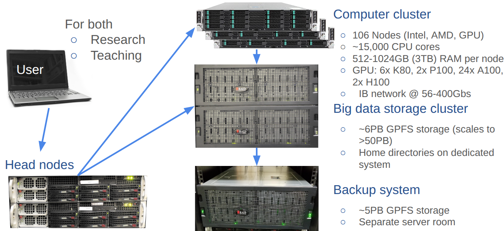

## Overview {.smaller}

Topics covered in this tutorial:

- **HPCC Cluster** — what it is and how it's structured
- **Linux basics** — essential commands
- **File exchange** — moving data to/from the cluster
- **Permissions and ownership**
- **Module system** — loading software
- **Conda** — environment and package management
- **Big data storage** — `bigdata` directory
- **Slurm** — the job queuing system
- **Code editors** — Vim/Nvim, VS Code, and more
- **nvim-R-Tmux** — terminal IDE for R/Python/Bash

---

## What Is a Computer Cluster? {.smaller}

- An assembly of **CPU units (nodes)** working together in parallel
- Nodes are connected via a high-speed internal network (e.g. **Infiniband**)
- One or more **head nodes** control load and traffic
- Users log into a head node via `ssh` and submit jobs via a **queuing system** (e.g. Slurm)

::: {.callout-warning}
**Never run compute jobs directly on the head node!**  
The head node controls the entire system — heavy jobs there affect all users.
:::

For code testing, log into a compute node interactively with `srun` (see later).

---

## Computer Cluster Overview {.smaller}

{width=100%}

---

## HPCC Cluster Hardware {.smaller}

### Computer Nodes
| Resource | Specification |
|---|---|
| CPU cores | **>12,000** total |
| Nodes | 130 Intel, AMD, and GPU nodes |
| Cores per node | 32–128 |
| RAM per node | 256–4,096 GB |
| GPUs | 64 (NVIDIA K80, P100, A100, H100) |

### Interconnect
- **HDR InfiniBand @ 200 Gb/s**

### Storage
- Parallel **GPFS** filesystem: **5.0 PB** usable (scalable to 50+ PB)
- Backup system of same architecture

---

## Logging in via SSH {.smaller .scrollable}

### Step 1 — SSH login

```bash
ssh -X <username>@cluster.hpcc.ucr.edu
```

`-X` enables **X11 graphics forwarding** (required for GUI apps on the cluster).  
After login you land on a head node: `skylark` or `bluejay`.

### Step 2 — Password

Type your password (cursor won't move — this is normal).  
With SSH Keys configured, password + Duo are skipped automatically.

### Step 3 — Duo Multifactor Authentication

Follow on-screen Duo instructions.  
External users without UCR Duo must use [SSH Key authentication](https://hpcc.ucr.edu/manuals/access/login/#ssh-keys).

::: {.callout-important}
**After first login**, change your password immediately:
```bash
passwd
```
New passwords must be ≥ 8 characters with at least 3 of: lowercase, uppercase, number, punctuation.
:::

---

## Terminal Applications by OS {.smaller}

| OS | Recommended Terminal |
|---|---|
| **macOS** | Built-in Terminal or [iTerm2](https://iterm2.com/) |
| **Windows** | [MobaXterm](http://mobaxterm.mobatek.net/) (feature-rich, SSH key support) |
| **Linux** | Default system terminal |
| **ChromeOS** | Enable Linux apps → use built-in terminal |

::: {.callout-tip}
**Windows users:** In MobaXterm, enable a persistent home directory:  
`Settings → General → Persistent home directory`
:::

### X11 / Remote Graphics
- macOS: install and run [XQuartz](https://www.xquartz.org/) before connecting
- Windows/Linux/ChromeOS: X11 is built into MobaXterm / most terminals

---

## Setting Up a Linux Computing Environment on a Laptop 

All major operating systems can provide a Linux command-line environment
with minimal setup. Thus, users may want to enable such an environment on their own
laptop or desktop computer (optional for this class). 
For the installation users want to follow the instructions under the tab below 
that matches their operating system.

::: {.panel-tabset}

## 👆 Select your OS

::: {style="padding: 1em; border: 1px solid #e0e0e0; border-radius: 8px; color: #666;"}
Select the tab above that matches your operating system:

- **Windows** — use MobaXterm to get a Linux-like terminal environment
- **macOS** — use the native Terminal or iTerm2 with Homebrew for package management
- **Linux / ChromeOS** — use your existing terminal and `apt` for package management

With the exception of a terminal app this setup is optional for this class. 
:::

## Windows (MobaXterm)

MobaXterm is the recommended terminal environment for Windows users. It 
provides a full Linux-like bash shell, built-in SSH client, file browser, 
and a package manager — all without requiring a separate Linux installation.

**1. Download and install MobaXterm**

Download the **Installer edition** from 
[mobaxterm.mobatek.net](https://mobaxterm.mobatek.net/download.html) 
(green button). If your IT department does not allow software installation, 
use the Portable edition instead — but make sure to configure a persistent 
home directory under `Settings` → `General` → `Persistent home directory`.

**2. Open MobaXterm's local terminal**

Click **Start local terminal** in the MobaXterm home screen. This opens a 
bash shell running locally on your Windows machine.

**3. Verify Git is available**

Git is included in MobaXterm's built-in Unix toolkit and should work 
immediately:
```{bash}
#| eval: false
git --version
```

If for any reason Git is not found, install it via MobaXterm's package 
manager:
```{bash}
#| eval: false
apt-get install git
```

**4. Install additional Unix tools via MobaXterm's package manager**

MobaXterm includes its own `apt-get` for installing additional command-line 
tools:
```{bash}
#| eval: false
## Search for a package
apt-get search <package-name>

## Install a package
apt-get install <package-name>

## Examples
apt-get install tree
apt-get install wget
```

**5. Configure your Git identity (first time only)**
```{bash}
#| eval: false
git config --global user.name "Your Name"
git config --global user.email "your_github_email@example.com"
```

**Note on WSL:** If you have Windows Subsystem for Linux (WSL) installed on 
your machine, your setup will be identical to the **Linux** tab below and 
you do not need MobaXterm. WSL provides a full Linux distribution (e.g. 
Ubuntu) running natively on Windows and is an excellent alternative for 
more advanced users.

## macOS

macOS is Unix-based, so most tools work natively with minimal setup. The 
main steps are to install the Xcode command-line tools, Homebrew as a 
package manager, and optionally a more feature-rich terminal.

**1. Open Terminal**

The built-in Terminal app is located at:
```
Applications → Utilities → Terminal
```

Alternatively, install **iTerm2** from [iterm2.com](https://iterm2.com) for 
a more feature-rich terminal with better split panes, search, and 
customization. Both work identically for the purposes of this course.

**2. Install Xcode Command Line Tools**

Xcode provides essential compilers and development tools including Git. 
Run the following and follow the on-screen prompts:
```{bash}
#| eval: false
xcode-select --install
```

Verify Git was installed:
```{bash}
#| eval: false
git --version
```

**3. Install Homebrew**

Homebrew is the standard package manager for macOS and allows easy 
installation of bioinformatics and command-line tools:
```{bash}
#| eval: false
/bin/bash -c "$(curl -fsSL https://raw.githubusercontent.com/Homebrew/install/HEAD/install.sh)"
```

Verify the installation:
```{bash}
#| eval: false
brew --version
```

**4. Install software with Homebrew**
```{bash}
#| eval: false
## Search for a package
brew search <package-name>

## Install a package
brew install <package-name>

## Examples
brew install git        # install or update Git via Homebrew
brew install wget
brew install tree

## Update all installed packages
brew upgrade
```

**5. Install XQuartz (for graphical applications)**

Some bioinformatics tools require an X11 display server to render graphical 
output over SSH. Install XQuartz from 
[xquartz.org](https://www.xquartz.org):
```{bash}
#| eval: false
## Or install via Homebrew
brew install --cask xquartz
```

After installation, log out and back in for XQuartz to take effect.

**6. Configure your Git identity (first time only)**
```{bash}
#| eval: false
git config --global user.name "Your Name"
git config --global user.email "your_github_email@example.com"
```

## Linux / ChromeOS

Linux users already have everything they need. The main steps are to verify 
the required tools are installed and set up Git.

**1. Open a Terminal**

Most Linux desktop environments provide a terminal via:

- **Ubuntu/Debian:** search for `Terminal` in the application menu, or press `Ctrl+Alt+T`
- **Fedora/RHEL:** search for `Terminal` or `Konsole`
- **ChromeOS:** enable Linux (Crostini) under `Settings` → `Advanced` → 
  `Developers` → `Linux development environment` → **Turn on**. This installs 
  a Debian-based Linux container with a full terminal.

**2. Verify Git is installed**
```{bash}
#| eval: false
git --version
```

If not installed:
```{bash}
#| eval: false
## Ubuntu/Debian/ChromeOS
sudo apt-get update
sudo apt-get install git

## Fedora/RHEL
sudo dnf install git
```

**3. Install additional software with apt-get**
```{bash}
#| eval: false
## Search for a package
apt-cache search <package-name>

## Install a package
sudo apt-get install <package-name>

## Examples
sudo apt-get install wget
sudo apt-get install tree
sudo apt-get install build-essential   # installs compilers and dev tools

## Update all installed packages
sudo apt-get update && sudo apt-get upgrade
```

**4. Install XQuartz / X11 (for graphical applications over SSH)**

To display graphical applications forwarded from HPCC over SSH:
```{bash}
#| eval: false
sudo apt-get install xorg
```

**5. Configure your Git identity (first time only)**
```{bash}
#| eval: false
git config --global user.name "Your Name"
git config --global user.email "your_github_email@example.com"
```

:::

---

## Important Linux Commands {.smaller .scrollable}

### Getting help

```bash
man <program_name>        # Open manual page for any command
```

### Directory listing

```bash
ls                        # Basic list
ls -l                     # Detailed (long format)
ls -al                    # Include hidden files (starting with .)
ll -d <directory>         # Permissions of a specific dir/file
```

### Navigation

```bash
pwd                       # Print working directory
pwd -P                    # Physical path (resolves symbolic links)
cd <path>                 # Change to directory
cd                        # Go to home directory
cd -                      # Switch to previous directory
```

### Search, count, create

```bash
grep "pattern" file       # Search text pattern in files
wc file                   # Word/line/character count
mkdir <dirname>           # Create directory
```

---

## Important Linux Commands (cont.) {.smaller .scrollable}

### File operations

```bash
rm <file>                 # Delete file
rm -r <dir>               # Delete directory recursively
mv <src> <dst>            # Move or rename file
```

### Downloading & viewing

```bash
wget <url>                # Download file from internet to current directory
less <file>               # View file (scroll with arrows, quit with q)
```

### Wildcards and pipes

```bash
ls file.*                 # Wildcard: match any extension
ls > filelist.txt         # Redirect stdout to file
command < myfile          # Use file as input
command >> myfile         # Append output to file
command1 | command2       # Pipe: output of cmd1 → input of cmd2
command > /dev/null       # Suppress output
grep pattern file | wc    # Count matches of a pattern in file
grep pattern badfile 2> mystderr   # Redirect stderr to file
```

---

## Linux Path Notation and Special Characters

The following code box contains frequently used Linux notations. Use the scroll option of the code box to inspect all of them.  

```{bash}
#| style: "max-height: 600px; overflow-y: auto;"
#| eval: false

## ~/  : Tilde - shortcut for the current user's home directory
##       Expands to /home/<username> on Linux or /Users/<username> on macOS
echo ~           # prints your home directory path
ls ~/            # list contents of your home directory
ls ~/.ssh/       # list contents of the .ssh folder in your home directory

## /   : Forward slash - root of the entire file system (the top level)
##       All absolute paths start from here
ls /             # list contents of the root directory
ls /home/        # list all user home directories on the system

## .   : Single dot - refers to the current working directory
ls .             # list contents of the current directory (same as just 'ls')
./script.sh      # execute a script located in the current directory
##       Without ./ the shell would not find the script unless it is in PATH

## ..  : Double dot - refers to the parent directory (one level up)
ls ..            # list contents of the parent directory
cd ..            # move up one directory level
cd ../..         # move up two directory levels

## ../  : Double dot with slash - parent directory, used to build relative paths
ls ../data/      # list a 'data' folder that sits one level above current directory
cp ../data/file.txt .   # copy file.txt from parent's data/ into current directory

## Absolute vs Relative paths
## Absolute: always starts with / and gives the full path from root
ls /home/username/project/data/

## Relative: starts from wherever you currently are (no leading /)
ls project/data/ # works if you are already in /home/username/

## Practical examples combining these notations
ls -al ~/        # list all files including hidden ones in home directory
cp ~/.ssh/id_rsa.pub .          # copy your public SSH key into current directory
mv ./script.sh ../bin/          # move script up one level into a bin/ directory
cat ../../config/settings.txt   # read a file two levels up in config/ directory

## Additional special notations
## -   : Single dash - refers to the previous directory you were in
cd -             # switch back to the last directory you were in

## *   : Wildcard - matches any number of any characters in filenames
ls *.sh          # list all files ending in .sh in current directory
ls data_*.txt    # list all .txt files starting with 'data_'

## ?   : Single character wildcard - matches exactly one character
ls file?.txt     # matches file1.txt, fileA.txt but not file10.txt

## {}  : Brace expansion - generate multiple strings at once
ls file{1,2,3}.txt        # expands to: ls file1.txt file2.txt file3.txt
mkdir -p project/{data,code,results}  # create three subdirectories at once
```

---

## File Exchange {.smaller .scrollable}

### GUI Applications

| OS | Application |
|---|---|
| Windows | [WinSCP](http://winscp.net) or [MobaXterm](https://mobaxterm.mobatek.net) |
| macOS | [CyberDuck](http://cyberduck.en.softonic.com/mac) |
| All platforms | [FileZilla](https://filezilla-project.org/) |

### SCP — command-line file copy

```bash
scp file user@remotehost:/home/user/          # Local → Remote
scp user@remotehost:/home/user/file .         # Remote → Local
```

### RSYNC — smarter sync (preferred for large transfers)

```bash
# View remote directory content
rsync user@remotehost:~/somedirectory/*

# Download a directory
rsync -avzhe ssh user@remotehost:~/somedirectory .

# Upload a directory
rsync -avzhe ssh somedirectory user@hostname:~/
```

**RSYNC flags:** `-a` (archive/recursive), `-v` (verbose), `-z` (compress), `-h` (human-readable), `-e ssh` (encrypt via SSH), `--delete` (mirror deletions)

---

## Checking File Integrity {.smaller}

Use **MD5 checksums** to verify files after downloads or copies:

```bash
# Generate checksum
md5sum myfile1.txt

# Save checksum to a file
md5sum myfile1.txt > myfile1.md5

# Verify file matches its checksum
md5sum -c myfile1.md5
```

Expected output:

```
4c1ac93e1be5f77451fa909653b2404c  myfile1.txt
myfile1.txt: OK
```

---

## Comparing Directories {.smaller}

Find differences between two directories (useful for checking backups or code changes):

```bash
diff -r --exclude=".git" dir1/ dir2/
```

- `-r`: recursive comparison
- `--exclude=".git"`: skip the Git metadata folder

---

## File Permissions & Ownership {.smaller .scrollable}

### View permissions

```bash
ls -al                    # List all files with permissions
ls -ld <directory>        # Permissions of a specific entry
```

### Permission string format: `drwxrwxrwx`

| Character | Meaning |
|---|---|
| `d` | directory (`-` = file) |
| 1st `rwx` | **user** (owner) permissions |
| 2nd `rwx` | **group** permissions |
| 3rd `rwx` | **world** (other) permissions |
| `r` = read, `w` = write, `x` = execute ||

### Change permissions

```bash
chmod ugo+rx my_file             # Add read+execute for user, group, world
chmod -R ugo+rx my_dir           # Recursive
chmod -R ugo-x,u+rwX,go+rX,go-w ./* ./.[!.]*  # dirs=executable, files=not
```

### Change ownership

```bash
chown <user>:<group> <file_or_dir>
```

---

## Symbolic Links {.smaller}

Create short **nicknames (aliases)** for files or directories:

```bash
ln -s original_filename new_nickname
```

Example:

```bash
ln -s /bigdata/gen242/shared/data ./data    # shortcut to shared data
ls -l data                                   # shows -> /bigdata/gen242/shared/data
```

Useful for: avoiding long paths, pointing multiple scripts at shared files.

---

## Homework HW1: Introduction to Linux and HPC {.smaller}

::: {.center-page}
See [here](https://girke.bioinformatics.ucr.edu/GEN242/assignments/homework/hw01/hw01.html)
:::

---

## Software Module System {.smaller .scrollable}

Over **2,000 software tools** are installed on HPCC. The **module system** manages them (including multiple versions of the same tool).

### Key commands

```bash
module avail              # List all available modules
module avail R            # List all modules starting with 'R'
module load R             # Load default version of R
module load R/4.3.0       # Load a specific version
module unload R/4.2.0     # Unload a specific version
module list               # List currently loaded modules
```

::: {.callout-note}
New software install requests: email `support@hpcc.ucr.edu`
:::

### Custom installs
- Use **Conda** for personal environment management (next slide)
- Or compile tools from source in your home directory

---

## Conda — Package & Environment Management {.smaller}

Conda lets you create isolated software environments — useful when you need specific versions of tools or tools not in the module system.

::: {.callout-tip}
Full documentation: [HPCC Conda/Package Management](https://hpcc.ucr.edu/manuals/hpc_cluster/package_manage/)
:::

### Common Conda workflow

```bash
# Create a new environment
conda create -n myenv python=3.11

# Activate it
conda activate myenv

# Install packages
conda install -c bioconda samtools

# Deactivate
conda deactivate

# List environments
conda env list
```

---

## Big Data Storage {.smaller}

Default home directory comes with only **20 GB**. Use `bigdata` for large datasets:

| Path | Purpose |
|---|---|
| `/bigdata/labname/username` | Personal bigdata space |
| `/bigdata/labname/shared` | Shared within the lab group |

For GEN242 users, `labname` = `gen242`:

```bash
ls /bigdata/gen242/          # List the course bigdata directory
```

::: {.callout-note}
Monitor your disk usage at the [HPCC Cluster Dashboard](https://dashboard.hpcc.ucr.edu/)
:::

All lab members share the same bigdata quota — coordinate with your group!

---

## Queuing with Slurm — Overview {.smaller}

HPCC uses **Slurm** for job scheduling. All compute jobs must go through Slurm:

{width=70%}

**Fig 2:** Overview of Slurm on the HPCC Cluster.

- **`sbatch`** — submit batch jobs (scripts)
- **`srun`** — launch interactive sessions
- **`squeue`** — monitor job queue
- **`scancel`** — cancel jobs

---

## Job Submission with `sbatch` {.smaller .scrollable}

### Check available partitions

```bash
sinfo
```

### Submit a script

```bash
sbatch script_name.sh
```

### Example submission script

```bash
#!/bin/bash -l

#SBATCH --nodes=1
#SBATCH --ntasks=1
#SBATCH --cpus-per-task=1
#SBATCH --mem-per-cpu=1G
#SBATCH --time=1-00:15:00        # 1 day and 15 minutes
#SBATCH --mail-user=user@ucr.edu
#SBATCH --mail-type=ALL
#SBATCH --job-name="my_analysis"
#SBATCH --partition="gen242"     # Other options: intel, batch, highmem, gpu, short
#SBATCH --account="gen242"

Rscript my_script.R
```

`STDOUT` and `STDERR` are written to `slurm-<jobid>.out` by default.

---

## Interactive Sessions with `srun` {.smaller .scrollable}

### Basic interactive session

```bash
srun --pty bash -l
```

### Session with specific resources

```bash
srun --x11 \
     --partition=gen242 \
     --account=gen242 \
     --mem=2gb \
     --cpus-per-task 4 \
     --ntasks 1 \
     --time 1:00:00 \
     --pty bash -l
```

::: {.callout-tip}
**Shortcut alias** — add this to `~/.bashrc` for a quick `srun` command:

```bash
alias srun_gen242='echo "srun --x11 --partition=gen242 --account=gen242 \
  --mem=20gb --cpus-per-task 8 --ntasks 1 --time 20:00:00 --pty bash -l"'
```

Run `srun_gen242` to print the command, then copy-paste and customize before executing.
:::

---

## Monitoring and Managing Jobs {.smaller .scrollable}

### View the job queue

```bash
squeue                             # All jobs
squeue -u <username>               # Your jobs only
```

### Detailed job info

```bash
scontrol show job <JOBID>
scontrol show jobid -dd <JOBID>
```

### Cluster activity summary

```bash
jobMonitor                         # Custom HPCC visualization tool
```

### Cancel jobs

```bash
scancel -i <JOBID>                 # Cancel one job
scancel -u <username>              # Cancel all your jobs
scancel --name <myJobName>         # Cancel by job name
```

### Alter a running job

```bash
scontrol update jobid=<JOBID> TimeLimit=<NEW_TIME>
```

### View resource limits

```bash
sacctmgr show account $GROUP format=Account,User,Partition,GrpCPUs,GrpMem,GrpNodes --ass | grep $USER
```

---

## Code Editors Overview {.smaller}

| Editor | Type | Notes |
|---|---|---|
| **Vi / Vim / Neovim** | Terminal | Available on every Linux system; powerful but has learning curve |
| **Emacs** | Terminal/GUI | Extensible; great for Lisp/LaTeX |
| **VS Code** | GUI | Most popular today; wide extension ecosystem; available via OnDemand |
| **Pico / Nano** | Terminal | Simple; keystroke reference shown on screen |

### HPCC OnDemand GUI environments
Available at [OnDemand](https://hpcc.ucr.edu/manuals/hpc_cluster/selected_software/ondemand/):
- **RStudio Server** (Posit)
- **VS Code**
- **JupyterHub**
- **MATLAB**

These run on compute nodes via Slurm — great for interactive visualization.

---

## Vim / Neovim Basics {.smaller .scrollable}

### Open a file

```bash
nvim myfile.txt        # Neovim (preferred)
vim myfile.txt         # Vim
```

### Three main modes

| Mode | How to enter | Used for |
|---|---|---|
| **Normal** | `Esc` | Navigation, commands |
| **Insert** | `i` | Typing / editing text |
| **Command** | `:` | Save, quit, search |

### Essential commands

```
i          → Enter insert mode (start typing)
Esc        → Return to normal mode
:w         → Save file
:q         → Quit (if no changes)
:wq        → Save and quit
:!q        → Force quit without saving
```

### Navigation in normal mode
- Arrow keys to move cursor
- `Fn + Up/Down` to page through file

---

## nvim-R-Tmux Environment {.smaller .scrollable}

A powerful **terminal IDE** for R, Python, and Bash on HPC systems.

### Components

| Tool | Role |
|---|---|
| **Neovim** | Code editor with syntax highlighting, LSP |
| **R.nvim** | Plugin to send R code from editor → R console |
| **hlterm** | Same functionality for Python and Bash |
| **Tmux** | Terminal multiplexer — split windows, detach/reattach sessions |

### Key advantage for HPC

> A **tmux session persists** on the login node indefinitely — survives network drops, VPN disconnects, and laptop closures. Your R session is exactly where you left it.

---

## nvim-R-Tmux vs OnDemand {.smaller}

| Feature | nvim-R-Tmux | OnDemand (RStudio, VSCode, Jupyter) |
|---|---|---|
| **Access** | Any SSH terminal | Browser (any device) |
| **Availability** | Any Linux system | Only where OnDemand is deployed |
| **Resources** | Login node (no Slurm needed) | Slurm compute node allocation |
| **Languages** | R, Python, Bash, more | Tool-specific |
| **Install overhead** | Minimal (config files) | Server-side setup |
| **Bandwidth** | Very low (text only) | Higher (browser-based) |
| **Session persistence** | ✅ Tmux persists forever | ❌ Browser session ends on disconnect |

Use **nvim-R-Tmux** as your persistent backbone for writing code and submitting jobs;  
switch to **OnDemand** for interactive visualization and resource-intensive exploration.

---

## Quick Setup of nvim-R-Tmux on HPCC {.smaller}

### Install (one-time setup)

```bash
# 1. Log in to HPCC and clone the setup repo
git clone https://github.com/tgirke/nvim-R-Tmux.git

# 2. Run the install script
cd nvim-R-Tmux
bash install_nvim_r_tmux.sh

# 3. Log out and back in to activate
```

### Start a tmux session

```bash
tmux new -s mysession    # Create a named session
tmux attach -t mysession # Reattach later
```

### Open Neovim in tmux

```bash
nvim myscript.R          # Opens R script
```

Press `\rf` to start R console → `enter` to send current line → `\ce` to send chunk.

---

## Important Tmux Keybindings {.smaller}

All tmux commands start with the **prefix key** `Ctrl-a` (on HPCC config):

| Keybinding | Action |
|---|---|
| `Ctrl-a c` | Create new window |
| `Ctrl-a n / p` | Next / previous window |
| `Ctrl-a "` | Split pane horizontally |
| `Ctrl-a %` | Split pane vertically |
| `Ctrl-a arrow` | Move between panes |
| `Ctrl-a d` | Detach session (keeps it running!) |
| `Ctrl-a [` | Enter scroll/copy mode |
| `q` | Exit scroll mode |

---

## Important Neovim Keybindings for R {.smaller}

| Keybinding | Action |
|---|---|
| `\rf` | Start R console in split pane |
| `\l` | Send current line to R |
| `\ss` | Send selected block to R |
| `\aa` | Send entire file to R |
| `\rq` | Quit R |
| `\ro` | Open R object browser |
| `gcc` | Toggle comment on current line |
| `:w` | Save file |
| `:wq` | Save and quit |

---

## Summary {.smaller}

| Topic | Key Commands |
|---|---|
| SSH login | `ssh -X user@cluster.hpcc.ucr.edu` |
| File listing | `ls -al` |
| Navigate | `cd`, `pwd` |
| Load software | `module load <name>` |
| Submit job | `sbatch script.sh` |
| Interactive node | `srun --pty bash -l` |
| Monitor jobs | `squeue -u <user>` |
| Cancel job | `scancel -i <JOBID>` |
| File transfer | `rsync -avzhe ssh src user@host:dst` |
| Check file integrity | `md5sum -c file.md5` |

::: {.callout-tip}
**Resources:**  
[HPCC Cluster Manual](https://hpcc.ucr.edu/manuals/hpc_cluster/) · [Linux Manual](https://hpcc.ucr.edu/manuals/linux_basics/) · [Slurm Docs](https://slurm.schedmd.com/documentation.html)
:::

**Next:** T3 — [Introduction to R](https://girke.bioinformatics.ucr.edu/GEN242/tutorials/rbasics/rbasics_index.html)
