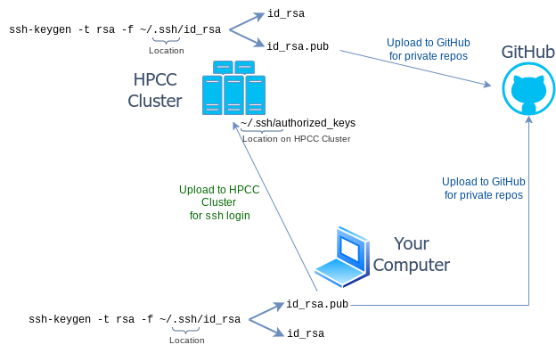

<br/>
<br/>

## GitHub in GEN242 

+ Note, this class will make heavy use of GitHub 
+ Homework assignments will be submitted and graded on GitHub Classroom
+ Course projects will also use private GitHub repositories: one repository for each course project (shared among students of each project)
+ Each student will need a personal GitHub account. They can be created [here](https://github.com/personal).
+ GitHub provides an unlimited number of free public repositories to each user. Via GitHub Education students can sign up for an extended number of free private GitHub accounts (see [here](https://education.github.com)).
+ For beginners this [quick guide](https://guides.github.com/activities/hello-world/) may be useful

## What are Git and GitHub?

+ Git is a version control system similar to SVN
+ GitHub is an online social coding service based on Git 
+ Combined Git/GitHub: environment for version control and social coding

## Installing Git
+ [Install](http://git-scm.com/book/en/Getting-Started-Installing-Git) on Windows, OS X and Linux
+ When using it from RStudio, it needs to find the Git executable

## Git Basics from Command-Line

Also try [interactive git tutorial](https://try.github.io/levels/1/challenges/1).

+ Finding help from command-line 

    ```sh
    git <command> --help
    ```

+ Initialize a directory as a Git repository (here `my_repos`).

    ```sh
    mkdir my_dir; cd my_repos
    git init
    ```
	
+ Add specific files to Git repository (staging area) 

   ```sh
   touch myfile
   git add myfile
   ```

+ Add all files recursively 

  To ignore specific files (_e.g._ temp files), list them in a `.gitignore` file in your repository's root directory. Regular expressions are supported. See [here](https://help.github.com/articles/ignoring-files/) for more details.

   ```sh
   git add -A :/
   ```

+ After editing file(s) in your repos, record a snapshot of the staging area 

   ```sh
   git commit -am "some edits"
   ```

## GitHub Basics from Command-Line

1. Generate a new remote repository on GitHub online with same name as in previous section (or use [hub](https://hub.github.com/) or [GitHub CLI](https://github.com/cli/cli#installation) command-line wrappers for this). To avoid errors with the online method, do not
   initialize the new repository with README, license, or `.gitignore` files. You can
   add these files after your project has been pushed to GitHub. 

   ```sh
   git remote add origin git@github.com:<user_name>/<repos_name>.git # Use here my_repos under <repos_name>, if example from previous section is used.
   ```

2. Push updates to remote. Next time one can just use `git push`

    ```sh
    git push 
    ```

3. Clone existing remote repository
    
    ```sh
    git clone git@github.com:<user_name>/<repos_name>.git
    ```

4. Before working on project, update local git repos 

    ```sh
    git pull 
    ```

5. Make changes and recommit local to remote 

    ```sh
    git commit -am "some edits"; git push 
    ```
   

### Important When Working with Private GitHub Repositories!

In order to work with _private GitHub repositories_, like the ones used in GEN242, users need to activate in their GitHub account under `Settings` as authentication method an [SSH Key](https://docs.github.com/en/authentication/connecting-to-github-with-ssh/adding-a-new-ssh-key-to-your-github-account). 
The latter SSH Key method is usually preferred. To push to a private GitHub repository from the HPCC cluster, you need to generate an SSH Key from your home account on the HPCC cluster using
the standard Linux `ssh-keygen` method as described [here](https://hpcc.ucr.edu/manuals/access/login/#ssh-keys), and then upload the 
newly generated public SSH Key of your HPCC account located under `~/.ssh/id_rsa.pub` to GitHub. The same method can be used to
create an SSH Key on a personal computer and then upload the public key to GitHub. Usually, one should create a dedicated key
pair for each computer one uses and upload the corresponding public keys to GitHub. If you are new to SSH Keys, then please read this [short introduction](https://hpcc.ucr.edu/manuals/access/login/#ssh-keys). 

<center></center>
<b>Fig 1:</b> SSH Keys required to work with private GitHub repos from a local computer as well as a remote system like the HPCC Cluster. The figure also includes the SSH Key required for password-less login to the remote system (here HPCC cluster). For generating SSH keys, see <a href="https://hpcc.ucr.edu/manuals/access/login/#ssh-keys">here</a>.

<br></br>


### SSH Key Setup for GitHub Access

To push and pull from your private GEN242 GitHub repositories, you need to 
authenticate with GitHub using an SSH key. The process involves generating an 
SSH key pair on the computer you want to work from, and then uploading the 
public key to your GitHub account. Since most students work both on the 
**HPCC cluster** and on their **local computer**, this setup needs to be 
completed separately for each machine — each gets its own key pair, and both 
public keys get uploaded to GitHub.

Select the tab below that matches your working environment and follow the 
steps in order. If you work from both HPCC and a local computer, complete 
the HPCC tab first, then return and complete your local computer tab.

::: {.panel-tabset}

## HPCC → GitHub

**Step 1: Generate an SSH key pair on HPCC**

Log into HPCC via MobaXterm (Windows) or Terminal (macOS/Linux) and run the 
following commands on the HPCC cluster:
```{bash}
#| eval: false
## Create .ssh directory if it does not exist yet
mkdir -m 700 ${HOME}/.ssh

## Generate SSH key pair
ssh-keygen -t rsa -f ~/.ssh/id_rsa
```

Follow the prompts. You may set a passphrase or leave it blank. Once complete 
you will find two files in your `~/.ssh/` directory:

- `id_rsa` — your **private** key (never share this)
- `id_rsa.pub` — your **public** key (this gets uploaded to GitHub)

**Step 2: Copy your public key**
```{bash}
#| eval: false
cat ~/.ssh/id_rsa.pub
```

Select and copy the entire output line.

**Step 3: Upload the public key to GitHub**

1. Go to [github.com](https://github.com) and click your **profile picture** → **Settings**
2. In the left sidebar click **SSH and GPG keys** → **New SSH key**
3. Give it the title `HPCC`
4. Paste the public key and click **Add SSH key**

**Step 4: Test the GitHub SSH connection from HPCC**
```{bash}
#| eval: false
ssh -T git@github.com
```

A successful setup returns: `Hi <username>! You've successfully authenticated...`

**Step 5: Clone your private GEN242 repo using the SSH URL**

On your repo page on GitHub click **Code → SSH** and copy the URL, then run:
```{bash}
#| eval: false
git clone git@github.com:GEN242-2026/<username>-hw.git
```

Replace `<username>` with your GitHub username. All subsequent `git push` and 
`git pull` commands inside that directory will use SSH automatically.

## macOS/Linux → GitHub

**Step 1: Generate an SSH key pair on your local computer**

Open Terminal and run the following commands on your local machine:
```{bash}
#| eval: false
## Create .ssh directory if it does not exist yet
mkdir -m 700 ${HOME}/.ssh

## Generate SSH key pair
ssh-keygen -t rsa -f ~/.ssh/id_rsa
```

Follow the prompts. You may set a passphrase or leave it blank. Once complete 
you will find two files in your `~/.ssh/` directory:

- `id_rsa` — your **private** key (never share this)
- `id_rsa.pub` — your **public** key (this gets uploaded to GitHub)

**Step 2: Copy your public key**
```{bash}
#| eval: false
cat ~/.ssh/id_rsa.pub
```

Select and copy the entire output line.

**Step 3: Upload the public key to GitHub**

1. Go to [github.com](https://github.com) and click your **profile picture** → **Settings**
2. In the left sidebar click **SSH and GPG keys** → **New SSH key**
3. Give it the title `macOS laptop` or `Linux desktop` as appropriate
4. Paste the public key and click **Add SSH key**

**Step 4: Test the GitHub SSH connection**
```{bash}
#| eval: false
ssh -T git@github.com
```

A successful setup returns: `Hi <username>! You've successfully authenticated...`

**Step 5: Clone your private GEN242 repo using the SSH URL**

On your repo page on GitHub click **Code → SSH** and copy the URL, then run:
```{bash}
#| eval: false
git clone git@github.com:GEN242-2026/<username>-hw.git
```

Replace `<username>` with your GitHub username. All subsequent `git push` and 
`git pull` commands inside that directory will use SSH automatically.

## Windows (MobaXterm) → GitHub

**Download and install MobaXterm**

Download the **Installer edition** (green button) from 
[mobaxterm.mobatek.net](https://mobaxterm.mobatek.net/download.html). 
If your IT department does not allow software installation, use the 
Portable edition instead — but note that you will need to configure a 
persistent home directory under `Settings` → `General` → `Persistent home 
directory` to avoid losing your SSH keys between sessions.

**Step 1: Open MobaXterm's local terminal**

In MobaXterm click **Start local terminal**. This opens a bash shell running 
locally on your Windows machine. All commands below are run here — 
**not** in an HPCC session.

**Step 2: Generate an SSH key pair**
```{bash}
#| eval: false
## Create .ssh directory if it does not exist yet
mkdir -m 700 ${HOME}/.ssh

## Generate SSH key pair
ssh-keygen -t rsa -f ~/.ssh/id_rsa
```

Follow the prompts. You may set a passphrase or leave it blank. The key pair 
is saved in MobaXterm's local home directory, which on Windows is located at:
```
C:\Users\<WindowsUsername>\Documents\MobaXterm\home\.ssh\
```

The two files created are:

- `id_rsa` — your **private** key (never share this)
- `id_rsa.pub` — your **public** key (this gets uploaded to GitHub)

**Step 3: Copy your public key**
```{bash}
#| eval: false
cat ~/.ssh/id_rsa.pub
```

To avoid accidentally copying extra whitespace (which will break the key), 
you can alternatively use MobaXterm's built-in file browser: open the left 
sidebar → navigate to `~/.ssh/` → right-click `id_rsa.pub` → open with text 
editor → select all and copy.

**Step 4: Upload the public key to GitHub**

1. Go to [github.com](https://github.com) and click your **profile picture** → **Settings**
2. In the left sidebar click **SSH and GPG keys** → **New SSH key**
3. Give it the title `Windows laptop`
4. Paste the public key and click **Add SSH key**

**Step 5: Configure Git identity (first time only)**

MobaXterm's local terminal may not have your Git identity set. Run:
```{bash}
#| eval: false
git config --global user.name "Your Name"
git config --global user.email "your_github_email@example.com"
```

**Step 6: Test the GitHub SSH connection**
```{bash}
#| eval: false
ssh -T git@github.com
```

A successful setup returns: `Hi <username>! You've successfully authenticated...`

**Step 7: Clone your private GEN242 repo using the SSH URL**

On your repo page on GitHub click **Code → SSH** and copy the URL, then run:
```{bash}
#| eval: false
git clone git@github.com:GEN242-2026/<username>-hw.git
```

Replace `<username>` with your GitHub username. All subsequent `git push` and 
`git pull` commands inside that directory will use SSH automatically.

:::

## Simple Working Routing for Homeworks and Projects

To upload and sync homeworks and projects to GitHub, run the following
git/GitHub workflow from the command-line after your SSH key is set up (see
above) and after your private homework or project repository has been shared
with you via a GitHub invitation email. The workflow is identical whether you
are on HPCC, a Mac/Linux computer, or MobaXterm's local terminal on Windows.

```{bash}
#| eval: false

# Clone your repo (first time only, on each machine you use)
git clone git@github.com:GEN242-2026/<username>-hw.git
cd <username>-hw

# Always pull first to get the latest changes before starting work
git pull

# Create or edit files, then stage and commit your changes
touch test                    # creates an empty file for testing
git add test                  # stage a specific file, or use 'git add -A' for all changes
git commit -am "some edits"   # commit with a short descriptive message
git push                      # upload commits to GitHub

# -> Edit the test file directly on GitHub online, then run git pull to sync changes back
git pull
```

## Online file upload

Useful for new users who want to upload their homework assignments to GitHub but are not familiar enough with the command-line yet.

1. Press `Add file` button on your repository, and then `Upload files`. 
2. Under the file path window add required subdirectory structure and a dummy file name (e.g. `Homework/HW1/dummy.txt`)
3. After this press `Upload files` and upload any file (e.g. homework) to the newly create directory. After this the initial dummy file can be deleted. The latter is necessary since empty directories are not visible on GitHub.


## Using GitHub from RStudio

Note: one can also set up SSH Keys from RStudio. How to do this is explained [here](https://happygitwithr.com/ssh-keys). 

+ After installing Git (see [here](https://git-scm.com/book/en/v2/Getting-Started-Installing-Git)), set path to Git executable in Rstudio: 
	+ Tools `>` Global Options `>` Git/SVN

+ If needed, log in to GitHub account and create repository. Use option `Initialize this repository with a README`. 

+ Clone repository by copying & pasting URL from repository into RStudio's 'Clone Git Repository' window: 
    + File `>` New Project `>` Version Control `>` Git `>` Provide URL

+ Now do some work (_e.g._ add an R script), commit and push changes as follows: 
    + Tools `>` Version Control `>` Commit

+ Check files in staging area and press `Commit Button`

+ To commit changes to GitHub, press `Push Button`

+ Shortcuts to automate above routines are [here](https://support.rstudio.com/hc/en-us/articles/200711853-Keyboard-Shortcuts)

+ To resolve password issues, follow instructions [here](https://github.com/jennybc/stat540_2014/blob/master/seminars/seminar92_git.md). 

## Viewing static HTML files on GitHub

Simple viewing of HTML files on GitHub can be enabled by making the following
changes to a public repos. Without these adjustments, one needs to download an
HTML file from GitHub in order to view the rendered content. An example GitHub
repos for showcasing this feature is
[here](https://github.com/tgirke/View_HTML_on_GitHub/tree/master).

+ Make sure your GitHub repos is public
+ Go to `Settings`
+ Select `Pages` in menu on left
+ Select `Deploy from a branch` under `Source`
+ Select a branch in the `GitHub Pages` section
+ Save the changes and wait until a URL is provided for your site. 
+ To test, upload an HTML file and append its paths to the URL provided in previous step.


