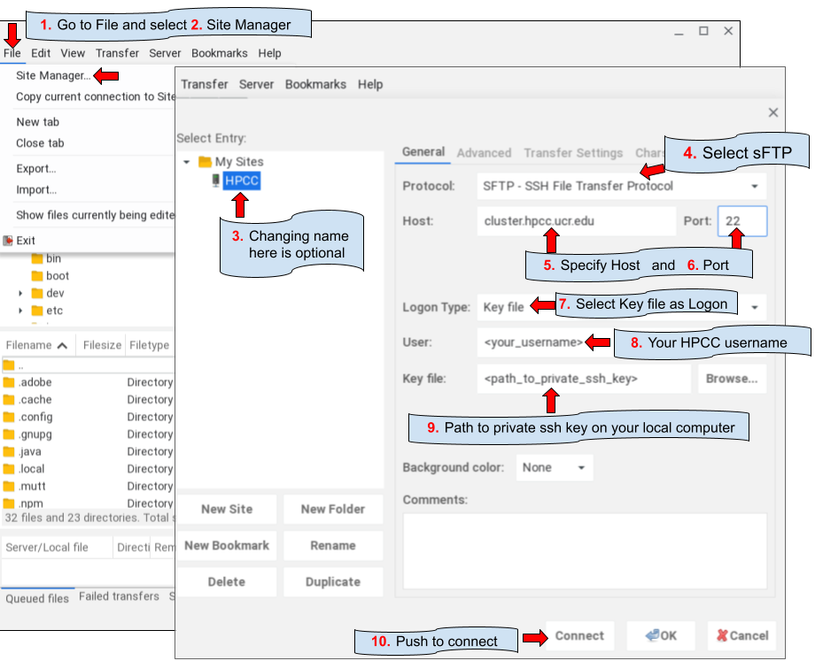
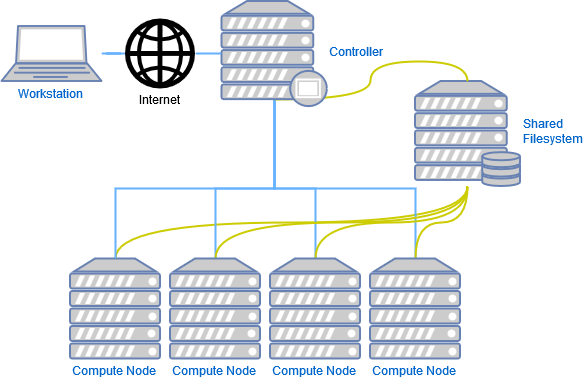
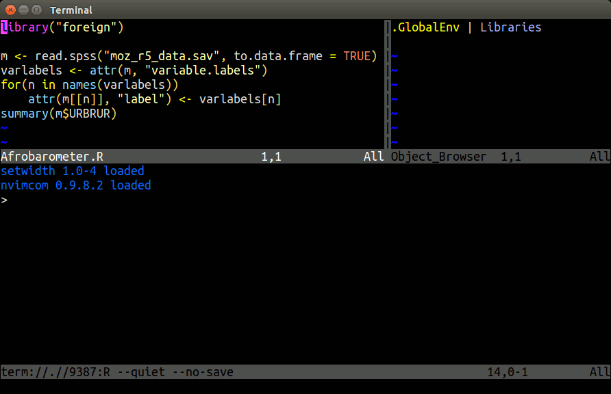

<br/>
<br/>

## HPCC Cluster Overview

The HPCC Cluster (formerly called biocluster) is a shared research computing system available at UCR. The HPCC website is available [here](http://hpcc.ucr.edu/index.html).

### What Is a Computer Cluster?

* A computer cluster is an assembly of CPU units, so called computer nodes that work together to perform many computations in parallel. To achieve this, an internal network (e.g. Infiniband interconnect) connects the nodes to a larger unit, while one or more head nodes controls the load and traffic across the entire system.

* Usually, users log into one of the head nodes via `ssh` to submit their computing requests to a queuing system provided by resource management and scheduling software, such as Slurm, SGE, or TORQUE/MAUI. The queuing system distributes the processes to the computer nodes in a controlled fashion.

* Because the head node controls the entire system, users should never run computing jobs on the head node directly!

* For code testing purposes, one can log into one of the nodes via `srun` (see below) and run jobs interactively. 

### Hardware Infrastructure

### Computer nodes

- Over 12,000 CPU cores
- 130 Intel, AMD and GPU nodes 
- 32-128 CPU cores per node
- 256-4,096 GB of RAM per node
- 64 GPUs including NVIDIA K80, P100, A100 and H100
    
### Interconnect 
- HDR IB @200Gbs 

### Storage

- Parallel GPFS storage system with 5.0 PB usable space
- File system scales to over 50 PB 
- Backup of same architecture and similar amount

### User traffic

- Computing tasks need to be submitted via `sbatch` or `srun`
- HPCC Cluster headnode only for login, not for computing tasks!
- Monitor cluster activity: `squeue` or `jobMonitor` (`qstatMonitor`)

### Manuals

- [HPCC Cluster Manual](https://hpcc.ucr.edu/manuals/hpc_cluster/)
- [Linux Manual](https://hpcc.ucr.edu/manuals/linux_basics/)


## Linux Basics

### Log into HPCC Cluster via SSH Terminal

Terminal-based login is the most feature-rich method for accessing remote Linux systems. Web-based alternatives via [JupyterHub](https://hpcc.ucr.edu/manuals/access/login/#b-web-based-access) and
[RStudio Server](https://hpcc.ucr.edu/manuals/access/login/#b-web-based-access) are also possible. To access the HPCC
cluster with the standard `ssh` protocol, users want to follow steps 1-3. Only
step 1 is required after setting up SSH Key-based access.

__1.__ Type the following `ssh` login command from a terminal application, where `<username>` needs to be replaced by the actual account name of a user. The `<>` characters indicate a placeholder and need to be removed. Next, press enter to execute the `ssh` command.

```bash
ssh -X <username>@cluster.hpcc.ucr.edu
```
After this a user is logged in to one of the headnodes, which are `skylark` or `bluejay`.  

The `-X` argument enables X11 support, which is required for opening GUI applications on remote systems.

__2.__ Type your password and hit enter. Note, when typing the password the cursor will not move and nothing is printed to the screen. If SSH Key access is enabled, both the password and Duo steps will be skipped automatically during the log in process.

__3.__ Follow the [Duo multifactor authenication](https://hpcc.ucr.edu/manuals/access/login/#passwordduo) instructions printed to the screen. As external users do not have access to UCR's Duo system, they can only log in via the alternative SSH Key method. How to enable SSH Keys is described [here](https://hpcc.ucr.edu/manuals/access/login/#ssh-keys). Note, Duo will be bypassed if SSH Key based login is enabled. This can be more conveniet than Duo when accessing the cluster frequently. 
    
If the login is performed via a GUI application, which is an option in MobaXterm,
then one can provide the same login information given under the above `ssh`
commad in the corresponding fields of the login window as follows:

+ Host name: `cluster.hpcc.ucr.edu`
+ User name: ...
+ Password: ...

__Importantly__, after the first login into a new account (or a password reset),
users need to change their password with the `passwd` command and then follow
the on-screen instructions. This requires to enter the current password once
and the new password twice. New passwords need to be at least 8 characters 
long and meet at least 3 of the following requirments: lowercase character, 
uppercase character, number, and punctuation character.

__What to do if password/Duo is not working?__ If this happens then most often the login is blocked because a password was typed too many times incorrectly, or 
not changed after the first login (see above). To correct this, please request a password reset by emailing [support@hpcc.ucr.edu](mailto:support@hpcc.ucr.edu). 
Remember, password/Duo based access is only possible if a user's UCR NetID matches the corresponding HPCC username. If this is not the case then 
UCR users can request to change their HPCC user account name to their NetID or use the [SSH key](https://hpcc.ucr.edu/manuals/access/login/#ssh-keys) based access method.

#### Terminal Options

Various ssh terminal applications are available for all major operating systems. Examples include:

+ macOS: built-in macOS [Terminal](https://support.apple.com/guide/terminal/welcome/mac) or [iTerm2](https://iterm2.com/) 
+ Windows: [MobaXterm](http://mobaxterm.mobatek.net/) is a very feature rich terminal option for Windows users. [Putty](http://www.chiark.greenend.org.uk/~sgtatham/putty/download.html) is an alternative, but outdated and not recommended anymore. [Here](https://mobaxterm.mobatek.net/demo.html) are annimated usage introductions for MobaXterm. 
    + Additional useful manuals for MobaXterm are here: [SSH-Key Generation (HPCC Manual)](https://hpcc.ucr.edu/manuals/hpc_cluster/sshkeys/sshkeys_winos/#create-ssh-keys-mobaxterm), [SSH Key Generation (Main MobaXterm Manual)](https://mobaxterm.mobatek.net/documentation.html#6_3) and [Connect to Remote Systems (UNL Manual)](https://hcc.unl.edu/docs/connecting/mobaxterm/). 
    + __Note__, when using MobaXterm, it is important to check that the usage of a persistent home directory has been enabled. For this, go to `Settings` -> `General` -> `Persistent home directory`. If the latter field shows `<Temp directory>`, then specify a suitable location for your home directory. 
    + To find out where MobaXterm stores its files (incl. SSH Keys), type in the MobaXterm terminal `open ~`. This will open a user's home directory in the Windows file browser.  
+ Linux: a wide range of Terminal applications is available for Linux. Usually, the default terminal available on a Linux distribution will be sufficient. 
+ ChromeOS: after enabling Linux apps on Chromebooks one can use the default terminal that is similar to those on Linux systems. 
+ Additional login information can be found on the corresponding HPCC manuals:
    + Login page: [here](https://hpcc.ucr.edu/manuals/hpc_cluster/login/)
    + SSH Keys: [here](https://hpcc.ucr.edu/manuals/access/login/#ssh-keys)
    + Duo Multifactor Authenication: [here](https://hpcc.ucr.edu/manuals/access/login/#passwordduo) 
    + UCR Duo Manual: [here](https://its.ucr.edu/sites/g/files/rcwecm321/files/2018-06/Multi-Factor%20Authentication%20Handout.pdf)

#### Remote Graphics Support

X11 support is included in the terminal applications of most OSs. This includes MobaXterm on Windows, Linux and ChromeOS terminals. On macOS systems, users need to run XQuartz 
in the background to enable X11 graphics display support. XQuartz can be downloaded from [here](https://www.xquartz.org/) (also see this video [here](https://www.youtube.com/watch?v=uS4zTqfwSSQ)). 
Note, XQuartz is optional if remote graphics support is not needed.


### Important Linux Commands

The following provides a short overview of important shell commands. Much more detailed information can be found on [HPCC's Linux tutorials](https://hpcc.ucr.edu/manuals/linux_basics/).


Finding help
```sh
man <program_name>
```
        
List content of directories
```sh
ls
ls -l or ll # includes details about files and directories
ls -al # includes hidden files starting with a dot in their name
ll -d <directory> # lists permissions of specfic directory or file
```

Print current working directory
```sh
pwd
pwd -P # returns physical location in case one followed symbolic link
```

Search in files and directories
```sh
grep
```

Word count
```sh
wc
```

Create directory
```sh
mkdir
```

Change directory
```sh
cd <path> # changes pwd to specified path
cd # changes pwd to root of home directory
cd - # switches to previous directory
```

Change directory
```sh
cd
```

Delete files and directories
```sh
rm
```

Move and rename files
```sh
mv
```

Copy files from internet to `pwd`
```sh
wget
```

Viewing files
```sh
less
```


### File Exchange

__GUI applications__

+ Windows: [WinSCP](http://winscp.net/eng/index.php) or [MobaXterm](https://mobaxterm.mobatek.net/features.html)
+ Mac OS X: [CyberDuck](http://cyberduck.en.softonic.com/mac)
+ Win/OS X/Linux: [FileZilla](https://filezilla-project.org/)

<center></center>
<center><b>Fig 1:</b> FileZilla settings with an SSH key. For generating SSH keys see <a href="https://hpcc.ucr.edu/manuals/hpc_cluster/sshkeys/">here</a>.</center>


<br></br>

__SCP: via command-line__ ([Manual](https://linux.die.net/man/1/scp))

Advantages of this method include: batch up/downloads and ease of automation. 

```sh
scp file user@remotehost:/home/user/ # From local to remote 
scp user@remotehost:/home/user/file . # From remote to local 
```

__RSYNC: via command-line__ ([Manual](https://linux.die.net/man/1/rsync))

Advantages of this method include: same as SCP plus differential update options and viewing of directory content.


Print (view) content of remote directory

```sh
rsync user@remotehost:~/somedirectory/*
```

Download directory or file(s)

```sh
rsync -avzhe ssh user@remotehost:~/somedirectory .
  # -a: recursive archive mode (thus -r not required), also preserves permissions, time stamps, etc 
  # -v: verbose
  # -z: compress data during transfer
  # -h: print messages in human-readable format
  # -e: specifies transfer protocol; using ssh here provides encryption during transfer
  # --delete: files that were deleted on source will be deleted also in backup-destination
  # -n: for testing use this dry-run option, but drop '-e ssh' in this case
```

Upload directory or file(s)
```sh
rsync -avzhe ssh somedirectory user@hostname:~/
```

### Check Integrity of Files

To check the integrity of files (_e.g._ after downloading or copying them),
one can use their hash (checksum) values created by `md5sum`. These hash 
values are specific to a file and very small in size. If a hash value for a 
data file is identical with the hash value of the downloaded copy, then the 
downloaded copy is usually identical with the source file. The following routine 
assumes that a file named `myfile1.txt` was downloaded along with its
checksum (here `*.md5` created for testing). Next, the checksum values are compared.

```sh
md5sum myfile1.txt # generates checksum
md5sum myfile1.txt > myfile1.md5 # saves checksum to file
```
```
        4c1ac93e1be5f77451fa909653b2404c  myfile1.txt
```
```sh
md5sum -c myfile1.md5 # checks checksum value
```
```
        myfile1.txt: OK
```

### Compare Differences Among Directories

Differences in files and content of two directories can be identified with 
the `diff` command. The following also shows how to exclude certain files
in this comparison, here a file called `.git`.

```sh
diff -r --exclude=".git" dir1/ dir2/
```

### STD IN/OUT/ERR, Redirect & Wildcards

Wildcard `*` to specify many files
```sh
file.*                        
```
Redirect `ls` output to file
```sh
ls > file                     
```
Specify file as input to command
```sh
command < myfile              
```
Append output of command to file
```sh
command >> myfile             
```
Pipe `STDOUT` of one command to another command
```sh
command1 | command2     
```
Turn off progress info 
```sh
command > /dev/null 
```
Pipe output of `grep` to `wc`
```sh
grep pattern file | wc        
```
Print `STDERR` to file
```sh
grep pattern nonexistingfile 2 > mystderr 
```

### Homework Assignment (HW2)

See HW2 page [here](https://girke.bioinformatics.ucr.edu/GEN242/assignments/homework/hw02/hw02/).

### Permissions and ownership

List directories and files

```sh
ls -al 
ls -ld <directory/file> # lists only specified dir/file
```

The previous command shows something like this for each file/dir: `drwxrwxrwx`. The 
meaning of this syntax is as follows:
         
* `d`: directory
* `rwx`: read, write and execute permissions, respectively
    * first triplet: user permissions (u)
    * second triplet: group permissions (g)
    * third triplet: world permissions (o)

Example for assigning write and execute permissions to user, group and world
```sh
chmod ugo+rx my_file
```

* `+` causes the permissions selected to be added
* `-` causes them to be removed
* `=` causes them to be the only permissions that the file has.

When performing the same operation on many files with subdirectories then one can 
use `-R` for recursive behavior.
```sh
chmod -R ugo+rx my_dir
```

Since directories have to be executable the capital `X` option can be useful which
applies only to directories but not to files. The following will assign `drwxr-xr-x` to directories 
and `-rw-r--r--` to files and hidden files.
```sh
chmod -R ugo-x,u+rwX,go+rX,go-w ./* ./.[!.]*
```

Syntax for changing user & group ownership
```sh
chown <user>:<group> <file or dir> 
```

### Symbolic Links
Symbolic links are short nicknames to files and directories that save typing of their full paths. 
```sh
ln -s original_filename new_nickname
```


## Software and module system

* Over 2,000 software tools are currently installed on the HPCC Cluster
* Custom installs in user accounts via various mechanisms, e.g. environment management systems such as [conda](https://conda.io/projects/conda/en/latest/index.html)
* Most common research databases used in bioinformatics are available
* Support of most common programming languages used in research computing
* A module system is used to facilitate the management of software tools. This includes any number of versions of each software.
* New software install requests can be sent to support@hpcc.ucr.edu.
* To use software manged under the module system, users need to learn using some basic commands. The most common commands are listed below.

Print available modules
```sh
module avail
```

Print available modules starting with letter 'R'
```sh
module avail R
```

Load default module R
```sh
module load R
```

Unload specific module R
```sh
module unload R/4.2.0
```

Load specific R version
```sh
module unload R/4.1.2
```

List loaded modules
```sh
module list
```

## Installs and package management with Conda:

See [here](https://hpcc.ucr.edu/manuals/hpc_cluster/package_manage/).


## Big data storage

Each user account on HPCC Cluster comes only with 20GB of disk space. Much more disk space is 
available in a dedicated `bigdata` directory. How much space depends on the subscription 
of each user group. The path of `bigdata` and `bigdata-shared` is as follows:

* `/bigdata/labname/username`
* `/bigdata/labname/shared`

All lab members share the same bigdata pool. The course number `gen242` is used as `labname`
for user accounts adminstered under GEN242 (here /bigdata/gen242/<hpcc_username>).

The disk usage of `home` and `bigdata` can be monitored on the [HPCC Cluster Dashboard](https://dashboard.hpcc.ucr.edu/).


## Queuing system: `Slurm` 

The HPCC cluster uses `Slurm` as queuing and load balancing system. To control user traffic, any 
type of compute intensive jobs need to be submitted via `sbatch` or `srun` (see below) to the computer
nodes. Much more detailed information on this topic can be found on these sites: 

+ [UCR HPCC Manual](http://hpcc.ucr.edu/manuals_linux-cluster_jobs.html)
+ [Slurm Documentation](https://slurm.schedmd.com/documentation.html)
+ [Torque/Slurm Comparison](http://www.nersc.gov/users/computational-systems/cori/running-jobs/for-edison-users/torque-moab-vs-slurm-comparisons/)
+ [Switching from Torque to Slurm](https://sites.google.com/a/case.edu/hpc-upgraded-cluster/slurm-cluster-commands)
+ [Slurm Quick Start Tutorial](http://www.ceci-hpc.be/slurm_tutorial.html)


<center></center>
<center><b>Fig 2:</b> Overview of Slurm on HPCC cluster. </center>

### Job submission with `sbatch`

Print information about queues/partitions available on a cluster.
```sh
sinfo
```

Compute jobs are submitted with `sbatch` via a submission script (here `script_name.sh`).

```sh
sbatch script_name.sh
```

The following sample submission script (`script_name.sh`) executes an R script named `my_script.R`.

```sh
#!/bin/bash -l

#SBATCH --nodes=1
#SBATCH --ntasks=1
#SBATCH --cpus-per-task=1
#SBATCH --mem-per-cpu=1G
#SBATCH --time=1-00:15:00 # 1 day and 15 minutes
#SBATCH --mail-user=useremail@address.com
#SBATCH --mail-type=ALL
#SBATCH --job-name="some_test"
#SBATCH --partition="gen242" # Choose alternative partitions from: intel, batch, highmem, gpu, short
#SBATCH --account="gen242" # Same as above

Rscript my_script.R
```

`STDOUT` and `STDERROR` of jobs will be written to files named
`slurm-<jobid>.out` or to a custom file specified under `#SBATCH --output` in
the submission script. 

### Interactive sessions with `srun`

This option logs a user in to a computer node of a specified partition (queue), while Slurm monitors and controls the resource request.

```sh
srun --pty bash -l
```

Interactive session with specific resource requests. Additional information about partitions is [here](https://hpcc.ucr.edu/manuals/hpc_cluster/jobs/). 
```sh
srun --x11 --partition=gen242 --account=gen242 --mem=2gb --cpus-per-task 4 --ntasks 1 --time 1:00:00 --pty bash -l
```

The argument `--mem` limits the amount of RAM, `--cpus` the number of CPU
cores, `--time` the time how long a session will be active. Under
`--parition` one can choose among different queues and node architectures.
Current options under `--partition` for most users of the HPCC cluster are: `intel`, `batch`, `highmem`, `gpu`,
and `short`. The latter has a time limit of 2 hours. Note, `--x11` will only work when logged in with X11 support.
This requires the `-X` argument when logging in via `ssh` (see above). On macOS systems X11 support is provided
by [XQuartz](https://www.xquartz.org/) which needs to be installed and running on a system prior to loging in to
a remote system. If X11 support is not available or broken then one can still connect via `srun` by dropping the
`--x11` argument form the `srun` command.

To run your most frequently used `srun` command quickly, one can place the following line 
in a user's `~/.bashrc` file. After the next login or sourcing the `.bashrc` file, one can 
execute the command with its alias, here: `srun_gen242`. In this case `echo` is used to print the command to the screen rather
than executing it right away. This way one can copy and paste it, make changes as needed and 
then execute it.

```sh
alias srun_gen242='echo "srun --x11 --partition=gen242 --account=gen242 --mem=20gb --cpus-per-task 8 --ntasks 1 --time 20:00:00 --pty bash -l"'
```


### Monitoring jobs with `squeue`

List all jobs in queue
```sh
squeue
```

List jobs of a specific user
```sh
squeue -u <user>
```

Print more detailed information about a job
```sh
scontrol show job <JOBID>
scontrol show jobid -dd <JOBID>
```

Custom command to summarize and visualize cluster activity
```sh
jobMonitor
```

### Deleting and altering jobs 

Delete a single job
```sh
scancel -i <JOBID>
```

Delete all jobs of a user
```sh
scancel -u <username> 
```

Delete all jobs of a certain name
```sh
scancel --name <myJobName>
```

Altering jobs with `scontrol update`. The below example changes the walltime (`<NEW_TIME>`) of a specific job (`<JOBID>`). 
```sh
scontrol update jobid=<JOBID> TimeLimit=<NEW_TIME>
```

### Resource limits

Resourse limits for users can be viewed as follows. 
```sh
sacctmgr show account $GROUP format=Account,User,Partition,GrpCPUs,GrpMem,GrpNodes --ass | grep $USER
```

Similarly, one can view the limits of the group a user belongs to. 
```sh
sacctmgr show account $GROUP format=Account,User,Partition,GrpCPUs,GrpMem,GrpNodes,GrpTRES%30 --ass | head -3
```

## Code editors and IDEs

The following list includes examples of several widely used code editors.

* __Vi/Vim/Neovim__: Non-graphical (terminal-based) editor. Vi is guaranteed to be available on any system. Vim and Nvim (Neovim) are the improved versions of vi.
* __Emacs__: Non-graphical or window-based editor. You still need to know keystroke commands to use it. Installed on all Linux distributions and on most other Unix systems.
* __VS Code__: Widely used code editor developed by Microsoft. Provides wide range of functionalities.
* __Pico__: Simple terminal-based editor available on most versions of Unix. Uses keystroke commands, but they are listed in logical fashion at bottom of screen. 
* __Nano__: A simple terminal-based editor which is default on modern Debian systems. 

### Why use a terminal-based environment on HPC?

HPCC provides several excellent web-based GUI environments via
[OnDemand](https://hpcc.ucr.edu/manuals/hpc_cluster/selected_software/ondemand/)
including RStudio Server (Posit), VS Code, JupyterHub, and Matlab. These
run directly on compute nodes through Slurm and are great for interactive
data exploration and visualization.

nvim-R-Tmux complements rather than replaces these tools. The two approaches
serve different purposes and are often used together in the same workflow:

**Key differences**

| | nvim-R-Tmux | OnDemand (RStudio, VS Code, Jupyter) |
|---|---|---|
| Access | Any SSH terminal | Browser (available anywhere) |
| Availability | Any Linux system | Only where OnDemand is deployed |
| Resource needed | Login node (no Slurm required) | Slurm compute node allocation |
| Languages | R, Python, Bash, and more | Tool-specific (RStudio=R, Jupyter=Python/R) |
| Install overhead | Minimal (config files only) | Server-side setup required |
| Best for | Quick access, scripting, job submission, monitoring, lightweight interactive work | Heavy computation, interactive visualization, GUI workflows |
| Bandwidth | Minimal (text only) | Higher (browser-based) |

A typical HPC workflow combines both: use nvim-R-Tmux as the persistent
backbone for writing code, submitting and monitoring Slurm jobs, and quick
interactive R/Python work on the login node; switch to OnDemand RStudio or
JupyterHub when you need interactive visualization or resource-intensive
exploration on a compute node.

The core advantage of nvim-R-Tmux for HPC work is robustness — a tmux
session on the login node persists indefinitely regardless of network
interruptions, VPN drops, or closing your laptop. Your R session, open
files, and command history are exactly where you left them when you
reconnect.

### Vim overview

The following opens a file (here `myfile`) with nvim (or vim)

```sh
nvim myfile.txt # for neovim (or 'vim myfile.txt' for vim)
```

Once you are in Nvim, there are three main modes: normal, insert and command mode. The most important commands for switching between the three modes are:

* `i`: The `i` key brings you from the normal mode to the insert mode. The latter is used for typing. 
* `Esc`: The `Esc` key brings you from the insert mode back to the normal mode.
* `:`: The `:` key starts the command mode at the bottom of the screen.

Use the arrow keys to move your cursor in the text. Using `Fn Up/Down key` allows to page through
the text quicker. In the following command overview, all commands starting with `:` need to be typed in the command mode. 
All other commands are typed in the normal mode after pushing the `Esc` key. 

Important modifier keys to control vim/nvim

* `:w`: save changes to file. If you are in editing mode you have to hit `Esc` first.
* `:q`: quit file that has not been changed
* `:wq`: save and quit file
* `:!q`: quit file without saving any changes

### Useful resources for learning vim/nvim

* [Interactive Vim Tutorial](http://www.openvim.com)
* [Official Vim Documentation](http://vimdoc.sourceforge.net/)
* [HPCC Vim/Nvim Overview](https://hpcc.ucr.edu/manuals/hpc_cluster/terminalide/#vimnvim-overview)
* [HPCC Linux Manual (old)](http://hpcc.ucr.edu/manuals_linux-basics_vim.html)


## nvim-R-Tmux Essentials

Terminal-based Working Environment for R, Python and Bash:
{fig-align="center" width=80%}.

### Basics

[Tmux](https://github.com/tmux/tmux) is a terminal multiplexer that allows
splitting terminal windows and detaching/reattaching to existing terminal
sessions. Combined with the [R.nvim](https://github.com/R-nvim/R.nvim) plugin
it provides a powerful command-line working environment for R where users can
send code from a script to the R console. The
[hlterm](https://github.com/jalvesaq/hlterm) plugin provides the same
functionality for Python and Bash scripts. All three tools need to be installed
on a system. On HPCC Cluster they can be configured in each user account by
following the instructions below.

### Quick configuration on UCR's HPCC

Skip these steps if nvim-R-Tmux is already configured in your account. Or
follow the [detailed step-wise install
instructions](https://github.com/tgirke/nvim-R-Tmux#step-wise-install)
to install nvim-R-Tmux from scratch on your own system (e.g. laptop).

1. Log in to your user account on HPCC and clone the repository:

```bash
git clone https://github.com/tgirke/nvim-R-Tmux.git
cd nvim-R-Tmux
bash install_nvim_r_tmux.sh
```

2. Log out and back in to activate the environment.

3. Follow the usage instructions in the next section.

### Basic usage of nvim-R-Tmux

The official and much more detailed user manual for R.nvim is available
[here](https://github.com/R-nvim/R.nvim/blob/main/doc/R.nvim.txt). The
following gives a short introduction into the basic usage of nvim-R-Tmux.
A short overview is on this [slide](https://docs.google.com/presentation/d/1AYVON1pS-vBe5NLp89L2HMBZZjr6L-Z20zN6ZG9r7L0/edit#slide=id.p):

<center><iframe src="https://docs.google.com/presentation/d/e/2PACX-1vTdNORZZ6y3qBt5SMqW1owr3xdtczf9UeK88eFtLbZtatfW3H1XztX_VvQaeOZ5kDcce8qVodPgbAmI/embed?start=false&loop=false&delayms=3000" frameborder="0" width="416" height="256" allowfullscreen="true" mozallowfullscreen="true" webkitallowfullscreen="true"></iframe></center>

**1. Start tmux session**

Running Nvim from within a tmux session is strongly recommended for remote
work on HPCC — it allows re-attaching to sessions after disconnects. When
using tmux it is important to remember on which head node it was started (on
HPCC: `skylark` or `bluejay`), since it can only be restarted from the same
head node.

```bash
tmux a                 # starts a new tmux session with default layout or re-attaches to existing session
```

The default session opens five named windows that can be changed in a user's `~/.tmux.conf` file. 
Switch between windows with `Ctrl-a 1` through `Ctrl-a 5`.

**2. Open nvim-connected R session**

Open a `*.R` or `*.Rmd` file with `nvim` and initialize a connected R session
with `\rf`. The resulting split window between Nvim and R behaves like a split
viewport in nvim, meaning `Ctrl-w w` followed by `i` and `Esc` is important
for navigation between panes.

```bash
nvim myscript.R        # open an R script (or *.Rmd / *.qmd file)
```

Then inside nvim press `\rf` to start the connected R session.

**3. Send R code from nvim to the R pane**

Single lines of code can be sent from nvim to the R console by pressing
`Enter` in normal mode. To send several lines at once, select them in nvim's
visual mode (press `v` to start selection) and then press `Enter`. The default
keybinding for sending code in R.nvim is `\l` — this has been remapped in the
provided `init.lua` to `Enter` for consistency with other editors.

### Important keybindings for nvim

The main advantages of Neovim compared to Vim are its better performance and
its built-in terminal emulator facilitating communication between Neovim and
interactive programming environments such as R. The usage of Neovim is almost
identical to Vim.

In the following keybinding syntax, keys connected with `-` need to be pressed
simultaneously, e.g. `Ctrl-w`. Any key after that (space separated) needs to
be pressed after releasing the combined keys. So `Ctrl-w w` means: press
`Ctrl` and `w` simultaneously, release both, then press `w`.

**Modes**

| Key | Action |
|-----|--------|
| `i` | enter insert mode (for typing) |
| `Esc` | return to normal mode |
| `:` | enter command mode |

**R.nvim commands** (in `.R` / `.Rmd` / `.qmd` files)

| Key / Command | Action |
|---------------|--------|
| `\rf` | open connected R session |
| `Enter` | send current line to R (normal mode) |
| `Enter` | send selection to R (visual mode) |
| `\aa` | send entire file to R |
| `\ff` | send current function to R |
| `\ce` | send current chunk (Rmd/Quarto) |
| `\ch` | send all chunks above cursor |
| `\rh` | open R help for word under cursor |
| `\ro` | toggle object browser |
| `\rv` | view data frame under cursor |
| `Alt -` | insert `<-` |
| `Alt ,` | insert `\|>` |
| `:RMapsDesc` | list all R.nvim keybindings |
| `:RConfigShow` | show current R.nvim config |

**Viewport and split commands**

| Key / Command | Action |
|---------------|--------|
| `:split` or `:vsplit` | split viewport horizontally or vertically |
| `gz` | maximize size of viewport in normal mode |
| `Ctrl-w w` | jump cursor between splits |
| `Ctrl-w r` | swap viewports |
| `Ctrl-w =` | resize splits to equal size |
| `Ctrl-w H` or `Ctrl-w K` | toggle between horizontal/vertical split |
| `Ctrl-h/j/k/l` | jump to split in that direction |
| `:terminal` | open terminal in current window |
| `Esc` | exit terminal insert mode |
| `Space-m` | quick toggle mouse on/off |
| `:set mouse=a` or `n` | alternative mouse on/off with `-n` or `-n` |

**Search and edit**

| Key / Command | Action |
|---------------|--------|
| `/` or `?` | search forward or backward |
| `:%s/search/replace/cg` | find and replace (with confirmation) |
| `:%s/\s\+$//` | remove trailing whitespace |
| `yy`, `dd`, `p` | copy, cut, paste current line |
| `:set spell` / `:set nospell` | toggle spell checking |
| `z=` | spelling suggestions for word under cursor |

**Completion and help**

| Key / Command | Action |
|---------------|--------|
| `Ctrl-Space` | omni completion for R objects/functions (insert mode) |
| `:h r-nvim` | open R.nvim user manual |
| `:Rhelp fct_name` | open help for a function with tab completion |

**Other useful commands**

| Key / Command | Action |
|---------------|--------|
| `:set tabstop=20` | table viewing with aligned columns |

### File browser: neo-tree

[neo-tree](https://github.com/nvim-neo-tree/neo-tree.nvim) provides file
browser functionality for Neovim, replacing the older NERDTree plugin. To
open or close the file browser, press `zz` in normal mode.

| Key | Action |
|-----|--------|
| `zz` | toggle file browser open/close |
| `Enter` | open selected file |
| `a` | create new file or directory |
| `d` | delete file or directory |
| `r` | rename file |
| `H` | toggle hidden files on/off |
| `?` | open neo-tree help |
| `q` | close file browser |
| `Ctrl-w w` | jump cursor back to editor |

Hidden files (dotfiles) are not shown by default. Press `H` to toggle them.

### nvim IDEs for Python and Bash

For languages other than R, the
[hlterm](https://github.com/jalvesaq/hlterm) plugin provides REPL
integration for Neovim. It is the modern replacement for the older
`vimcmdline` plugin and is written by the same author as R.nvim (Jakson
Alves de Aquino). Supported languages include Python, Bash/Shell, Julia,
JavaScript, and many others.

The usage is very similar to R.nvim. Open a Python or Bash script with nvim,
start the interpreter with `\s`, and send lines with `Enter`:

```bash
nvim myscript.py       # open Python script
nvim myscript.sh       # open Bash script
```

| Key | Action |
|-----|--------|
| `\s` | start interpreter (Python or Bash) |
| `Enter` | send current line (normal mode) |
| `Enter` | send selection (visual mode) |

The `Enter` keybinding is buffer-local — R files use R.nvim's Enter and
Python/Bash files use hlterm's Enter without any conflict.

### Important keybindings for tmux

**Prefix key: `Ctrl-a`** (hold Ctrl and press a, release both, then press
the next key)

**Pane-level commands**

| Key | Action |
|-----|--------|
| `Ctrl-a \|` | split pane vertically |
| `Ctrl-a -` | split pane horizontally |
| `Ctrl-a` + arrow | move between panes |
| `Alt` + arrow | resize pane (no prefix needed) |
| `Ctrl-a z` | zoom/unzoom active pane (maximize) |
| `Ctrl-a o` | rotate pane arrangement |
| `Ctrl-a x` | close current pane |
| `Ctrl-a m` | toggle mouse on/off |

**Window-level commands**

| Key | Action |
|-----|--------|
| `Ctrl-a c` | create new window |
| `Ctrl-a n` / `Ctrl-a p` | next / previous window |
| `Ctrl-a 1`…`5` | jump to window by number |
| `Ctrl-a ,` | rename current window |

**Session-level commands**

| Key / Command | Action |
|---------------|--------|
| `Ctrl-a d` | detach from current session |
| `Ctrl-a s` | switch between sessions |
| `tmux` | start new session with default layout |
| `tmux a` | reattach to existing session |
| `tmux new -s NAME` | start new named session |
| `tmux a -t NAME` | reattach to named session |
| `tmux ls` | list active sessions |
| `Ctrl-a : kill-session` | kill current session |
| `Ctrl-a r` | reload tmux config |

Mouse support is enabled by default. Use `Ctrl-a m` to toggle it off when
you need to select text for terminal copy/paste. On most terminals,
`Shift+click` selects text even when mouse support is active.


