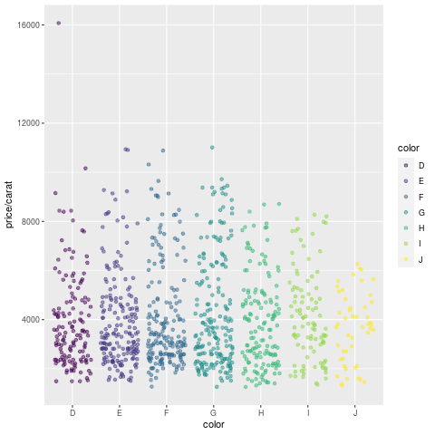

<p align="right">
  <a href="https://raw.githubusercontent.com/tgirke/GEN242/main/tutorials/quarto/quarto_index.qmd">
    
  </a>
</p>


## R Markdown Overview

R Markdown combines markdown (an easy to write plain text format) with embedded
R code chunks. When compiling R Markdown documents, the code components can be
evaluated so that both the code and its output can be included in the final
document. This makes analysis reports highly reproducible by allowing to automatically
regenerate them when the underlying R code or data changes. R Markdown
documents (`.Rmd` files) can be rendered to various formats including HTML and
PDF. The R code in an `.Rmd` document is processed by `knitr`, while the
resulting `.md` file is rendered by `pandoc` to the final output formats
(_e.g._ HTML or PDF). Historically, R Markdown is an extension of the older
`Sweave/Latex` environment. Rendering of mathematical expressions and reference
management is also supported by R Markdown using embedded Latex syntax and
Bibtex, respectively. A successor publishing environment is [Quarto](https://quarto.org)
(`.qmd` files), which is covered in the [Quarto section](#quarto-overview) below.
Note that this tutorial itself is written as a `.qmd` file, meaning all examples
shown in the R Markdown sections render identically in Quarto.

## Quick Start

### Install R Markdown

To work with this tutorial, the `rmarkdown` package needs to be installed on a system. 

```{r install_rmarkdown}
#| eval: false
install.packages("rmarkdown")

```

### Initialize a new R Markdown (`Rmd`) script

To minimize typing, it can be helful to start with an R Markdown template and
then modify it as needed. Note the file name of an R Markdown scirpt needs to
have the extension `.Rmd`. Template files for the following examples are available 
here:

+ R Markdown sample script: [`sample.Rmd`](https://raw.githubusercontent.com/tgirke/GEN242/main/static/custom/quarto/sample.Rmd)
+ Bibtex file for handling citations and reference section: [`bibtex.bib`](https://raw.githubusercontent.com/tgirke/GEN242/main/content/en/tutorials/quarto/bibtex.bib)

Users want to download these files, open the `sample.Rmd` file with their preferred R IDE 
(_e.g._ RStudio, vim or emacs), initilize an R session and then direct their R session to 
the location of these two files.


### Metadata section

The metadata section (YAML header) in an R Markdown script defines how it will be processed and 
rendered. The metadata section also includes both title, author, and date information as well as 
options for customizing the output format. For instance, PDF and HTML output can be defined 
with `pdf_document` and `html_document`, respectively. The `BiocStyle::` prefix will use the
formatting style of the [`BiocStyle`](http://bioconductor.org/packages/release/bioc/html/BiocStyle.html) 
package from Bioconductor.

```
---
title: "My First R Markdown Document"
author: "Author: First Last"
date: "Last update: `r format(Sys.time(), '%d %B, %Y')`"
output:
  BiocStyle::html_document:
    toc: true
    toc_depth: 3
    fig_caption: yes

fontsize: 14pt
bibliography: bibtex.bib
---
```

### Render `Rmd` script

An R Markdown script can be evaluated and rendered with the following `render` command or by pressing the `knit` button in RStudio.
The `output_format` argument defines the format of the output (_e.g._ `html_document` or `pdf_document`). The setting `output_format="all"` will generate 
all supported output formats. Alternatively, one can specify several output formats in the metadata section.

```{r render_rmarkdown}
#| eval: false
#| message: false
rmarkdown::render("sample.Rmd", clean=TRUE, output_format="BiocStyle::html_document")

```

The following shows two options how to run the rendering from the command-line. To render to PDF format, use the argument setting: `output_format="pdf_document"`.

```{bash render_commandline}
#| eval: false
#| message: false
$ Rscript -e "rmarkdown::render('sample.Rmd', output_format='BiocStyle::html_document', clean=TRUE)"

```

Alternatively, one can use a Makefile to evaluate and render an R Markdown
script. A sample Makefile for rendering the above `sample.Rmd` can be
downloaded [`here`](https://raw.githubusercontent.com/tgirke/GEN242-2018/refs/heads/gh-pages/_vignettes/07_Rbasics/Makefile?token=GHSAT0AAAAAADDLUNC2UYW52XPCS4PCD5LM2BNINLA).
To apply it to a custom `Rmd` file, one needs open the Makefile in a text
editor and change the value assigned to `MAIN` (line 13) to the base name of
the corresponding `.Rmd` file (_e.g._ assign `systemPipeRNAseq` if the file
name is `systemPipeRNAseq.Rmd`).  To execute the `Makefile`, run the following
command from the command-line.

```{bash render_makefile}
#| eval: false
#| message: false
$ make -B

```

### R code chunks

R Code Chunks can be embedded in an R Markdown script by using three backticks
at the beginning of a new line along with arguments enclosed in curly braces
controlling the behavior of the code. The following lines contain the
plain R code. A code chunk is terminated by a new line starting with three backticks.
The following shows an example of such a code chunk. Note the backslashes are
not part of it. They have been added to print the code chunk syntax in this document.

```
	```\{r code_chunk_name, eval=FALSE\}
	x <- 1:10
	```

```

The following lists the most important arguments to control the behavior of R code chunks:

+ `r`: specifies language for code chunk, here R
+ `chode_chunk_name`: name of code chunk; this name needs to be unique within an Rmd
+ `eval`: if assigned `TRUE` the code will be evaluated
+ `warning`: if assigned `FALSE` warnings will not be shown
+ `message`: if assigned `FALSE` messages will not be shown
+ `cache`: if assigned `TRUE` results will be cached to reuse in future rendering instances
+ `fig.height`: allows to specify height of figures in inches
+ `fig.width`: allows to specify width of figures in inches

For more details on code chunk options see [here](https://rmarkdown.rstudio.com/lesson-3.html).
If document rendering of code chunk sections becomes time consuming due to long computations, one can enable caching to improve performance. 
The corresponding [cache options](https://bookdown.org/yihui/rmarkdown-cookbook/cache.html) of the `knitr` package describes how caching works and the cache examples [here](https://yihui.org/knitr/demo/cache/) provide additional details.

### Learning Markdown

The basic syntax of Markdown and derivatives like kramdown is extremely easy to learn. Rather
than providing another introduction on this topic, here are some useful sites for learning Markdown:

+ [R Markdown Online Book](https://bookdown.org/yihui/rmarkdown/)
+ [Markdown Intro on GitHub](https://guides.github.com/features/mastering-markdown/)
+ [Markdown Cheet Sheet](https://github.com/adam-p/markdown-here/wiki/Markdown-Cheatsheet)
+ [Markdown Basics from RStudio](http://rmarkdown.rstudio.com/authoring_basics.html) 
+ [R Markdown Cheat Sheet](https://rmarkdown.rstudio.com/lesson-15.HTML)
+ [kramdown Syntax](http://kramdown.gettalong.org/syntax.html)

### Tables

There are several ways to render tables. First, they can be printed within the R code chunks. Second, 
much nicer formatted tables can be generated with the functions `kable`, `kableExtra`, `pander` or `xtable`. The following
example uses `kable` from the `knitr` package.

### With `knitr::kable`

```{r kable}
library(knitr)
kable(iris[1:12,])

```

A much more elegant and powerful solution is to create fully interactive tables with the [`DT` package](https://rstudio.github.io/DT/). 
This JavaScirpt based environment provides a wrapper to the `DataTables` library using jQuery. The resulting tables can be sorted, queried and resized by the
user. Note, R Markdown source files containing JavaScript components can only be rendered into HTML and not PDF.

### With `DT::datatable` 

```{r dt}
library(DT)
datatable(iris)

```

### Figures

Plots generated by the R code chunks in an R Markdown document can be automatically 
inserted in the output file. The size of the figure can be controlled with the `fig.height`
and `fig.width` arguments.

```{r some_jitter_plot}
library(ggplot2)
dsmall <- diamonds[sample(nrow(diamonds), 1000), ]
ggplot(dsmall, aes(color, price/carat)) + geom_jitter(alpha = I(1 / 2), aes(color=color))

```

Sometimes it can be useful to explicitly write an image to a file and then insert that 
image into the final document by referencing its file name in the R Markdown source. For 
instance, this can be useful for time consuming analyses. The following code will generate a 
file named `myplot.png`. To insert the file  in the final document, one can use standard 
Markdown or HTML syntax, _e.g._: ``.  

```{r some_custom_inserted_plot}
#| warning: false
#| message: false
png("myplot.png")
ggplot(dsmall, aes(color, price/carat)) + geom_jitter(alpha = I(1 / 2), aes(color=color))
dev.off()

```
{fig-align="center"}

### Custom functions

Custom functions can be kept in a separate R file (here [`custom_Fct.R`](https://raw.githubusercontent.com/tgirke/GEN242/main/content/en/tutorials/quarto/custom_Fct.R)) and then imported
with the `source()` command. In the following example, the `custom_Fct.R` file is located on GitHub.  

```{r import_custom_fct}
source("https://raw.githubusercontent.com/tgirke/GEN242/refs/heads/main/tutorials/quarto/custom_Fct.R")

```

Now the imported function (here `myMAcomp`) can be used.

```{r use_custom_fct}
myMA <- matrix(rnorm(100000), 10000, 10, dimnames=list(1:10000, paste("C", 1:10, sep="")))
resultDF <- myMAcomp(myMA=myMA, group=c(1,1,1,2,2,2,3,3,4,4), myfct=mean)
kable(resultDF[1:12,])

```

### Inline R code

To evaluate R code inline, one can enclose an R expression with a single back-tick
followed by `r` and then the actual expression.  For instance, the back-ticked version 
of 'r 1 + 1' evaluates to `r 1 + 1` and 'r pi' evaluates to `r pi`.

### Mathematical equations

To render mathematical equations, one can use standard Latex syntax. When expressions are 
enclosed with single `$` signs then they will be shown inline, while 
enclosing them with double `$$` signs will show them in display mode. For instance, the following 
Latex syntax `d(X,Y) = \sqrt[]{ \sum_{i=1}^{n}{(x_{i}-y_{i})^2} }` renders in display mode as follows:

$$d(X,Y) = \sqrt[]{ \sum_{i=1}^{n}{(x_{i}-y_{i})^2} }$$

To learn LaTeX syntax for mathematical equations, one can consult various online manuals, such as 
this [Wikibooks tutorial](https://en.wikibooks.org/wiki/LaTeX/Mathematics), or use an online
equation rendering and checking tool, such as this [one](https://arachnoid.com/latex/).

### Citations and bibliographies

Citations and bibliographies can be autogenerated in R Markdown in a similar
way as in Latex/Bibtex. Reference collections should be stored in a separate
file in Bibtex or other supported formats. To cite a publication in an R Markdown 
script, one uses the syntax `[@<id1>]` where `<id1>` needs to be replaced with a 
reference identifier present in the Bibtex database listed in the metadata section 
of the R Markdown script  (_e.g._ `bibtex.bib`). For instance, to cite Lawrence et al. 
(2013), one  uses its reference identifier (_e.g._ `Lawrence2013-kt`) as `<id1>` [@Lawrence2013-kt]. 
This will place the citation inline in the text and add the corresponding
reference to a reference list at the end of the output document. For the latter a 
special section called `References` needs to be specified at the end of the R Markdown script.
To fine control the formatting of citations and reference lists, users want to consult this 
[R Markdown page](http://rmarkdown.rstudio.com/authoring_bibliographies_and_citations.html).
Also, for general reference management and obtaining references in Bibtex format [Paperpile](https://paperpile.com/features) 
can be very helpful.


### Viewing R Markdown report on HPCC cluster

R Markdown reports located on UCR's HPCC Cluster can be viewed locally in a web browser (without moving 
the source HTML) by creating a symbolic link from a user's `.html` directory. This way any updates to 
the report will show up immediately without creating another copy of the HTML file. For instance, if user 
`ttest` has generated an R Markdown report under `~/bigdata/today/rmarkdown/sample.html`, then the 
symbolic link can be created as follows:

```{r rmarkdown_symbolic_link}
#| eval: false
cd ~/.html
ln -s ~/bigdata/today/rmarkdown/sample.html sample.html

```

After this one can view the report in a web browser using this URL [https://cluster.hpcc.ucr.edu/~ttest/rmarkdown/sample.html](https://cluster.hpcc.ucr.edu/~ttest/rmarkdown/sample.html).
If necessary access to the URL can be restricted with a password following the instructions [here](http://hpcc.ucr.edu/manuals_linux-cluster_sharing.html#sharing-files-on-the-web). Very
important: to set up accounts for html viewing, users have to apply the configuration settings for their accounts that are outlined on the HPCC website [here](https://hpcc.ucr.edu/manuals/hpc_cluster/sharing/#sharing-files-on-the-web).

### Viewing R Markdown report on GitHub

To host and view static HTML files on GitHub, follow the instructions [here](https://bit.ly/3MFARYY). Note, this works
only with public GitHub repos. 


## Quarto Overview {#quarto-overview}

[Quarto](https://quarto.org) is the next-generation publishing system from Posit (formerly RStudio)
that supersedes R Markdown. It uses the same underlying tools — `knitr` for executing R code and
`pandoc` for converting the resulting Markdown to output formats — so the design model and most of
the syntax carry over directly. The key differences are that Quarto is language-agnostic (R, Python,
Julia and Observable JS are all first-class citizens in the same document), uses a unified
`format:` key in the YAML header instead of `output:`, and moves chunk options from the `{r ...}`
header line to special `#|` comment lines inside the chunk. Because course projects in GEN242 must
be submitted as `.qmd` files rendered through Quarto, this section covers everything needed to write
and render them. The [Rmd vs Quarto comparison table](#rmd-vs-quarto-comparison) at the end of this
section summarises the differences at a glance.

### Install Quarto

Quarto is a standalone command-line tool that ships bundled with recent versions of RStudio (≥ 2022.07).
For standalone installation or to update to the latest release, download the installer for your
platform from <https://quarto.org/docs/get-started/>. The companion R package `quarto` provides
convenience wrappers for rendering from within an R session.

```{r install_quarto}
#| eval: false
install.packages("quarto")   # R convenience wrapper (optional)

```

To confirm that the Quarto CLI is available, run the following in a terminal.

```{bash quarto_check}
#| eval: false
quarto check

```

### Initialize a new Quarto (`.qmd`) script

Quarto source files use the `.qmd` extension. The simplest way to start is to copy an
existing `.qmd` file (such as this tutorial) and adapt it. A minimal template and the
shared Bibtex file are available here:

+ Quarto sample script: [`sample.qmd`](https://raw.githubusercontent.com/tgirke/GEN242/main/static/custom/rmarkdown/sample.qmd)
+ Bibtex file (shared with R Markdown): [`bibtex.bib`](https://raw.githubusercontent.com/tgirke/GEN242/main/content/en/tutorials/rmarkdown/bibtex.bib)

### Metadata section

The YAML header of a `.qmd` file uses `format:` instead of `output:` to specify the output
format and its options. The structure is otherwise very similar to R Markdown. The following
example produces a standalone HTML document with a floating table of contents and numbered
sections, which is the recommended format for GEN242 course project reports.

```
---
title: "My First Quarto Document"
author: "Author: First Last"
date: last-modified
format:
  html:
    toc: true
    toc-depth: 3
    number-sections: true
    fig-cap-location: bottom
bibliography: bibtex.bib
---
```

Key differences from the R Markdown YAML header:

+ `format:` replaces `output:`; the sub-key is the format name (_e.g._ `html`, `pdf`, `docx`)
+ Option names use kebab-case (`toc-depth`, `number-sections`) instead of underscores
+ `date: last-modified` automatically inserts the file modification date without any inline R expression
+ `BiocStyle` is not used; Quarto has its own theming system via `theme:` under `format: html:`

To produce PDF output, change `html:` to `pdf:`. To generate both formats in one render pass,
list them both under `format:`.

```
format:
  html:
    toc: true
  pdf:
    toc: true
```

### Render `.qmd` script

A Quarto document can be rendered from R or from the command-line. In RStudio, the **Render**
button (replacing the old **Knit** button) triggers rendering.

```{r render_quarto_r}
#| eval: false
quarto::quarto_render("sample.qmd")                        # default format from YAML
quarto::quarto_render("sample.qmd", output_format="pdf")   # override to PDF

```

From the command-line:

```{bash render_quarto_cli}
#| eval: false
quarto render sample.qmd               # uses format defined in YAML
quarto render sample.qmd --to pdf      # override output format

```

### Code chunks

Quarto code chunks open identically to R Markdown — three backticks followed by the language
name in curly braces. The difference is that chunk options are written as `#|` comment lines
_inside_ the chunk rather than as comma-separated arguments on the opening line. Both styles
are accepted by Quarto for backward compatibility, but the `#|` style is preferred because it
works consistently across all execution engines (knitr and Jupyter) and is easier to read and
edit for long option lists.

**R Markdown style (still accepted by Quarto):**

```
	```\{r chunk_name, eval=FALSE, fig.height=4\}
	x <- 1:10
	```
```

**Quarto style (preferred):**

```
	```\{r chunk_name\}
	#| eval: false
	#| fig-height: 4
	x <- 1:10
	```
```

The most important chunk options and their Quarto equivalents are listed below. Note that
option names switch from dot-separated to kebab-case in Quarto.

| R Markdown option | Quarto `#\|` option | Effect |
|---|---|---|
| `eval=TRUE/FALSE` | `#\| eval: true/false` | Execute the chunk |
| `echo=TRUE/FALSE` | `#\| echo: true/false` | Show source code |
| `warning=FALSE` | `#\| warning: false` | Suppress warnings |
| `message=FALSE` | `#\| message: false` | Suppress messages |
| `cache=TRUE` | `#\| cache: true` | Cache results |
| `fig.height=4` | `#\| fig-height: 4` | Figure height (inches) |
| `fig.width=6` | `#\| fig-width: 6` | Figure width (inches) |
| `fig.cap="..."` | `#\| fig-cap: "..."` | Figure caption |
| `out.width="80%"` | `#\| out-width: "80%"` | Rendered figure width |

Document-wide defaults for chunk options can be set once in the YAML header under
`execute:`, avoiding repetition across chunks.

```
---
execute:
  echo: true
  warning: false
  message: false
---
```

### Inline R code

Inline R code works identically to R Markdown. An inline expression is written as a
backtick followed by the letter `r`, a space, the R expression, and a closing backtick.
For instance, writing `nrow(iris)` as an inline R expression evaluates to 150 (the number
of rows in `iris`). Quarto additionally supports inline expressions for Python and Julia
by replacing `r` with `python` or `julia` respectively, when those engines are active.

### Figures and cross-references

Figure insertion and sizing work the same way as in R Markdown. Quarto additionally
supports a native cross-referencing system that does not require any extra packages. A figure
produced by a code chunk can be cross-referenced by giving the chunk a label that starts with
`fig-`:

```
	```\{r\}
	#| label: fig-jitter
	#| fig-cap: "Diamond price by color."
	#| fig-height: 4
	ggplot(dsmall, aes(color, price/carat)) +
	  geom_jitter(alpha = 0.5, aes(color = color))
	```
```

Elsewhere in the document, `@fig-jitter` renders as a numbered hyperlink (_e.g._ "Figure 1").
The same scheme applies to tables (`tbl-` prefix) and sections (`sec-` prefix, requires
`number-sections: true` in the YAML header).

### Callout blocks

Quarto introduces _callout blocks_, a convenient way to highlight notes, warnings, tips and
important information in a visually distinct box. They are written with a fenced `:::` div
syntax and are not available in standard R Markdown.

```
::: {.callout-note}
This is a note callout. Use `.callout-tip`, `.callout-warning`, `.callout-important`,
or `.callout-caution` for other styles.
:::
```

::: {.callout-note}
This is a note callout. Use `.callout-tip`, `.callout-warning`, `.callout-important`,
or `.callout-caution` for other styles.
:::

::: {.callout-tip}
Callout blocks can also have titles: add `## My Title` as the first line inside the block.
:::

::: {.callout-warning}
JavaScript-dependent output (_e.g._ `DT::datatable`) can only be rendered to HTML, not PDF —
this applies to both R Markdown and Quarto.
:::

### Quarto projects and `_quarto.yml`

When a `.qmd` file is part of a larger website or book (such as the GEN242 course site),
project-level settings are controlled by a `_quarto.yml` file in the root directory of the
project. Individual `.qmd` files inherit these settings and only need to specify
document-specific overrides in their own YAML headers. The GEN242 site `_quarto.yml` sets
the sidebar, navigation, default theme, and bibliography, which is why the YAML headers of
tutorial pages like this one are short. Students writing course project reports as standalone
files do not need a `_quarto.yml` and should include all needed settings in the document YAML
header directly.

### Viewing a Quarto report on the HPCC cluster

Quarto HTML output can be viewed on the HPCC cluster using the same symbolic-link approach
described for R Markdown above. After rendering `sample.qmd` to `sample.html`, create the
link as follows:

```{bash quarto_hpcc_link}
#| eval: false
cd ~/.html
ln -s ~/bigdata/today/quarto/sample.html sample.html

```

The report is then accessible at
`https://cluster.hpcc.ucr.edu/~<username>/quarto/sample.html`.

### Viewing a Quarto report on GitHub

Quarto HTML files can be hosted on GitHub Pages using the same workflow as R Markdown HTML
files. Follow the instructions [here](https://bit.ly/3MFARYY). Quarto also has dedicated
support for publishing to GitHub Pages via `quarto publish gh-pages`; see the
[Quarto publishing documentation](https://quarto.org/docs/publishing/github-pages.html) for
details.

### Rmd vs Quarto comparison {#rmd-vs-quarto-comparison}

The table below summarises the most important syntax differences between R Markdown and Quarto
for the features covered in this tutorial. Everything not listed here is identical between the
two systems.

| Feature | R Markdown (`.Rmd`) | Quarto (`.qmd`) |
|---|---|---|
| Output format key | `output: html_document` | `format: html` |
| HTML with TOC | `output: html_document: toc: true` | `format: html: toc: true` |
| Option naming style | `toc_depth`, `fig_caption` | `toc-depth`, `fig-cap-location` |
| Date | `format(Sys.time(), ...)` as inline R | `last-modified` |
| Chunk options | `{r name, eval=FALSE, fig.height=4}` | `#\| eval: false` / `#\| fig-height: 4` |
| Global chunk defaults | `knitr::opts_chunk$set(...)` | `execute:` block in YAML |
| Render from R | `rmarkdown::render("file.Rmd")` | `quarto::quarto_render("file.qmd")` |
| Render from CLI | `Rscript -e "rmarkdown::render(...)"` | `quarto render file.qmd` |
| Figure cross-refs | requires `bookdown` output format | native via `@fig-label` |
| Callout blocks | not available | `:::  {.callout-note}` |
| Multi-language chunks | R only (or via `reticulate`) | R, Python, Julia, Observable natively |
| Project config | `_site.yml` / `_bookdown.yml` | `_quarto.yml` |
| Math, citations, Bibtex | `[@key]`, `$...$`, `$$...$$` | identical |
| `knitr::kable`, DT, ggplot | standard | identical |
| Inline R code | backtick + `r` + expression + backtick | identical |

Additional Quarto documentation and learning resources:

+ [Quarto official documentation](https://quarto.org/docs/guide/)
+ [Quarto for R users (from R Markdown)](https://quarto.org/docs/faq/rmarkdown.html)
+ [Quarto cheatsheet](https://rstudio.github.io/cheatsheets/quarto.pdf)
+ [Awesome Quarto (community resources)](https://github.com/mcanouil/awesome-quarto)


## Session Info

```{r sessionInfo}
sessionInfo()

```

## References
