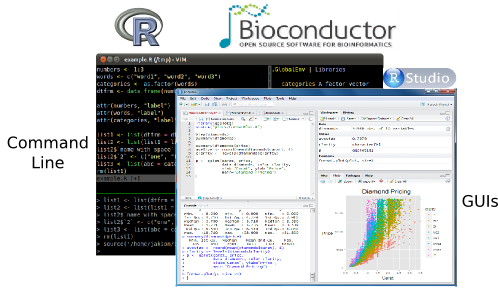
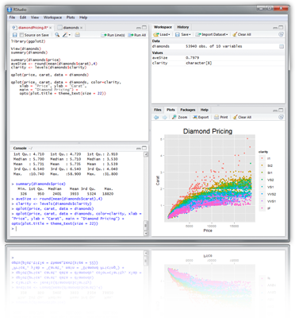

```{r setup}
#| echo: false
#| message: false
#| warning: false
suppressPackageStartupMessages({
    library(limma) 
    library(ggplot2) }) 

```


## Overview

## What is R?

[R](http://cran.at.r-project.org) is a powerful statistical environment and
programming language for the analysis and visualization of data.  The
associated [Bioconductor](http://bioconductor.org/) and CRAN package
repositories provide many additional R packages for statistical data analysis
for a wide array of research areas. The R software is free and runs on all
common operating systems. 

## Why Using R?

* Complete statistical environment and programming language
* Efficient functions and data structures for data analysis
* Powerful graphics
* Access to fast growing number of analysis packages
* Most widely used language in bioinformatics
* Is standard for data mining and biostatistical analysis
* Technical advantages: free, open-source, available for all OSs

## Books and Documentation
* simpleR - Using R for Introductory Statistics (John Verzani, 2004) - [URL](http://cran.r-project.org/doc/contrib/Verzani-SimpleR.pdf)
* Bioinformatics and Computational Biology Solutions Using R and Bioconductor (Gentleman et al., 2005) - [URL](http://www.bioconductor.org/help/publications/books/bioinformatics-and-computational-biology-solutions/)
* More on this see "Finding Help" section in UCR Manual - [URL](http://manuals.bioinformatics.ucr.edu/home/R\_BioCondManual\#TOC-Finding-Help)

## R Working Environments

{fig-align="center"}Some R working environments with support for syntax highlighting and utilities to send code 
to the R console: 

* [RStudio/Posit Desktop](https://www.rstudio.com/products/rstudio/features): excellent choice for beginners ([Cheat Sheets](https://posit.co/resources/cheatsheets/?type=posit-cheatsheets/))
* [RStudio/Posit Server](https://posit.co/download/rstudio-server/): web-based UI for RStudio. Available at UCR via [onDemand](https://hpcc.ucr.edu/manuals/hpc_cluster/selected_software/ondemand/#rstudio-on-ondemand) (old standalone [web instance]() will be discontinued).
* [RStudio/Posit Cloud](https://rstudio.cloud/): cloud-based RStudio Server 
* [Vim-R-Tmux](../linux/index.qmd#nvim-r-tmux-essentials): R working environment based on vim and tmux. 
* [Emacs](http://www.xemacs.org/Download/index.html) ([ESS add-on package](http://ess.r-project.org/))
* [gedit](https://wiki.gnome.org/Apps/Gedit), [Rgedit](http://rgedit.sourceforge.net/), [RKWard](https://rkward.kde.org/), [Eclipse](http://www.walware.de/goto/statet), [Tinn-R](http://www.sciviews.org/Tinn-R/), [Notepad++](https://notepad-plus-plus.org/), [NppToR](http://sourceforge.net/projects/npptor/)
	
### Example: RStudio 

New integrated development environment (IDE) for [R](http://www.rstudio.com/ide/download/). Highly functional for both beginners and 
advanced.

{fig-align="center"}Some userful shortcuts: `Ctrl+Enter` (send code), `Ctrl+Shift+C` (comment/uncomment), `Ctrl+1/2` (switch window focus)

### Example: Nvim-R-Tmux

Terminal-based Working Environment for R: [Nvim-R-Tmux](https://girke.bioinformatics.ucr.edu/GEN242/custom/slides/R_for_HPC/NvimR.html#1). 

{fig-align="center"}Install and usage instructions for Nvim-R are provided in this [slide show](https://girke.bioinformatics.ucr.edu/GEN242/custom/slides/R_for_HPC/NvimR.html#11) and 
[this tutorial](../linux/index.qmd#quick-configuration-in-user-accounts-of-ucrs-hpcc). The most detailed instructions
can be found on the [Nvim-R_Tmux](https://github.com/tgirke/Nvim-R_Tmux) GitHub repos.

## R Package Repositories

* CRAN (>14,000 packages) general data analysis - [URL](http://cran.at.r-project.org/)
* Bioconductor (>2,000 packages) bioscience data analysis - [URL](http://www.bioconductor.org/)
* Omegahat (>90 packages) programming interfaces - [URL](https://github.com/omegahat?tab=repositories)
* RStudio packages - [URL](https://www.rstudio.com/products/rpackages/)

## Working routine for tutorials

When working in R, a good practice is to write all commands directly into an [R script](../rprogramming/index.qmd#r-scripts), instead of the R console, and then send the commands for execution to the R console with the `Ctrl+Enter` shortcut in RStudio/Posit, or similar shortcuts in other R coding environments, such as [Nvim-R](../linux/index.qmd#nvim-r-tmux-essentials). This way all work is preserved and can be reused in the future. 

The following instructions in this section provide a short overview of the standard working routine users should use to load R-based tutorials of this website into an R IDE (Nvim-R or RStudio).
For Nvim-R on HPCC users can visit the Quick Demo slide [here](https://girke.bioinformatics.ucr.edu/GEN242/custom/slides/R_for_HPC/NvimR.html#11).


**Step 1.** Download `*.Rmd` or `*.R` file. These so called source files are always linked on the top right corner of each tutorial. The ones for this tutorial are [here](../rbasics/rbasics_index.qmd).
   The file download can be accomplished via `download.file` from within R (see below), `wget` from the command-line or with the save function in a user's web browser. The following downloads the `Rmd` file of this tutorial via `download.file` from the R console.

```{r download_file}
#| eval: false
download.file("https://raw.githubusercontent.com/tgirke/GEN242//main/content/en/tutorials/rbasics/Rbasics.Rmd", "Rbasics.Rmd") 

```

2. Load `*.Rmd` or `*.R` file in Neovim (Nvim-R) or RStudio.

3. Send code from code editor to R console by pushing `space bar` in Neovim (Nvim-R) or `Ctrl + Enter` in RStudio. In `*.Rmd` files the code lines are in so called [code chunks](../rmarkdown/index.qmd#r-code-chunks) and only those
   ones can be sent to the console. To obtain in Neovim a connected R session one has to initiate by pressing the `\rf` key combination. For details see [here](https://girke.bioinformatics.ucr.edu/GEN242/custom/slides/R_for_HPC/NvimR.html#11).


## Installation of R, RStudio and R Packages

1. Install R for your operating system from [CRAN](http://cran.at.r-project.org/).

2. Install RStudio from [RStudio](http://www.rstudio.com/ide/download).

3. Install CRAN Packages from R console like this:

```{r install_cran}
#| eval: false
install.packages(c("pkg1", "pkg2")) 
install.packages("pkg.zip", repos=NULL)

```

4. Install [Bioconductor](https://bioconductor.org/packages/release/BiocViews.html#___Software) packages as follows:

```{r install_bioc}
#| eval: false
if (!requireNamespace("BiocManager", quietly = TRUE))
    install.packages("BiocManager") # Installs BiocManager if not available yet
BiocManager::version() # Reports Bioconductor version
BiocManager::install(c("pkg1", "pkg2")) # Installs packages specified under "pkg1" 

```

5. For more details consult the [Bioc Install page](http://www.bioconductor.org/install/)
   and [BiocManager](https://cran.r-project.org/web/packages/BiocManager/vignettes/BiocManager.html) package.

6. Instructions for upgrading R and packages to newer versions are given at the end of this tutorial [here](#upgrading-to-new-rbioc-versions).

## Getting Around

### Startup and Closing Behavior

* __Starting R__:
The R GUI versions, including RStudio, under Windows and Mac OS X can be
opened by double-clicking their icons. Alternatively, one can start it by
typing `R` in a terminal (default under Linux). 

* __Startup/Closing Behavior__:
The R environment is controlled by hidden files in the startup directory:
`.RData`, `.Rhistory` and `.Rprofile` (optional). 
	

* __Closing R__:

```
q()  

```
```
Save workspace image? [y/n/c]:

```
        
* __Note__:
    When responding with `y`, then the entire R workspace will be written to
    the `.RData` file which can become very large. Often it is better to select `n` here,
    because a much better working pratice is to save an analysis protocol to an `R` or `Rmd` source file. 
    This way one can quickly regenerate all data sets and objects needed in a future session. 

## Navigating directories

List objects in current R session

```{r r_ls}
#| eval: false
ls()

```

Return content of current working directory

```{r r_dirshow}
#| eval: false
dir()

```

Return path of current working directory

```{r r_dirpath}
#| eval: false
getwd()

```

Change current working directory

```{r r_setwd}
#| eval: false
setwd("/home/user")

```

Checking information about files (collection of useful commands)

```{r r_list_files}
#| eval: false
list.files(path="./", pattern="*.txt$", full.names=TRUE) # lists files in directory
file.exists(c("file1", "file2")) # check if provided files exist
file.size(list.files(path="./", pattern=".txt$", full.names=TRUE)) # return file sizes
file.info(list.files(path="./", pattern=".txt$", full.names=TRUE)) # retrive detailed information about files

```

## Basic Syntax

Create an object with the assignment operator `<-` or `=`

```{r r_assignment}
#| eval: false
object <- ...

```

General R command syntax

```{r r_syntax}
#| eval: false
object <- function_name(arguments) 
object <- object[arguments] 

```

Instead of the assignment operator one can use the `assign` function

```{r r_assign_fct}
#| eval: false
assign("x", function(arguments))

```

To simplify chaining of serveral operations, `dplyr` (`magrittr`) provides the `%>%` (pipe) operator,
where `x %>% f(y)` turns into `f(x, y)`. This way one can pipe together multiple
operations by writing them from left-to-right or top-to-bottom. This makes for
easy to type and readable code. Details on this are provided in the dplyr tutorial [here](../dplyr/index.qmd).


```{r r_pipes}
#| eval: false
... %>% ...

```

Finding help

```{r r_find_help}
#| eval: false
?function_name

```

Load one or more R packages (libraries)

```{r r_package_load}
#| eval: false
library("my_library") # Single package
lapply(c("my_library1", "my_library2"), require, character.only = TRUE) # Multiple packages

```

List functions defined by a library

```{r r_package_functions}
#| eval: false
library(help="my_library")

```

Load library manual (PDF or HTML file)

```{r r_load_vignette}
#| eval: false
vignette("my_library") 

```

Execute an R script from within R

```{r r_execute_script}
#| eval: false
source("my_script.R")

```

Execute an R script from command-line (the first of the three options is preferred)

```{bash sh_execute_script}
#| eval: false
$ Rscript my_script.R
$ R CMD BATCH my_script.R 
$ R --slave < my_script.R 

```

## Data Types 

### Numeric data

Example: `1, 2, 3, ...`

```{r r_numeric_data}

x <- c(1, 2, 3)
x
is.numeric(x)
as.character(x)

```

### Character data

Example: `"a", "b", "c", ...`

```{r r_character_data}
x <- c("1", "2", "3")
x
is.character(x)
as.numeric(x)

```

### Complex data

Example: mix of both

```{r r_complex_data}
c(1, "b", 3)

```

### Logical data

Example: `TRUE` of `FALSE`

```{r r_logical_data}
x <- 1:10 < 5
x  
!x
which(x) # Returns index for the 'TRUE' values in logical vector

```

## Data Objects

### Object types

* List of common object types
    * `vectors`: ordered collection of numeric, character, complex and logical values.
    * `factors`: special type vectors with grouping information of its components
    * `data.frames` including modern variants `DataFrame`, `tibbles`, etc.: two dimensional structures with different data types
    * `matrices`: two dimensional structures with data of same type
    * `arrays`: multidimensional arrays of vectors
    * `lists`: general form of vectors with different types of elements
    * `functions`: piece of code
    * Many more ...

* Simple rules for naming objects and their components
    * Object, row and column names should not start with a number
    * Avoid spaces in object, row and column names
    * Avoid special characters like '#'


#### Vectors (1D)

Definition: `numeric` or `character`

```{r r_vector_object}
myVec <- 1:10; names(myVec) <- letters[1:10]  
myVec <- setNames(1:10, letters[1:10]) # Same as above in single step
myVec[1:5]
myVec[c(2,4,6,8)]
myVec[c("b", "d", "f")]

```

#### Factors (1D)

Definition: vectors with grouping information

```{r r_factor_object}
factor(c("dog", "cat", "mouse", "dog", "dog", "cat"))

```

#### Matrices (2D)

Definition: two dimensional structures with data of same type

```{r r_matrix_object}
myMA <- matrix(1:30, 3, 10, byrow = TRUE) 
class(myMA)
myMA[1:2,]
myMA[1, , drop=FALSE]
class(as.data.frame(myMA)) # convert matrix to data.frame 

```

#### Data Frames (2D)

Definition: `data.frames` are two dimensional objects with data of variable types

```{r r_dataframe_object}
myDF <- data.frame(Col1=1:10, Col2=10:1) 
myDF[1:2, ]
class(as.matrix(myDF)) # convert data.frame to matrix

```

#### Tibbles

`Tibbles` are a more modern version of `data.frames`. Among many other advantages, one can see
here that `tibbles` have a nicer printing bahavior. Much more detailed information on this object
class is provided in the [`dplyr/tidyverse`](../dplyr/index.qmd) manual section.

```{r r_tibble_object}
library(tidyverse)
as_tibble(iris)

```

__Note:__ The above example uses the `iris` test dataset that is available in every R installation without explicitly importing or loading it. The following examples will often make use of this dataset.


#### Arrays

Definition: data structure with one, two or more dimensions


#### Lists

Definition: containers for any object type

```{r r_list_object}
myL <- list(name="Fred", wife="Mary", no.children=3, child.ages=c(4,7,9)) 
myL
myL[[4]][1:2] 

```

## Functions

Definition: piece of code

```{r r_function_object}
#| eval: false
myfct <- function(arg1, arg2, ...) { 
	function_body 
}

```

## Subsetting of data objects

__(1.) Subsetting by positive or negative index/position numbers__

```{r r_subset_by_index}
myVec <- 1:26; names(myVec) <- LETTERS 
myVec[1:4]

```

__(2.) Subsetting by same length logical vectors__

```{r r_subset_by_logical}
myLog <- myVec > 10
myVec[myLog] 

```	

__(3.) Subsetting by field names__

```{r r_subset_by_names}
myVec[c("B", "K", "M")]

```

__(4.) Subset with `$` sign__: references a single column or list component by its name 

```{r r_subset_by_dollar}
iris$Species[1:8]

```

## Important Utilities
	
### Combining Objects

The `c` function combines vectors and lists

```{r r_combine_vectors}
c(1, 2, 3)
x <- 1:3; y <- 101:103
c(x, y)

```

The `cbind` and `rbind` functions can be used to append columns and rows, respecively.

```{r r_cbind_rbind}
ma <- cbind(x, y)
ma
rbind(ma, ma)

```

### Accessing Dimensions of Objects

Length and dimension information of objects

```{r r_length_dim}
length(iris$Species)
dim(iris)

```

### Accessing Name Slots of Objects

Accessing row and column names of 2D objects

```{r col_row_names}
rownames(iris)[1:8]
colnames(iris)

```

Return name field of vectors and lists

```{r name_slots}
names(myVec)
names(myL)

```

### Sorting Objects

The function `sort` returns a vector in ascending or descending order.

```{r sort_objects}
sort(10:1)

```

The function `order` returns a sorting index for sorting an object alphanumerically.

```{r order_objects}
sortindex <- order(iris[,1], decreasing = FALSE)
sortindex[1:12]
iris[sortindex,][1:2,]
sortindex <- order(-iris[,1]) # Same as decreasing=TRUE

```
Sorting multiple columns

```{r order_columns}
iris[order(iris$Sepal.Length, iris$Sepal.Width),][1:2,]

```

### Check differences 

To check whether the values in two objects are the same, one can use the `==` comparison operator.
The `all` function allows to find out whether all values are the same. To check whether two objects
are exactly identical, use the `identical` function.

```{r identity}
myma <- iris[1:2,]
myma == iris[1:2,]
all(myma == iris[1:2,])
myma[1,1] <- 1 # changes value in first cell
all(myma == iris[1:2,])

```

## Operators and Calculations

### Comparison Operators

Comparison operators: `==`, `!=`, `<`, `>`, `<=`, `>=`

```{r comparison_operators}
1==1

```
Logical operators for boolean operations: AND: `&`, OR: `|`, NOT: `!`

```{r logical_operators}
x <- 1:10; y <- 10:1
x > y & x > 5

```

### Basic Calculations

To look up math functions, see Function Index [here](http://cran.at.r-project.org/doc/manuals/R-intro.html#Function-and-variable-index)

```{r logical_calculations}
x + y
sum(x)
mean(x)
apply(iris[1:6,1:3], 1, mean) 

```

## Reading and Writing External Data
### Import of tabular data

Import of a tab-delimited tabular file

```{r read_delim}
#| eval: false
myDF <- read.delim("myData.xls", sep="\t")

```

Import of Google Sheets. The following example imports a sample Google Sheet from [here](https://docs.google.com/spreadsheets/d/1U-32UcwZP1k3saKeaH1mbvEAOfZRdNHNkWK2GI1rpPM/edit#gid=472150521).
Detailed instructions for interacting from R with Google Sheets with the required `googlesheets4` package are [here](https://googlesheets4.tidyverse.org/).

```{r read_gs}
#| eval: false
library(googlesheets4)
gs4_deauth() # Easiest method for reading public access sheets
mysheet <- read_sheet("1U-32UcwZP1k3saKeaH1mbvEAOfZRdNHNkWK2GI1rpPM", skip=4)
myDF <- as.data.frame(mysheet)
myDF

```

Import from Excel sheets works well with `readxl`. For details see the `readxl` package manual [here](https://readxl.tidyverse.org/). Note: working with tab- or comma-delimited files is more flexible and highly preferred for automated analysis workflows.

```{r read_readxl}
#| eval: false
library("readxl")
mysheet <- read_excel(targets_path, sheet="Sheet1")

```

Additional import functions are described in the `readr` package section [here](../dplyr/index.qmd#reading-and-writing-tabular-files).

### Export of tabular data

```{r write_table}
#| eval: false
write.table(myDF, file="myfile.xls", sep="\t", quote=FALSE, col.names=NA)

```

### Line-wise import

```{r readlines}
#| eval: false
myDF <- readLines("myData.txt")

```

### Line-wise export

```{r writelines}
#| eval: false
writeLines(month.name, "myData.txt")

```

### Export R object

```{r saveRDSlist}
#| eval: false
mylist <- list(C1=iris[,1], C2=iris[,2]) # Example to export
saveRDS(mylist, "mylist.rds")

```

### Import R object

```{r readRDSlist}
#| eval: false
mylist <- readRDS("mylist.rds")

```

### Copy and paste into R

On Windows/Linux systems

```{r paste_windows}
#| eval: false
read.delim("clipboard") 

```
On Mac OS X systems

```{r paste_osx}
#| eval: false
read.delim(pipe("pbpaste")) 

```

### Copy and paste from R 

On Windows/Linux systems

```{r copy_windows}
#| eval: false
write.table(iris, "clipboard", sep="\t", col.names=NA, quote=FALSE) 

```

On Mac OS X systems

```{r copy_osx}
#| eval: false
zz <- pipe('pbcopy', 'w')
write.table(iris, zz, sep="\t", col.names=NA, quote=FALSE)
close(zz) 

```

### Homework 3A 

Homework 3A: [Object Subsetting Routines and Import/Export](../../assignments/homework/hw03/index.qmd)

## Useful R Functions

### Unique entries

Make vector entries unique with `unique`

```{r unique}
length(iris$Sepal.Length)
length(unique(iris$Sepal.Length))

```

### Count occurrences

Count occurrences of entries with `table`

```{r table}
table(iris$Species)

```

### Aggregate data

Compute aggregate statistics with `aggregate`

```{r aggregate}
aggregate(iris[,1:4], by=list(iris$Species), FUN=mean, na.rm=TRUE)

```

### Intersect data

Compute intersect between two vectors with `%in%`

```{r intersect}
month.name %in% c("May", "July")

```

### Merge data frames

Join two data frames by common field entries with `merge` (here row names `by.x=0`). To obtain only the common rows, change `all=TRUE` to `all=FALSE`. To merge on specific columns, refer to them by their position numbers or their column names.

```{r merge}
frame1 <- iris[sample(1:length(iris[,1]), 30), ]
frame1[1:2,]
dim(frame1)
my_result <- merge(frame1, iris, by.x = 0, by.y = 0, all = TRUE)
dim(my_result)

```

## Graphics in R

### Advantages

- Powerful environment for visualizing scientific data
- Integrated graphics and statistics infrastructure
- Publication quality graphics
- Fully programmable 
- Highly reproducible
- Full [LaTeX](http://www.latex-project.org/) and Markdown support via `knitr` and `R markdown`
- Vast number of R packages with graphics utilities

### Documentation for R Graphics

__General__

- Graphics Task Page - [URL](http://cran.r-project.org/web/views/Graphics.html)
- R Graph Gallery - [URL](http://addictedtor.free.fr/graphiques/allgraph.php)
- R Graphical Manual - [URL](http://cged.genes.nig.ac.jp/RGM2/index.php)
- Paul Murrell's book R (Grid) Graphics - [URL](http://www.stat.auckland.ac.nz/~paul/RGraphics/rgraphics.html)

__Interactive graphics__

- rggobi` (GGobi) - [URL](http://www.ggobi.org/)
- `iplots` - [URL](http://www.rosuda.org/iplots/)
- Open GL (`rgl`) - [URL](http://rgl.neoscientists.org/gallery.shtml)

### Graphics Environments

__Viewing and saving graphics in R__

- On-screen graphics
- postscript, pdf, svg
- jpeg, png, wmf, tiff, ...

__Four major graphic environments__

(a) Low-level infrastructure

- R Base Graphics (low- and high-level)
- `grid`: [Manual](http://www.stat.auckland.ac.nz/~paul/grid/grid.html)
        
(b) High-level infrastructure
        \begin{itemize}
- `lattice`: [Manual](http://lmdvr.r-forge.r-project.org), [Intro](http://www.his.sunderland.ac.uk/~cs0her/Statistics/UsingLatticeGraphicsInR.htm), [Book](http://www.amazon.com/Lattice-Multivariate-Data-Visualization-Use/dp/0387759689)
- `ggplot2`: [Manual](http://had.co.nz/ggplot2/), [Intro](http://www.ling.upenn.edu/~joseff/rstudy/summer2010_ggplot2_intro.html), [Book](http://had.co.nz/ggplot2/book/)

### Base Graphics: Overview

__Important high-level plotting functions__

- `plot`: generic x-y plotting
- `barplot`: bar plots
- `boxplot`: box-and-whisker plot
- `hist`: histograms
- `pie`: pie charts
- `dotchart`: cleveland dot plots
- `image, heatmap, contour, persp`: functions to generate image-like plots
- `qqnorm, qqline, qqplot`: distribution comparison plots
- `pairs, coplot`: display of multivariant data

__Help on graphics functions__

- `?myfct`
- `?plot`
- `?par`

#### Preferred Object Types

- Matrices and data frames
- Vectors
- Named vectors

### Scatter Plots

### Basic Scatter Plot

Sample data set for subsequent plots

```{r sample_data}
set.seed(1410)
y <- matrix(runif(30), ncol=3, dimnames=list(letters[1:10], LETTERS[1:3]))
y

```

Plot data

```{r basic_scatter_plot}
plot(y[,1], y[,2]) 

```

#### All pairs

```{r pairs_scatter_plot}
pairs(y) 

```

#### With labels

```{r labels_scatter_plot}
plot(y[,1], y[,2], pch=20, col="red", main="Symbols and Labels")
text(y[,1]+0.03, y[,2], rownames(y))

```

### More examples

__Print instead of symbols the row names__

```{r row_scatter_plot}
plot(y[,1], y[,2], type="n", main="Plot of Labels")
text(y[,1], y[,2], rownames(y)) 

```

__Usage of important plotting parameters__

```{r plot_usage}
#| eval: false
grid(5, 5, lwd = 2) 
op <- par(mar=c(8,8,8,8), bg="lightblue")
plot(y[,1], y[,2], type="p", col="red", cex.lab=1.2, cex.axis=1.2, 
     cex.main=1.2, cex.sub=1, lwd=4, pch=20, xlab="x label", 
     ylab="y label", main="My Main", sub="My Sub")
par(op)

```
__Important arguments__

- `mar`: specifies the margin sizes around the plotting area in order: `c(bottom, left, top, right)` 
- `col`: color of symbols
- `pch`: type of symbols, samples: `example(points)`
- `lwd`: size of symbols
- `cex.*`: control font sizes
- For details see `?par`


#### Add regression line 

```{r plot_regression}
plot(y[,1], y[,2])
myline <- lm(y[,2]~y[,1]); abline(myline, lwd=2) 
summary(myline) 

```

#### Log scale

Same plot as above, but on log scale

```{r plot_regression_log}
plot(y[,1], y[,2], log="xy") 

```

#### Add a mathematical expression

```{r plot_regression_math}
plot(y[,1], y[,2]); text(y[1,1], y[1,2], expression(sum(frac(1,sqrt(x^2*pi)))), cex=1.3) 

```

### Homework 3B 

Homework 3B: [Scatter Plots](../../assignments/homework/hw03/index.qmd)


### Line Plots

#### Single data set

```{r plot_line_single}
plot(y[,1], type="l", lwd=2, col="blue") 

```

#### Many Data Sets

Plots line graph for all columns in data frame `y`. The `split.screen` function is used in this example in a for loop to overlay several line graphs in the same plot. 

```{r plot_line_many}
split.screen(c(1,1)) 
plot(y[,1], ylim=c(0,1), xlab="Measurement", ylab="Intensity", type="l", lwd=2, col=1)
for(i in 2:length(y[1,])) { 
	screen(1, new=FALSE)
	plot(y[,i], ylim=c(0,1), type="l", lwd=2, col=i, xaxt="n", yaxt="n", ylab="", xlab="", main="", bty="n") 
}
close.screen(all=TRUE) 

```

### Bar Plots 

#### Basics

```{r plot_bar_simple}
barplot(y[1:4,], ylim=c(0, max(y[1:4,])+0.3), beside=TRUE, legend=letters[1:4]) 
text(labels=round(as.vector(as.matrix(y[1:4,])),2), x=seq(1.5, 13, by=1) + sort(rep(c(0,1,2), 4)), y=as.vector(as.matrix(y[1:4,]))+0.04) 

```

The `barplot` function has a convenient default behavior when the input data are provided as `matrix` containing row and column names. The column names are used in the `barplot` as group labels (here A to C) and the row names as labels for each measurement within a group (here: a to d). When working with a `data.frame` or `tibble`, use `as.matrix` to coerce the input to a `matrix`; and to populate or change the rownames or colnames slots, use `rownames(y) <- ...` or `colnames(y) <- ...`, respectively. 

#### Error Bars

```{r plot_bar_error}
bar <- barplot(m <- rowMeans(y) * 10, ylim=c(0, 10))
stdev <- sd(t(y))
arrows(bar, m, bar, m + stdev, length=0.15, angle = 90)

```

### Histograms

```{r plot_hist}
hist(y, freq=TRUE, breaks=10)

```

### Density Plots

```{r plot_dens}
plot(density(y), col="red")

```

### Pie Charts

```{r plot_pie}
pie(y[,1], col=rainbow(length(y[,1]), start=0.1, end=0.8), clockwise=TRUE)
legend("topright", legend=row.names(y), cex=1.3, bty="n", pch=15, pt.cex=1.8, 
col=rainbow(length(y[,1]), start=0.1, end=0.8), ncol=1) 

```

### Color Selection Utilities

Default color palette and how to change it

```{r color_palette}
palette()
palette(rainbow(5, start=0.1, end=0.2))
palette()
palette("default")

```

The `gray` function allows to select any type of gray shades by providing values from 0 to 1

```{r color_grey}
gray(seq(0.1, 1, by= 0.2))

```

Color gradients with `colorpanel` function from `gplots` library`

```{r color_gradient}
library(gplots)
colorpanel(5, "darkblue", "yellow", "white")

```
Much more on colors in R see Earl Glynn's color chart [here](http://research.stowers-institute.org/efg/R/Color/Chart/)


### Saving Graphics to File

After the `pdf()` command all graphs are redirected to file `test.pdf`. Works for all common formats similarly: jpeg, png, ps, tiff, ...

```{r save_graphics}
#| eval: false
pdf("test.pdf")
plot(1:10, 1:10)
dev.off() 

```

Generates Scalable Vector Graphics (SVG) files that can be edited in vector graphics programs, such as InkScape.

```{r save_graphics_svg}
#| eval: false
library("RSvgDevice")
devSVG("test.svg")
plot(1:10, 1:10)
dev.off() 

```


### Homework 3C

Homework 3C: [Bar Plots](../../assignments/homework/hw03/index.qmd)

## Analysis Routine

### Overview

The following exercise introduces a variety of useful data analysis utilities in R. 

### Analysis Routine: Data Import

- __Step 1__: To get started with this exercise, direct your R session to a dedicated workshop directory and download into this directory the following sample tables. Then import the files into Excel and save them as tab delimited text files.

    - [MolecularWeight_tair7.xls](https://cluster.hpcc.ucr.edu/~tgirke/Documents/R_BioCond/Samples/MolecularWeight_tair7.xls)
    - [TargetP_analysis_tair7.xls](https://cluster.hpcc.ucr.edu/~tgirke/Documents/R_BioCond/Samples/TargetP_analysis_tair7.xls)

__Import the tables into R__

Import molecular weight table

```{r import_data1}
#| eval: false
my_mw <- read.delim(file="MolecularWeight_tair7.xls", header=TRUE, sep="\t") 
my_mw[1:2,]

``` 

Import subcelluar targeting table

```{r import_data2}
#| eval: false
my_target <- read.delim(file="TargetP_analysis_tair7.xls", header=TRUE, sep="\t") 
my_target[1:2,]

```

Online import of molecular weight table

```{r import_data1b}
my_mw <- read.delim(file="http://faculty.ucr.edu/~tgirke/Documents/R_BioCond/Samples/MolecularWeight_tair7.xls", header=TRUE, sep="\t") 
my_mw[1:2,]

``` 

Online import of subcelluar targeting table

```{r import_data2b}
my_target <- read.delim(file="http://faculty.ucr.edu/~tgirke/Documents/R_BioCond/Samples/TargetP_analysis_tair7.xls", header=TRUE, sep="\t") 
my_target[1:2,]

```

### Merging Data Frames

- __Step 2__: Assign uniform gene ID column titles

```{r col_names_uni}
colnames(my_target)[1] <- "ID"
colnames(my_mw)[1] <- "ID" 

```

- __Step 3__: Merge the two tables based on common ID field

```{r merge_tables}
my_mw_target <- merge(my_mw, my_target, by.x="ID", by.y="ID", all.x=TRUE)

```

- __Step 4__: Shorten one table before the merge and then remove the non-matching rows (NAs) in the merged file

```{r merge_tables_shorten}
my_mw_target2a <- merge(my_mw, my_target[1:40,], by.x="ID", by.y="ID", all.x=TRUE)  # To remove non-matching rows, use the argument setting 'all=FALSE'.
my_mw_target2 <- na.omit(my_mw_target2a) # Removes rows containing "NAs" (non-matching rows).

```

- __Homework 3D__: How can the merge function in the previous step be executed so that only the common rows among the two data frames are returned? Prove that both methods - the two step version with `na.omit` and your method - return identical results. 
- __Homework 3E__: Replace all `NAs` in the data frame `my_mw_target2a` with zeros.

```{r homework3D_solutions}
#| eval: false
#| echo: false
my_mw_target_tmp <- merge(my_mw, my_target[1:40,], by.x="ID", by.y="ID", all=FALSE) 
all(my_mw_target2 == my_mw_target_tmp)
my_mw_target2a <- as.matrix(my_mw_target2a)
my_mw_target2a[is.na(my_mw_target2a)] <- 0
my_mw_target2a <- as.data.frame(my_mw_target2a)

```

### Filtering Data

- __Step 5__: Retrieve all records with a value of greater than 100,000 in 'MW' column and 'C' value in 'Loc' column (targeted to chloroplast).

```{r filter_tables1}
query <- my_mw_target[my_mw_target[, 2] > 100000 & my_mw_target[, 4] == "C", ] 
query[1:4, ]
dim(query)

```

- __Homework 3F__: How many protein entries in the `my`_mw`_target` data frame have a MW of greater then 4,000 and less then 5,000. Subset the data frame accordingly and sort it by MW to check that your result is correct.


### String Substitutions

- __Step 6__: Use a regular expression in a substitute function to generate a separate ID column that lacks the gene model extensions.

```{r string_sub}
my_mw_target3 <- data.frame(loci=gsub("\\..*", "", as.character(my_mw_target[,1]), perl = TRUE), my_mw_target)
my_mw_target3[1:3,1:8]

```

- __Homework 3G__: Retrieve those rows in `my_mw_target3` where the second column contains the following identifiers: `c("AT5G52930.1", "AT4G18950.1", "AT1G15385.1", "AT4G36500.1", "AT1G67530.1")`. Use the `%in%` function for this query. As an alternative approach, assign the second column to the row index of the data frame and then perform the same query again using the row index. Explain the difference of the two methods.

### Calculations on Data Frames

- __Step 7__: Count the number of duplicates in the loci column with the `table` function and append the result to the data frame with the `cbind` function.

```{r calcul_1}
mycounts <- table(my_mw_target3[,1])[my_mw_target3[,1]]
my_mw_target4 <- cbind(my_mw_target3, Freq=mycounts[as.character(my_mw_target3[,1])]) 

```

- __Step 8__: Perform a vectorized devision of columns 3 and 4 (average AA weight per protein)

```{r calcul_2}
data.frame(my_mw_target4, avg_AA_WT=(my_mw_target4[,3] / my_mw_target4[,4]))[1:2,] 

```

- __Step 9__: Calculate for each row the mean and standard deviation across several columns

```{r calcul_3}
mymean <- apply(my_mw_target4[,6:9], 1, mean)
mystdev <- apply(my_mw_target4[,6:9], 1, sd, na.rm=TRUE)
data.frame(my_mw_target4, mean=mymean, stdev=mystdev)[1:2,5:12] 

```

### Plotting Example

- __Step 10__: Generate scatter plot for the 'MW' and 'Residues' columns.

```{r plot_example}
plot(my_mw_target4[1:500,3:4], col="red")

```

### Export Results and Run Entire Exercise as Script

- __Step 11__: Write the data frame `my_mw_target4` into a tab-delimited text file and inspect it in Excel.

```{r export_example}
write.table(my_mw_target4, file="my_file.xls", quote=FALSE, sep="\t", col.names = NA) 

```

- __Homework 3H__: Write all commands from this exercise into an R script named `exerciseRbasics.R`, or download it from [here](http://faculty.ucr.edu/~tgirke/Documents/R_BioCond/My_R_Scripts/exerciseRbasics.R). For demonstration the downloadable script version contains code for generating some additional plots that are not part of this exercise. Then execute the script with the `source` function like this: `source("exerciseRbasics.R")`. This will run all commands of this exercise and generate the corresponding output files in the current working directory. For homework 3H it is not necessary to submit the result files generated by the `exerciseRbasics.R` script. Stating how the script was executed (_e.g._ `source` or `Rscript` command) will be sufficient.  

```{r source_example}
#| eval: false
source("exerciseRbasics.R")

```

Or run it from the command-line (not from R!) with `Rscript` like this:

```
Rscript exerciseRbasics.R

```

## Miscellaneous Topics

### Upgrading to New R/Bioc Versions

 When upgrading to a new R version, it is important to understand that a reinstall of
 all R packages is necessary because CRAN/Bioc packages are developed and tested for specific
 R versions. This means when upgrading R, then the corresponding packages need to
 be upgraded to the versions that match the new R version. The following steps will work 
 in many situations.


**Step 1.** Export a list of all packages installed in a current version of R to a file 
   (below named `my_R_pkgs.txt`) by running the following
   commands from within R (or use `Rscript -e` from command-line)

```{r export_packages}
#| eval: false
my_R_pkgs <- rownames(installed.packages())
writeLines(my_R_pkgs, "my_R_pkgs.txt")

```

2. Install new version of R, and then from within the new R version all
   packages one had installed before. The first install command below installs
   first a series of packages that are useful to have in general no matter
   what. Custom packages are then installed in the next lines. Note, this
   can only install packages from CRAN and Bioconductor. Packages from custom
   sources, including private GitHub accounts, need to be installed separately.
   Usually, one can identify them by the report generated at the end of the below install
   routine telling which packages are not available on CRAN or
   Bioconductor. 


```{r install_packages}
#| eval: false
install.packages(c("devtools", "tidyverse", "BiocManager"))
BiocManager::install(version = "3.19") # look up current Bioc version here: https://bit.ly/3NADnll
my_R_pkgs <- readLines("my_R_pkgs.txt")
BiocManager::install(my_R_pkgs)

```

## Session Info

```
sessionInfo()

```

## References

