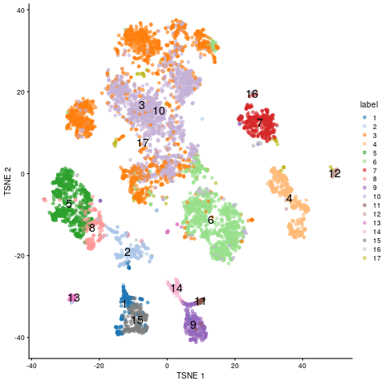
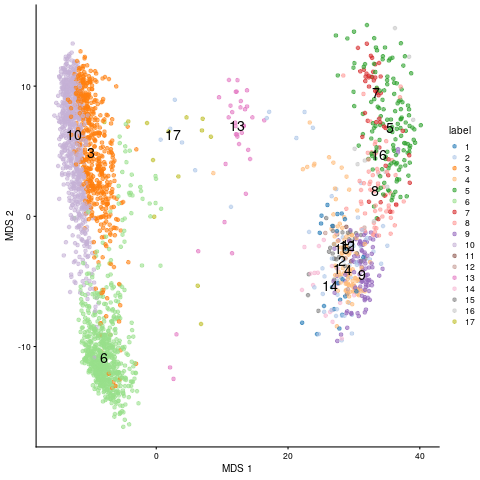
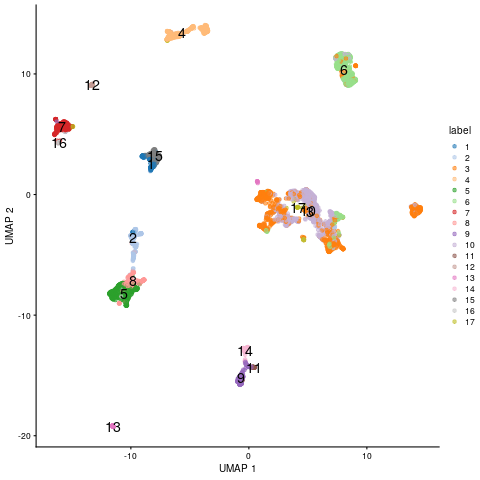
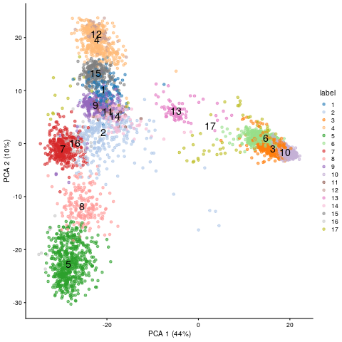
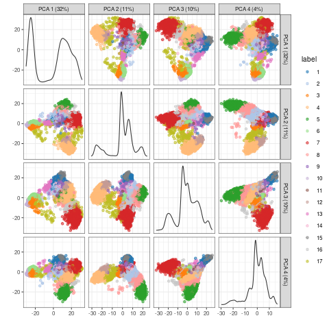

<p align="right">
  <a href="https://raw.githubusercontent.com/tgirke/GEN242/main/tutorials/scrnaseq/scrnaseq_index.qmd">
    
  </a>
</p>

<!--
- Render Rmd from command-line
Rscript -e "rmarkdown::render('scrnaseq_index.qmd', c('BiocStyle::html_document'), clean=F); knitr::knit('scrnaseq_index.Rmd', tangle=TRUE)"
- Render qmd from command line:
quarto render scrnaseq_index.qmd
Render qmd from R:
quarto::quarto_render("scrnaseq_index.qmd")
-->


```{r}
#| include: false
knitr::opts_chunk$set(echo = TRUE)

```

## Introduction


This tutorial introduces the usage of several software implementations of
embedding and clustering algorithms for high-dimensional gene expression data [@Duo2018-oo] that are often
used for single cell RNA-Seq (scRNA-Seq) data.  Many of them are available as R packages on CRAN, 
Bioconductor and/or GitHub. Examples of embedding methods include PCA, MDS,
[SC3](http://bioconductor.org/packages/release/bioc/html/SC3.html)
[@Kiselev2017-ye],
[isomap](https://bioconductor.org/packages/release/bioc/html/RDRToolbox.html),
[t-SNE](https://cran.r-project.org/web/packages/Rtsne/)
[@donaldson2010package], [FIt-SNE](https://github.com/KlugerLab/FIt-SNE)
[@Linderman2019-qh], and
[UMAP](https://cran.r-project.org/web/packages/umap/index.html)
[@McInnes2018-tc]. In addition, some packages such as Bioconductor's
[scater](https://bioconductor.org/packages/release/bioc/vignettes/scater/inst/doc/overview.html)
package provide in a single environment access to a wide range of embedding methods that can be
conveniently and uniformly applied to Bioconductor's S4 object class called
[`SingleCellExperiment`](https://bioconductor.org/packages/3.12/bioc/html/SingleCellExperiment.html)
for handling scRNA-Seq data [@Senabouth2019-cr; @Amezquita2020-vu]. The
performance of the different embedding methods for scRNA-Seq data has been
intensively tested by several studies, including Sun et al. [-@Sun2019-po;
-@Sun2020-ct].

For illustration purposes, the example code for the embedding methods first applies four widely
used methods to a bulk RNA-Seq data set [@Howard2013-fq], and then to a much more
complex scRNA-Seq data set [@Aztekin2019-sw] obtained from the
[`scRNAseq`](https://bioconductor.org/packages/release/data/experiment/html/scRNAseq.html)
package.


## Embedding of Bulk RNA-Seq data

### Generate `SummarizedExperiment` and `SingleCellExperiment` 

The following loads the bulk RNA-Seq data from Howard _et al._ [-@Howard2013-fq]
into `SummarizedExperiment` and `SingleCellExperiment` objects. This is done
by first creating a `SummarizedExperiment` object and then coercing it to a 
`SingleCellExperiment` object, as well as intializing the `SingleCellExperiment` 
directly. 

The subsequent clustering steps are performed on single cell data only. 


#### Create `SummarizedExperiment` and coerce to `SingleCellExperiment`

The required `targetsPE.txt` and `countDFeByg.xls` files can be downloaded 
from [here](https://github.com/tgirke/GEN242/tree/main/content/en/tutorials/scrnaseq/results).

```{r create_se_sce1a}
#| message: false
#| warning: false
library(SummarizedExperiment); library(SingleCellExperiment)                                                                                                                        
targetspath <- "results/targetsPE.txt"                                                                                                                                                      
countpath <- "results/countDFeByg.xls"                                                                                                                                              
targets <- read.delim(targetspath, comment.char = "#")                                                                                                                              
rownames(targets) <- targets$SampleName                                                                                                                                             
countDF <- read.delim(countpath, row.names=1, check.names=FALSE)                                                                                                                    
(se <- SummarizedExperiment(assays=list(counts=countDF), colData=targets))                                                                                                          
(sce <- as(se, "SingleCellExperiment"))

```

#### Create `SingleCellExperiment` directly

```{r create_se_sce1b}
sce2 <- SingleCellExperiment(assays=list(counts=countDF), colData=targets)

```

### Prepare data for plotting with embedding methods

The data are preprocessed (_e.g._normalized) to plot them with the `run`
embedding functions from the
[`scran`](https://bioconductor.org/packages/3.12/bioc/vignettes/scran/inst/doc/scran.html)
and [`scater`](https://bioconductor.org/packages/release/bioc/vignettes/scater/inst/doc/overview.html) packages.

```{r preprocess1}
#| message: false
#| warning: false
library(scran); library(scater)
sce <- logNormCounts(sce)
colLabels(sce) <- factor(colData(sce)$Factor) # This uses replicate info from above targets file as pseudo-clusters

```

### Embed with different methods and plot results

Note, the embedding results are sequentially appended to the
SingleCellExperiment object, meaning one can use the plot function whenever
necessary.

#### (a) tSNE 

```{r run_tsne1}
sce <- runTSNE(sce)
reducedDimNames(sce)
plotTSNE(sce, colour_by="label", text_by="label")

```

#### (b) MDS 

```{r run_mds1}
sce <- runMDS(sce)
reducedDimNames(sce)
plotMDS(sce, colour_by="label", text_by="label")

```

#### (c) UMAP 

```{r run_umap1}
sce <- runUMAP(sce) 
reducedDimNames(sce)
plotUMAP(sce, colour_by="label", text_by="label")

```

#### (d) PCA 

PCA plot for first two components.

```{r run_pca1a}
#| message: false
#| warning: false
sce <- runPCA(sce) # gives a warning due to small size of data set but it still works 
reducedDimNames(sce)
plotPCA(sce, colour_by="label", text_by="label")

```

Multiple components can be plotted in a series of pairwise plots. When more
than two components are plotted, the diagonal boxes in the scatter plot matrix
show the density for each component.

```{r run_pca1b}
#| message: false
#| warning: false
sce <- runPCA(sce, ncomponents=20) # gives a warning due to small size of data set but it still works 
reducedDimNames(sce)
plotPCA(sce, colour_by="label", text_by="label", ncomponents = 4)

```

## Embedding of scRNA-Seq data

### Load scRNA-Seq data 

The `scRNAseq` package is used to load the scRNA-Seq data set from Xenopus tail 
directly into a SingleCellExperiment object [@Aztekin2019-sw].

```{r create_sce2}
#| eval: false
#| message: false
#| warning: false
library(scRNAseq)
sce <- AztekinTailData()

```

### Prepare data for plotting with embedding methods 

Similarly as above, the data are preprocessed (_e.g._normalized) to plot them with the `run`
embedding functions from the
[`scran`](https://bioconductor.org/packages/3.12/bioc/vignettes/scran/inst/doc/scran.html)
package. In addition, the data is clustered with the `quickCluster` function.

```{r preprocess2}
#| eval: false
library(scran); library(scater)
sce <- logNormCounts(sce)
clusters <- quickCluster(sce)
# sce <- computeSumFactors(sce, clusters=clusters)
colLabels(sce) <- factor(clusters)
table(colLabels(sce))

```

To acclerate the testing performance of the following code, the size of the expression matrix 
is reduced to cell types with values $\ge10^4$.

```{r filter2}
#| eval: false
filter <- colSums(assays(sce)$counts) >= 10^4
sce <- sce[, filter]

```

To color items in the downstream dot plots by cell type instead of the above clustering result, 
one can use the cell type info under `colData()`. Note, this step is not evaluated here.

```{r collor_by_celltype2}
# colLabels(sce) <- colData(sce)$cluster

```

### Embed with different methods and plot results

As under the bulk RNA-Seq section, the embedding results are sequentially
appended to the `SingleCellExperiment` object, meaning one can use the plot
function whenever necessary.

#### (a) tSNE 

```{r run_tsne2}
#| eval: false
sce <- runTSNE(sce)
reducedDimNames(sce)
plotTSNE(sce, colour_by="label", text_by="label")

```

                                                                                                                                                     

#### (b) MDS 

```{r run_mds2}
#| eval: false
sce <- runMDS(sce)
reducedDimNames(sce)
plotMDS(sce, colour_by="label", text_by="label")

```

                                                                                                                                                     

## (c) UMAP 

```{r run_umap2}
#| eval: false
sce <- runUMAP(sce) # Note, the UMAP embedding is already stored in downloaded SingleCellExperiment object by authers. So one can just use this one or recompute it. 
reducedDimNames(sce)
plotUMAP(sce, colour_by="label", text_by="label")

```

                                                                                                                                                     


## (d) PCA 

PCA result plotted for first two components.

```{r run_pca2}
#| eval: false
sce <- runPCA(sce) 
reducedDimNames(sce)
plotPCA(sce, colour_by="label", text_by="label")

```

                                                                                                                                                     

Multiple components can be plotted in a series of pairwise plots. When more
than two components are plotted, the diagonal boxes in the scatter plot matrix
show the density for each component.

```{r run_pca2b}
#| eval: false
#| message: false
#| warning: false
sce <- runPCA(sce, ncomponents=20) 
reducedDimNames(sce)
plotPCA(sce, colour_by="label", text_by="label", ncomponents = 4)

```

                                                                                                                                                     


## Clustering for Single-Cell RNA-Seq Data

### Background

Single-cell RNA-Seq (scRNA-Seq) data presents unique challenges for clustering:
datasets commonly contain thousands to millions of cells, expression matrices are
highly sparse (most genes have zero counts per cell), and the goal is to identify
**cell type populations** from transcriptomic profiles rather than replicate groups.

For this reason, classical hierarchical or k-means clustering are rarely applied
directly to scRNA-Seq data. Instead, the standard workflow proceeds as:

1. Normalize and log-transform the count matrix
2. Select highly variable genes (HVGs) to reduce noise
3. Apply PCA to compress into 20–50 principal components
4. Build a **k-nearest neighbor (KNN) graph** in PCA space
5. Cluster cells with a **graph-based algorithm** (Louvain or Leiden)
6. Visualize clusters with **UMAP** (or tSNE)

### Graph-Based Clustering: Louvain and Leiden Algorithms

Both algorithms operate on the same graph structure:

- **KNN graph construction**: Each cell becomes a node. Edges connect each cell to
  its k most similar neighbors (typically k=20) in PCA-reduced space.
- **SNN refinement**: The KNN graph is refined into a Shared Nearest Neighbor (SNN)
  graph where edge weights reflect the Jaccard similarity of shared neighbors,
  making the graph robust to differences in local density.
- **Modularity optimization**: The algorithm partitions cells into communities by
  maximizing modularity Q — a measure of how many edges fall within clusters
  versus the random expectation.

**Louvain** (Blondel *et al.* 2008) is fast and widely used, but can produce
poorly-connected communities as a side effect of its greedy optimization.
**Leiden** (Traag *et al.* 2019) corrects this with an additional refinement phase
that guarantees well-connected, more stable communities. Leiden is generally
preferred for new analyses.

The `resolution` parameter (default 0.5–1.0) controls cluster granularity: higher
values yield more, smaller clusters. The number of clusters does **not** need to
be specified in advance.

### UMAP for Visualization

UMAP (Uniform Manifold Approximation and Projection; McInnes *et al.* 2018) is
used to embed high-dimensional PCA coordinates into 2D for visualization.
It constructs a fuzzy topological graph of the data, then optimizes a
low-dimensional layout that preserves local and global graph structure.

> **Important**: Clustering is always performed on PCA or SNN graph coordinates,
> **not** on UMAP coordinates. UMAP is a visualization tool only — inter-cluster
> distances in the UMAP plot are not quantitatively meaningful.

UMAP advantages over tSNE for scRNA-Seq:

- Faster and scales to millions of cells
- Better preserves global structure (relative positions of clusters are more
  meaningful)
- Supports embedding of new cells into an existing layout
- More reproducible given the same random seed

Both UMAP and tSNE are stochastic; always use `set.seed()` for reproducibility.

### Clustering Exercises: scRNA-Seq Data

The following exercises use the Bioconductor `scRNAseq` package to load a real
scRNA-Seq dataset, and apply graph-based clustering via the `scran`/`bluster`
ecosystem, which integrates with `SingleCellExperiment` objects.

#### Install and load required packages

```{r load_cluster_pkg} 
#| eval: true
#| message: false
#| warning: false
library(scran)
library(scater)
library(bluster)
library(scRNAseq)
library(SingleCellExperiment)
```

#### Load scRNA-Seq dataset

We use the Zeisel mouse brain dataset (3005 cells, 19972 genes), a classic
benchmark for scRNA-Seq clustering. Cell type labels are included for validation.

```{r load_zeisel} 
#| eval: true
#| message: false
#| warning: false
# Load dataset (~30 MB download on first use; cached thereafter)
sce <- ZeiselBrainData()
sce
## class: SingleCellExperiment
## dim: 19972 3005
## ...
## colData names(10): tissue group # ... level1class level2class
```

#### Data preprocessing

```{r cluster_prepro}
#| eval: true
#| message: false
#| warning: false
# 1. Remove lowly expressed genes (keep genes detected in >= 10 cells)
keep <- rowSums(counts(sce) > 0) >= 10
sce <- sce[keep, ]

# 2. Normalize using scran's pooling-based size factor estimation
set.seed(42)
clusters_quick <- quickCluster(sce)
sce <- computeSumFactors(sce, clusters = clusters_quick)
sce <- logNormCounts(sce)

# 3. Select highly variable genes (top 2000 HVGs)
dec <- modelGeneVar(sce)
hvgs <- getTopHVGs(dec, n = 2000)
cat("Number of HVGs selected:", length(hvgs), "\n")
```

#### Dimensionality reduction with PCA

```{r pca_cluster_sect}
#| eval: true
#| message: false
#| warning: false
# Run PCA on HVGs (50 components)
set.seed(42)
sce <- runPCA(sce, ncomponents = 50, subset_row = hvgs)

# Inspect variance explained
pct_var <- attr(reducedDim(sce, "PCA"), "percentVar")
plot(pct_var[1:20], type = "b", xlab = "PC", ylab = "% Variance explained",
     main = "Scree plot")
abline(v = 20, lty = 2, col = "red")  # Typical cutoff around 20-30 PCs
```

#### Graph-based clustering with Louvain algorithm

```{r louvain}
#| eval: true
#| message: false
#| warning: false
# Build SNN graph and cluster with Louvain (via igraph under the hood)
# Build SNN graph and cluster with Louvain algorithm
set.seed(42)
clust_out <- clusterCells(sce,
                           use.dimred = "PCA",
                           BLUSPARAM = SNNGraphParam(
                               k = 20,
                               type = "rank",
                               cluster.fun = "louvain",
                               cluster.args = list(resolution = 0.8)
                           ),
                           full = TRUE)

# Extract cluster vector from the full output and store
colLabels(sce) <- clust_out$clusters
table(colLabels(sce))


#### Graph-based clustering with Leiden algorithm (preferred)

```{r leiden}
#| eval: true
#| message: false
#| warning: false
# Leiden requires the igraph package with leiden support
# Note: cluster.fun = "leiden" is available in bluster >= 1.6
set.seed(42)
clust_leiden <- clusterCells(sce,
                              use.dimred = "PCA",
                              BLUSPARAM = SNNGraphParam(
                                  k = 20,
                                  type = "rank",
                                  cluster.fun = "leiden",
                                  cluster.args = list(
                                      objective_function = "modularity",
                                      resolution_parameter = 0.5
                                  )
                              ))

colData(sce)$leiden_cluster <- clust_leiden
table(sce$leiden_cluster)
```

#### UMAP visualization

```{r umap_clustering}
#| eval: true
#| message: false
#| warning: false
# Run UMAP on the first 20 PCs (use set.seed for reproducibility)
set.seed(42)
sce <- runUMAP(sce, dimred = "PCA", n_dimred = 20)

# Plot cells colored by Leiden cluster
plotReducedDim(sce, dimred = "UMAP",
               colour_by = "leiden_cluster",
               text_by = "leiden_cluster",
               point_size = 0.8) +
  ggtitle("UMAP colored by Leiden cluster")
```

#### Validate clusters against known cell type labels

The Zeisel dataset includes expert-annotated cell types in `colData(sce)$level1class`.
We can assess how well our unsupervised clusters recover known biology:

```{r validate}
#| eval: true
#| message: false
#| warning: false
# Contingency table: clusters vs. known cell types
tab <- table(cluster = sce$leiden_cluster,
             cell_type = sce$level1class)
tab

# Heatmap visualization of cluster-to-cell-type correspondence
pheatmap::pheatmap(
    log2(tab + 1),
    color = colorRampPalette(c("white", "navy"))(50),
    fontsize = 9,
    main = "Leiden clusters vs. known cell types"
)
```

#### Effect of resolution parameter

The `resolution` parameter is the key tuning choice in graph-based clustering.
Lower values give fewer, broader clusters; higher values give more, finer clusters.

```{r tuning}
#| eval: true
#| message: false
#| warning: false
# Compare cluster counts at different resolutions
resolutions <- c(0.2, 0.5, 0.8, 1.2, 2.0)

n_clusters <- sapply(resolutions, function(res) {
    set.seed(42)
    cl <- clusterCells(sce,
                       use.dimred = "PCA",
                       BLUSPARAM = SNNGraphParam(
                           k = 20,
                           type = "rank",
                           cluster.fun = "louvain",
                           cluster.args = list(resolution = res)
                       ))
    nlevels(factor(cl))
})

data.frame(resolution = resolutions, n_clusters = n_clusters)
```

#### tSNE vs UMAP comparison

```{r tsne_umap_comp}
#| eval: true
#| message: false
#| warning: false
# Also run tSNE for comparison
set.seed(42)
sce <- runTSNE(sce, dimred = "PCA", n_dimred = 20)

# Side-by-side comparison
library(gridExtra)
p1 <- plotReducedDim(sce, "TSNE", colour_by = "leiden_cluster",
                     point_size = 0.5) + ggtitle("tSNE")
p2 <- plotReducedDim(sce, "UMAP", colour_by = "leiden_cluster",
                     point_size = 0.5) + ggtitle("UMAP")
grid.arrange(p1, p2, ncol = 2)
```

#### Find cluster marker genes

After clustering, marker genes per cluster are identified to support
cell type annotation:

```{r marker_genes}
#| eval: true
#| message: false
#| warning: false
# Find marker genes for each cluster (using Wilcoxon test by default)
markers <- findMarkers(sce,
                       groups = sce$leiden_cluster,
                       test.type = "wilcox",
                       direction = "up",    # upregulated in cluster
                       lfc = 1)             # log2 fold-change threshold

# Inspect top 10 markers for cluster 1
markers[[1]][1:10, c("Top", "p.value", "FDR")]
```


<!--
References to add.

- Blondel VD, Guillaume JL, Lambiotte R, Lefebvre E (2008). Fast unfolding of
  communities in large networks. *J. Stat. Mech.* 10008.
- Traag VA, Waltman L, van Eck NJ (2019). From Louvain to Leiden: guaranteeing
  well-connected communities. *Sci Rep* 9: 5233.
- McInnes L, Healy J, Melville J (2018). UMAP: Uniform Manifold Approximation
  and Projection for Dimension Reduction. arXiv:1802.03426.
- Amezquita RA, *et al.* (2020). Orchestrating single-cell analysis with
  Bioconductor. *Nat Methods* 17: 137–145.
- Zeisel A, *et al.* (2015). Cell types in the mouse cortex and hippocampus
  revealed by single-cell RNA-seq. *Science* 347: 1138–1142.
-->


## Version Information

```{r sessionInfo}
sessionInfo()

```

## References
