<p align="right">
  <a href="https://raw.githubusercontent.com/tgirke/GEN242/main/tutorials/systempiper/systemPipeR_index.qmd">
    
  </a>
</p>

<!--
- Compile from command-line
Rscript -e "rmarkdown::render('systemPipeR.Rmd', c('BiocStyle::html_document'), clean=F); knitr::knit('systemPipeR.Rmd', tangle=TRUE)"
-->

```{r setup_dir}
#| echo: false
#| include: false
#| message: false
#| warning: false
unlink("rnaseq", recursive = TRUE)
systemPipeRdata::genWorkenvir(workflow = "rnaseq")
knitr::opts_knit$set(root.dir = 'rnaseq')

```


```{r setup}
#| echo: false
#| message: false
#| warning: false
suppressPackageStartupMessages({
    library(systemPipeR)
    library(BiocParallel)
    library(Biostrings)
    library(Rsamtools)
    library(GenomicRanges)
    library(ggplot2)
    library(GenomicAlignments)
    library(ShortRead)
    library(ape)
    library(batchtools)
    library(magrittr)
})

```


## Introduction


[_`systemPipeR`_](http://www.bioconductor.org/packages/devel/bioc/html/systemPipeR.html)
is a Workflow Management System (WMS) for data analysis that integrates R with
command-line (CL) software [@H_Backman2016-bt]. This platform allows scientists
to analyze diverse data types on personal or distributed computer systems. It
ensures a high level of reproducibility, scalability, and portability (Figure
\@ref(fig:utilities)). Central to `systemPipeR` is a CL interface (CLI) that
adopts the Common Workflow Language [CWL, @Crusoe2021-iq]. Using this CLI,
users can select the optimal R or CL software for each analysis step. The
platform supports end-to-end and partial execution of workflows, with built-in
restart capabilities. A workflow control container class manages analysis tasks
of varying complexity. Standardized processing routines for metadata facilitate
the handling of large numbers of input samples and complex experimental
designs. As a multipurpose workflow management toolkit, `systemPipeR` enables
users to run existing workflows, customize them, or create entirely new ones
while leveraging widely adopted data structures within the Bioconductor
ecosystem. Another key aspect of `systemPipeR` is its ability to generate
reproducible scientific analysis and technical reports. For result
interpretation, it offers a range of graphics functionalities. Additionally, an
associated Shiny App provides various interactive features for result
exploration, and enhancing the user experience.


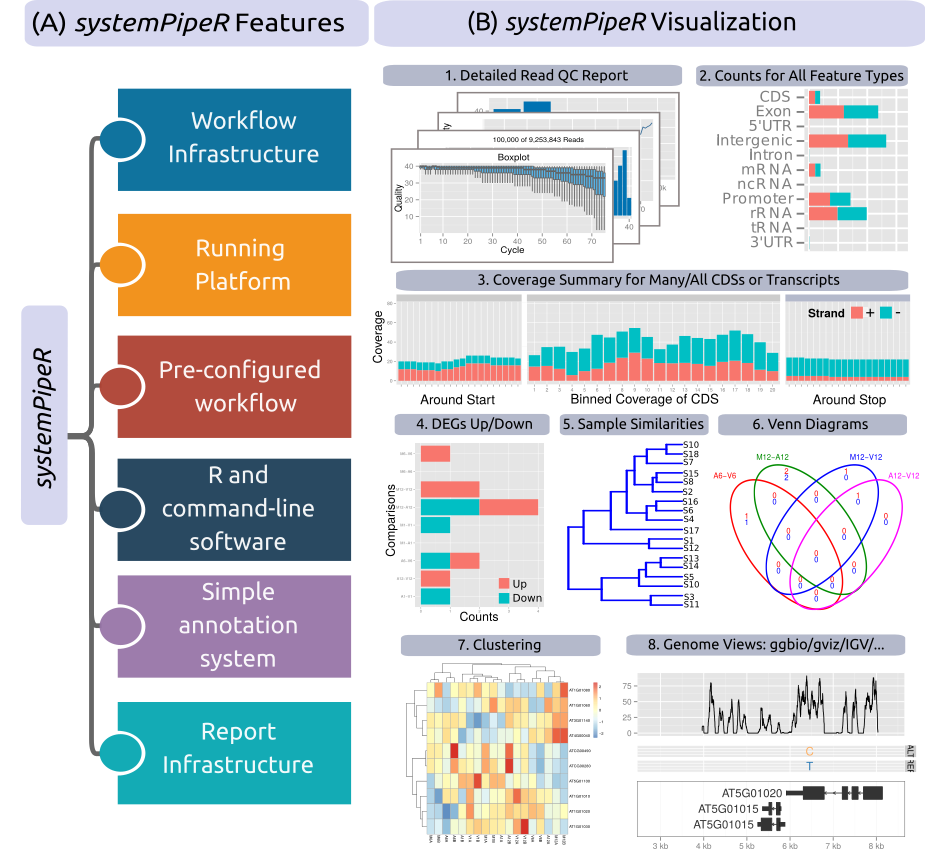{width=70% fig-align="center"}


### Workflow control class

A central component of `systemPipeR` is `SYSargsList` (or short `SAL`), a
container for workflow management. This S4 class stores all relevant
information for running and monitoring each analysis step in workflows. It 
captures the connectivity between workflow steps, the paths to their input and 
output data, and pertinent parameter values used in each step 
(see Figure \@ref(fig:sysargslistImage)). Typically, `SAL` instances are constructed 
from an intial metadata targets table, R code and CWL parameter files for each 
R- and CL-based analysis step in workflows (details provided below). 
For preconfigured workflows, users only need to provide their input data (such as FASTQ 
files) and the corresponding metadata in a targets file. The latter describes the 
experimental design, defines sample labels, replicate information, and other 
relevant information. 


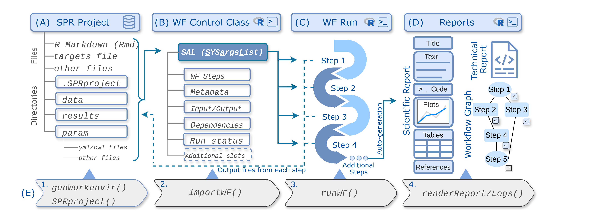{width=100% fig-align="center"}

Figure \@ref(fig:sysargslistImage) illustrates the design of the `systemPipeR` (SPR) 
WMS. (A) The root directory of a SPR Project includes files and directories
that contain the input data, metadata and parameters required for running a
workflow. This project environment can be autogenerated with the functions
given under (E). (B) The workflow instructions  are loaded from the project
environment into the Workflow Management Class `SAL`. (C) Subsequently,
the workflow can be executed and monitored. (D) After completion or during a
run various reports can be generated, including scientific and technical
reports, as well as interactive workflow graphs illustrating the workflow
topology as well as run and completion statistics. (E) The corresponding
commands (1-4) for the initialization, execution and report generation of
workflows are listed, which can be run with a single execution command.
Workflow steps and reporting instructions are specified in the Rmd
file (A), which is the source file for generating the scientific report (D).
Input data required for a workflow run are stored in the data directory, and
output files generated by a workflow run are written to the results directory
(A). The input/output and dependencies between steps are automatically
generated and managed by `SAL`. Status information is auto-saved to the
`SPRproject` directory, allowing for workflow tracking and restarts.


### CL interface (CLI) {#cl-interface}

_`systemPipeR`_ adopts the [Common Workflow Language
(CWL)](https://www.commonwl.org/index.html), which is a widely used community
standard for describing CL tools and workflows in a declarative, generic, and
reproducible manner [@Amstutz2016-ka]. CWL specifications are human-readable
[YAML](https://www.commonwl.org/user_guide/topics/yaml-guide.html) files that
are straightforward to create and to modify. Integrating CWL in `systemPipeR`
enhances the sharability, standardization, extensibility and portability of
data analysis workflows.

Following the CWL Specifications, the basic description for executing a CL
software are defined by two files: a cwl step definition file and a yml
configuration file. Figure \@ref(fig:sprandCWL) illustrates the utilitity of
the two files using “Hello World” as an example. The cwl file (A) defines the
parameters of CL tool or workflow (C), and the yml file (B) assigns the input
variables to the corresponding parameters. For convenience, in `systemPipeR` parameter
values can be provided by a targets file (D, see above), and automatically
passed on to the corresponding parameters in the yml file. The usage of a
targets file greatly simplifies the operation of the system for users, because
a tabular metadata file is intuitive to maintain, and it eliminates the need of
modifying the more complex cwl and yml files directly. The structure of
`targets` files is explained in the corresponding section
[below](https://girke.bioinformatics.ucr.edu/GEN242/tutorials/systempiper/systempiper/#targets-files). A detailed overview of the CWL syntax is provided in
the [CWL syntax](https://girke.bioinformatics.ucr.edu/GEN242/tutorials/systempiper/systempiper/#cwl) section below, and the details for connecting the input
information in `targets` with CWL parameters are described
[here](https://girke.bioinformatics.ucr.edu/GEN242/tutorials/systempiper/systempiper/#cwl_targets). 

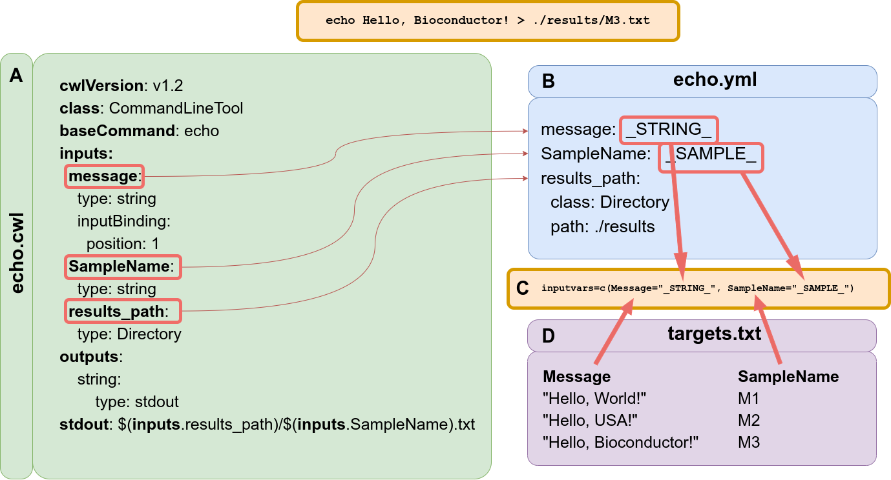{width=60% fig-align="center"}

### Workflow templates 

`systemPipeRdata`, a companion package to `systemPipeR`, offers a collection of
workflow templates that are ready to use. With a single command, users can
easily load these templates onto their systems. Once loaded, users have the
flexibility to utilize the templates as they are or modify them as needed. More
in-depth information can be found in the main vignette of systemPipeRdata,
which can be accessed
[here](https://www.bioconductor.org/packages/devel/data/experiment/vignettes/systemPipeRdata/inst/doc/systemPipeRdata.html).


### Other functionalities

The package also provides several convenience
functions that are useful for designing and testing workflows, such as a
[CL rendering function](https://girke.bioinformatics.ucr.edu/GEN242/tutorials/systempiper/systempiper/#cmd-step) that assembles from the parameter files (cwl, yml and 
targets) the exact CL strings for each step prior to running a CL tool. 
[Auto-generation of CWL](https://girke.bioinformatics.ucr.edu/GEN242/tutorials/systempiper/systempiper/#cwl-auto-generation) parameter files is also supported. Here, users can simply 
provide the CL strings for a CL software of interest to a rendering function that generates 
the corresponding `*.cwl` and `*.yml` files for them. Auto-conversion of workflows to 
executable [Bash scripts](https://girke.bioinformatics.ucr.edu/GEN242/tutorials/systempiper/systempiper/#bash-script) is also supported.


## Quick start

### Installation

The [_`systemPipeR`_](http://www.bioconductor.org/packages/devel/bioc/html/systemPipeR.html) 
package can be installed from the R console using the [_`BiocManager::install`_](https://cran.r-project.org/web/packages/BiocManager/index.html) 
command. The associated [_`systemPipeRdata`_](http://www.bioconductor.org/packages/devel/data/experiment/html/systemPipeRdata.html) package can be installed the same way. The latter is a data package for generating _`systemPipeR`_ 
workflow test instances with a single command. These instances contain all parameter files and 
sample data required to quickly test and run workflows. 

```{r install}
#| eval: false
if (!requireNamespace("BiocManager", quietly=TRUE)) install.packages("BiocManager")
BiocManager::install("systemPipeR")
BiocManager::install("systemPipeRdata")

```

For a workflow to run successfully, all CL tools used by a workflow need to be installed and executable on a user's system, where the analysis will be performed (details provided [below](https://girke.bioinformatics.ucr.edu/GEN242/tutorials/systempiper/systempiper/#third-party-software-tools)). 

### Five minute tutorial {#five-min}

The following demonstrates how to initialize, run and monitor workflows, and subsequently create analysis reports. 


__1. Create workflow environment.__ The chosen example uses the `genWorenvir` function from
the `systemPipeRdata` package to create an RNA-Seq workflow environment that is fully populated with a small test data set, including FASTQ files, reference genome and annotation data. After this, the user's R session needs to be directed 
into the resulting `rnaseq` directory (here with `setwd`). A list of available workflow templates 
is available in the vignette of the `systemPipeRdata` package [here](https://www.bioconductor.org/packages/devel/data/experiment/vignettes/systemPipeRdata/inst/doc/systemPipeRdata.html#wf-bioc-collection).

```{r eval=FALSE}
systemPipeRdata::genWorkenvir(workflow = "rnaseq")
setwd("rnaseq")

```

__2. Initialize project and import workflow from `Rmd` template.__ New workflow
instances are created with the `SPRproject` function. When calling this
function, a project directory with the default name `.SPRproject` is created
within the workflow directory. Progress information and log files of a workflow
run will be stored in this directory. After this, workflow steps can be loaded
into `sal` one-by-one, or all at once with the `importWF` function. The latter
reads all steps from a workflow Rmd file (here `systemPipeRNAseq.Rmd`)
defining the analysis steps. 

```{r eval=FALSE}
library(systemPipeR) 
# Initialize workflow project
sal <- SPRproject()
## Creating directory '/home/myuser/systemPipeR/rnaseq/.SPRproject'
## Creating file '/home/myuser/systemPipeR/rnaseq/.SPRproject/SYSargsList.yml'
sal <- importWF(sal, file_path = "systemPipeRNAseq.Rmd") # import into sal the WF steps defined by chosen Rmd file

## The following print statements, issued during the import, are shortened for brevity
## Import messages for first 3 of 20 steps total 
## Parse chunk code
## Now importing step 'load_SPR'
## Now importing step 'preprocessing' 
## Now importing step 'trimming'
## Now importing step '...' 
## ...

## Now check if required CL tools are installed 
## Messages for 4 of 7 CL tools total
##        step_name         tool in_path
## 1       trimming  trimmomatic    TRUE
## 2   hisat2_index hisat2-build    TRUE
## 3 hisat2_mapping       hisat2    TRUE
## 4 hisat2_mapping     samtools    TRUE
## ...

```

The `importWF` function also checks the availability of the R packages and CL 
software tools used by a workflow. All dependency CL software needs to be installed and exported to a user's
`PATH`. In the given example, the CL tools `trimmomatic`, `hisat2-build`, `hisat2`, 
and `samtools` are listed. If the `in_path` column shows `FALSE` for 
any of them, then the missing CL software needs to be installed and made available in a user's
`PATH` prior to running the workflow. Note, the shown availability table of CL tools can 
also be returned with `listCmdTools(sal, check_path=TRUE)`, and the availability of individual CL
tools can be checked with `tryCL`, _e.g._ for `hisat2` use: `tryCL(command = "hisat2")`.  

__3. Status summary.__ An overview of the workflow steps and their status
information can be returned by typing `sal`. For space reasons, the following
shows only the first 3 of a total of 20 steps of the RNA-Seq workflow. At this 
stage all workflow steps are listed as pending since none of them have been executed yet. 

```{r eval=FALSE}
sal
## Instance of 'SYSargsList': 
##     WF Steps:
##        1. load_SPR --> Status: Pending
##        2. preprocessing --> Status: Pending 
##            Total Files: 36 | Existing: 0 | Missing: 36 
##          2.1. preprocessReads-pe
##              cmdlist: 18 | Pending: 18
##        3. trimming --> Status: Pending 
##            Total Files: 72 | Existing: 0 | Missing: 72 
##        4. - 20. not shown here for brevity

```

__4. Run workflow.__ Next, one can execute the entire workflow from start to
finish. The `steps` argument of `runWF` can be used to run only selected steps.
For details, consult the help file with `?runWF`. During the run, detailed status
information will be provided for each workflow step.

```{r eval=FALSE}
sal <- runWF(sal)  

```

After completing all or only some steps, the status of workflow steps can
always be checked with the summary print function. If a workflow step was
completed, its status will change from `Pending` to `Success` or `Failed`.

```{r eval=FALSE}
sal

```

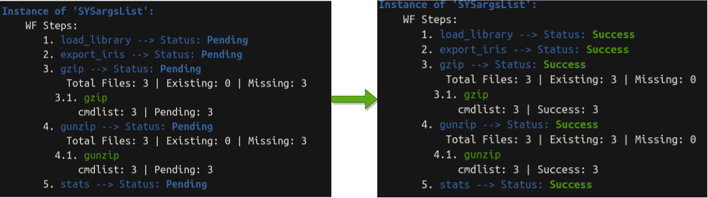{width=80% fig-align="center"}

__5. Workflow topology graph.__ Workflows can be displayed as topology graphs
using the `plotWF` function. The run status information for each step and various 
other details are embedded in these graphs. Additional details are provided in the [visualize workflow
section](https://girke.bioinformatics.ucr.edu/GEN242/tutorials/systempiper/systempiper/#visualize-workflow) below.

```{r eval=FALSE}
plotWF(sal)

```

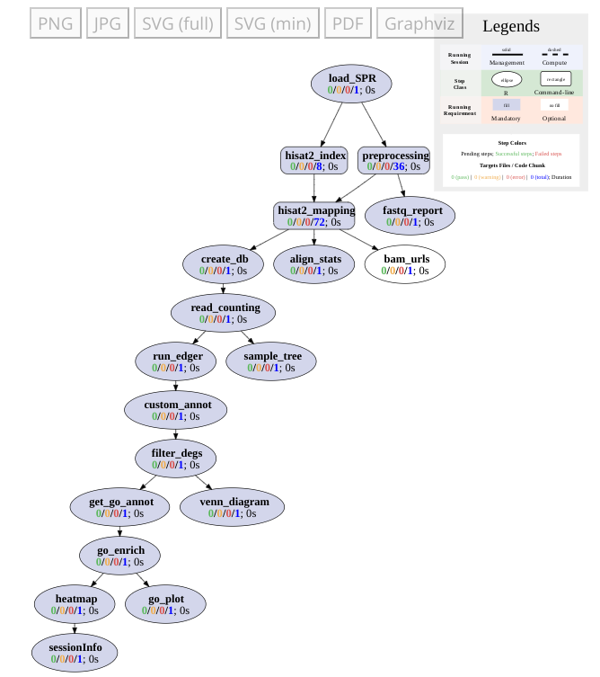{width=60% fig-align="center"}

__6. Report generation.__ The `renderReport` and `renderLogs` function can be used
for generating scientific and technical reports, respectively. Alternatively, scientific
reports can be generated with the `render` function of the `rmarkdown` package. The latter
option with `rmarkdown::render` is often more flexible and preferred for most users, since 
it provides the advantage that any modifications to the Rmd file are
instantly reflected in the HTML report, eliminating the necessity to update the `sal` object.


```{r eval=FALSE}
# Scietific report
sal <- renderReport(sal)
rmarkdown::render("systemPipeRNAseq.Rmd", clean = TRUE, output_format = "BiocStyle::html_document") 

# Technical (log) report
sal <- renderLogs(sal)

```

## Directory structure {#wf-directories}

The root directory of `systemPipeR` workflows contains by default three user 
facing sub-directories: `data`, `results` and `param`. A fourth sub-directory is 
a hidden log directory with the default name `.SPRproject` that is created when initializing 
a workflow run with the `SPRproject` function (see above). Users can change
the recommended directory structure, but will need to adjust in some cases the code in
their workflows. Just adding directories to the default structure is possible without requiring changes 
to the workflows. The following directory tree summarizes the expected content in 
each default directory (names given in <span style="color:green">***green***</span>).

* <span style="color:green">_**workflow/**_</span> 
    + This is the root directory of a workflow. It can have any name and includes the following files: 
        + Workflow *Rmd* and metadata targets file(s) 
        + Optionally, configuration files for computer clusters, such as `.batchtools.conf.R` and `tmpl` files for `batchtools` and `BiocParallel`. 
        + Additional files can be added as needed.
  + Default sub-directories: 
    + <span style="color:green">_**param/**_</span> 
        + CWL parameter files are organized by CL tools (under <span style="color:green">_**cwl/**_</span>), each with its own sub-directory that contains the corresponding `cwl` and `yml` files. Previous versions of parameter files are stored in a separate sub-directory. 
    + <span style="color:green">_**data/**_ </span>
        + Raw input and/or assay data (*e.g.* FASTQ files)
        + Reference data, including genome sequences, annotation files, databases, etc.
        + Any number of sub-directories can be added to organize the data under this directory.
        + Other input data
    + <span style="color:green">_**results/**_</span>
        + Analysis results are written to this directory. Examples include tables, plots, or NGS results such as alignment (BAM), variant (VCF), peak (BED) files.
        + Any number of sub-directories can be created to organize the analysis results under this directory.
    + <span style="color:green">_**.SPRproject/**_</span>
        + Hidden log directory created by `SPRproject` function at the beginning of a workflow run. It is a hidden directory because its name starts with a dot. 
        + Run status information and log files of a workflow run are stored here. The content in this directory is auto-generated and not expected to be modified by users.


## The _`targets`_ file {#targets-files}

A `targets` file defines the input files (_e.g._ FASTQ, BAM, BCF) and
sample comparisons used in a data analysis workflow. It can also store any number of 
additional descriptive information for each sample. How the input 
information is passed on from a `targets` file to the CWL parameter files is 
introduced [above](https://girke.bioinformatics.ucr.edu/GEN242/tutorials/systempiper/systempiper/#cl-interface), and additional details are given [below](https://girke.bioinformatics.ucr.edu/GEN242/tutorials/systempiper/systempiper/#cwl). The following
shows the format of two _`targets`_ file examples included in the package. They 
can also be viewed and downloaded from _`systemPipeR`'s_ GitHub repository
[here](https://github.com/tgirke/systemPipeR/blob/master/inst/extdata/targets.txt).
As an alternative to using targets files, `YAML` files can be used instead. Since 
organizing experimental variables in tabular files is straightforward, the following 
sections of this vignette focus on the usage of targets files. Their usage also 
integrates well with the widely used `SummarizedExperiment` object class.

Descendant targets files can be extracted for each step with input/output
operations where the output of the previous step(s) serves as input to the
current step, and the output of the current step becomes the input of the next 
step. This connectivity among input/output operations is automatically tracked
throughout workflows. This way it is straightforward to start workflows at
different processing stages. For instance, one can intialize an RNA-Seq workflow 
at the stage of raw sequence files (FASTQ), alignment files (BAM) or a precomputed 
read count table.

#### Single-end (SE) data

In a `targets` file with a single type of input files, here FASTQ files of 
single-end (SE) reads, the first three columns are mandatory including their 
column names, while it is four mandatory columns for FASTQ files of PE reads. 
All subsequent columns are optional and any number of additional columns 
can be added as needed. The columns in `targets` files are
expected to be tab separated (TSV format). The `SampleName` column contains
usually short labels for referencing samples (here FASTQ files) across many
workflow steps (_e.g._ plots and column titles). Importantly, the labels used in
the `SampleName` column need to be unique, while technical or biological
replicates are indicated by the same values under the `Factor` column. For
readability and transparency, it is useful to use here a short, consistent and
informative syntax for naming samples and replicates. This is important
since the values provided under the `SampleName` and `Factor` columns are intended to
be used as labels for naming the columns or plotting features in downstream
analysis steps.

```{r targetsSE}
targetspath <- system.file("extdata", "targets.txt", package = "systemPipeR") 
DT::datatable(read.delim(targetspath, comment.char = "#"))

```

To work with custom data, users need to generate a `targets` file containing 
the paths to their own FASTQ files and then provide under `targetspath` the
path to the corresponding `targets` file. 

#### Paired-end (PE) data

For paired-end (PE) samples, the structure of the targets file is similar. The main
difference is that `targets` files for PE data have two FASTQ path columns (here `FileName1` and `FileName2`) 
each containing the paths to the corresponding PE FASTQ files. 

```{r targetsPE}
targetspath <- system.file("extdata", "targetsPE.txt", package = "systemPipeR")
showDF(read.delim(targetspath, comment.char = "#"))

```

#### Sample comparisons

If needed, sample comparisons of comparative experiments, such as differentially expressed genes (DEGs), can be 
specified in the header lines of a `targets` file that start with a `# <CMP>` tag. 
Their usage is optional, but useful for controlling comparative analyses according 
to certain biological expectations, such as identifying DEGs in RNA-Seq experiments based on 
simple pair-wise comparisons.

```{r comment_lines}
#| echo: true
readLines(targetspath)[1:4]

```

The function `readComp` imports the comparison information and stores it in a 
`list`. Alternatively, `readComp` can obtain the comparison information from 
a `SYSargsList` instance containing the `targets` file information (see below). 


```{r targetscomp}
readComp(file = targetspath, format = "vector", delim = "-")

```

```{r cleaning1}
#| include: false
if (file.exists(".SPRproject")) unlink(".SPRproject", recursive = TRUE)
## NOTE: Removes previous project created in the quick-start section

```


## Detailed tutorial

### Initialization

A `systemPipeR` workflow instance is initialized with the `SPRproject` function. This function
call creates an empty `SAL` container instance and at the same time a linked project 
log directory that acts as a flat-file database of a workflow. A YAML file is automatically 
included in the project directory that specifies the basic location of the workflow project. 
Every time the `SAL` container is updated in R with a new workflow step or a modification 
to an existing step, the changes are automatically recorded in the flat-file database. This
is important for tracking the run status of workflows and providing restart functionality for 
workflows. 

```{r SPRproject1a}
#| eval: false
sal <- SPRproject() 

```

If `overwrite` is set to `TRUE`, a new project log directory will be created and any existing 
one deleted. This option should be used with caution. It is mainly useful when developing 
and testing workflows, but should be avoided in production runs of workflows.

```{r SPRproject1}
sal <- SPRproject(projPath = getwd(), overwrite = TRUE) 

```

The function checks whether the expected workflow directories (see [here](https://girke.bioinformatics.ucr.edu/GEN242/tutorials/systempiper/systempiper/#wf-directories)) exist,
and will create them if any of them is missing. If needed users can change the default names of 
these directories as shown.

```{r SPRproject_dir}
#| eval: false
sal <- SPRproject(data = "data", param = "param", results = "results") 

```

Similarly, the default names of the log directory and `YAML` file can be changed.

```{r SPRproject_logs}
#| eval: false
sal <- SPRproject(logs.dir= ".SPRproject", sys.file=".SPRproject/SYSargsList.yml") 

```

It is also possible to use for all workflow steps a dedicated R environment
that is separate from the current environment. This way R objects generated by
workflow steps will not overwrite objects with the same names in the current environment.

```{r SPRproject_env}
#| eval: false
sal <- SPRproject(envir = new.env()) 

```

At this stage, `sal` is an empty `SAL` (`SYSargsList`) container that only contains
the basic information about the project's directory structure that can be accessed with 
`projectInfo`.

```{r projectInfo}
sal
projectInfo(sal)

```

The number of workflow steps stored in a `SAL` object can be returned with the `length` function. At this stage
it returns zero since no workflow steps have been loaded into `sal` yet. 

```{r length}
length(sal)

```

### Constructing workflows

In systemPipeR, workflows can be incrementally constructed in [interactive mode](https://girke.bioinformatics.ucr.edu/GEN242/tutorials/systempiper/systempiper/#appendstep)
by sequentially evaluating code for individual workflow steps in the R console.
Alternatively, all steps of a workflow can be imported simultaneously from an R
script or an R Markdown workflow file using a [single import command](https://girke.bioinformatics.ucr.edu/GEN242/tutorials/systempiper/systempiper/#importWF).
To explain constructing and connecting different types of workflow steps, this
tutorial section introduces the interactive approach first. After that, the
automated import of entire workflows with many steps is explained, where the
individual steps are defined the same way.
In all cases, workflow steps are loaded into a `SAL` workflow container with the
proper connectivity information using `systemPipeR's` `appendStep` method. This
method allows steps to be comprised of R code or CL calls.

#### Stepwise construction  {#appendstep}

The following demonstrates how to design, load and run workflows using a simple
data processing routine as an example. This mini workflow will export a test
dataset to multiple files, compress/decompress the exported files, import them back 
into R, and then perform a simple statistical analysis and plot the results. The file 
compression steps demonstrate the usage of the CL interface.

The `sal` object of the new workflow project (directory named`.SPRproject`) was
intialized in the previous section. At this point this `sal` instance contains
no data analysis steps since none have been loaded so far.

```{r sal_check}
sal

```

Next, workflow steps will be added to `sal`.

##### Step 1: R step 

The first step in the chosen example workflow comprises R code that will be
stored in a `LineWise` object. It is constructed with the `LineWise` function,
and then appended to `sal` with the  `appendStep<-` method. The R code of an
analysis step is assigned to the `code` argument of the `LineWise` function. In this
assignment the R code has to be enclosed by braces (`{...}`) and separted from
them by new lines. Additionally, the workflow step should be given a descriptive name
under the `step_name` argument. Step names are required to be unique throughout
workflows. During the construction of workflow steps, the included R code will
not be executed. The execution of workflow steps is explained in a separate
section [below](https://girke.bioinformatics.ucr.edu/GEN242/tutorials/systempiper/systempiper/#wf-execution).

In the given code example, the `iris` dataset is split by the species
names under the `Species` column, and then the resulting `data.frames` are
exported to three tabular files. 


```{r rstep1}
appendStep(sal) <- LineWise(code = {
                              mapply(function(x, y) write.csv(x, y),
                                     split(iris, factor(iris$Species)),
                                     file.path("results", paste0(names(split(iris, factor(iris$Species))), ".csv"))
                                     ) 
                            },
                            step_name = "export_iris")

```

After adding the R code, `sal` contains now one workflow step.

```{r show}
sal

```

To extract the code of an R step stored in a `SAL` object, the `codeLine` method can be used.

```{r codeLine}
codeLine(sal)

```

##### Step 2: CL step {#cmd-step}

CL steps are stored as `SYSargs2` objects that are constructed with the
`SYSargsList` function, and then appended to `sal` with the `appendStep<-`
method. As outlined in the introduction (see [here](https://girke.bioinformatics.ucr.edu/GEN242/tutorials/systempiper/systempiper/#cl-interface)), CL steps
are defined by two CWL parameter files (`yml` configuration and `cwl` step
definition files) and an optional `targets` file. How parameter values in the
`targets` file are passed on to the corresponding entries in the `yml` file, is
defined by a `named vector` that is assigned to the `inputvars` argument of the
`SYSargsList` function. A parameter connection is established if a name assigned to
`inputvars` has matching column and element names in the `targets` and `yml` files, 
respectively (Fig \@ref(fig:sprandCWL)). More details about parameter passing and CWL 
syntax are provied below (see [here](https://girke.bioinformatics.ucr.edu/GEN242/tutorials/systempiper/systempiper/#cwl_targets) and [here](https://girke.bioinformatics.ucr.edu/GEN242/tutorials/systempiper/systempiper/#cwl)). 

The most important other arguments of the `SYSargsList` function are listed below. For more 
information, users want to consult the function's help with `?SYSargsList`.

  - `step_name`: a unique *name* for the step. If no name is provided, a default 
    `step_x` name will be assigned, where `x` is the step index.
  - `dir`: if `TRUE` (default) all output files generated by a workflow step will be written to a 
    subdirectory with the same name as `step_name`. This is useful for organizing result files. 
  - `dependency`: assign here the name of the step the current step depends on. This is mandatory 
    for all steps in a workflow, except the first one. The dependency tree of a workflow is 
    based on the dependency connections among steps.

In the specific example code given below, a CL step is added to the workflow where the
[`gzip`](https://www.gnu.org/software/gzip/) software is used to compress the
files that were generated in the previous step. 

```{r gzip_secondStep}
targetspath <- system.file("extdata/cwl/gunzip", "targets_gunzip.txt", package = "systemPipeR")
appendStep(sal) <- SYSargsList(step_name = "gzip", 
                      targets = targetspath, dir = TRUE,
                      wf_file = "gunzip/workflow_gzip.cwl", input_file = "gunzip/gzip.yml",
                      dir_path = system.file("extdata/cwl", package = "systemPipeR"),
                      inputvars = c(FileName = "_FILE_PATH_", SampleName = "_SampleName_"), 
                      dependency = "export_iris")

```

After adding the above CL step, `sal` contains now two steps. 

```{r}
sal

```

The individual CL calls, that will be executed by the `gzip` step, can be rendered and viewed 
with the `cmdlist` function. Under the `targets` argument one can subset the CL calls to 
specific samples by assigning the corresponding names or index numbers.

```{r}
cmdlist(sal, step = "gzip")
# cmdlist(sal, step = "gzip", targets=c("SE"))

```

##### Step 3: CL with input from previous step

In many use cases the output files, generated by an upstream workflow step, serve as input 
to a downstream step. To establish these input/output connections, the names (paths) of the 
output files generated by each step needs to be accessible. This information
can be extracted from `SAL` objects with the `outfiles` accessor method as shown below. 

```{r}
# outfiles(sal) # output files of all steps in sal
outfiles(sal)['gzip'] # output files of 'gzip' step
# colnames(outfiles(sal)$gzip) # returns column name passed on to `inputvars`

```

Note, the names of this and other important accessor methods for 'SAL' objects
can be looked up conveniently with `names(sal)` (for more details see [here](https://girke.bioinformatics.ucr.edu/GEN242/tutorials/systempiper/systempiper/#accessor-methods)). 

In the chosen workflow example, the output files (here compressed `gz` files), that
were generated by the previous `gzip` step, will be uncompressed in the current step with the
`gunzip` software. The corresponding input files for the `gunzip` step are listed under the 
`gzip_file` column above. For defining the `gunzip` step, the values 'gzip' and 'gzip_file' 
will be used under the `targets` and `inputvars` arguments of the `SYSargsList` function, 
respectively. The argument `rm_targets_col` allows to drop columns in the `targets` 
instance of the new step. The remaining parameters settings are similar to those in the 
previous step. 


```{r gunzip}
appendStep(sal) <- SYSargsList(step_name = "gunzip", 
                      targets = "gzip", dir = TRUE,
                      wf_file = "gunzip/workflow_gunzip.cwl", input_file = "gunzip/gunzip.yml",
                      dir_path = system.file("extdata/cwl", package = "systemPipeR"),
                      inputvars = c(gzip_file = "_FILE_PATH_", SampleName = "_SampleName_"), 
                      rm_targets_col = "FileName", 
                      dependency = "gzip")

```

After adding the above new step, `sal` contains now a third step. 

```{r}
sal

```

The `targets` instance of the new step can be returned with the `targetsWF` method
where the output files from the previous step are listed under the first column (input).

```{r targetsWF_3}
targetsWF(sal['gunzip'])

```

As before, the output files of the new step can be returned with `outfiles`. 

```{r outfiles_2}
outfiles(sal['gunzip'])

```

Finally, the corresponding CL calls of the new step can be returned with the `cmdlist` 
function (here for first entry).

```{r}
cmdlist(sal["gunzip"], targets = 1)

```

##### Step 4: R with input from previous step 

The final step in this sample workflow is an R step that uses the files from a previous
step as input. In this case the `getColumn` method is used to obtain the paths to the files
generated in a previous step, which is in the given example the 'gunzip' step.. 

```{r getColumn}
getColumn(sal, step = "gunzip", 'outfiles')

```

In this R step, the tabular files generated in the previous `gunzip` CL step
are imported into R and row appended to a single `data.frame`. Next the
column-wise mean values are calculated for the first four columns.
Subsequently, the results are plotted as a bar diagram with error bars. 

```{r}
appendStep(sal) <- LineWise(code = {
                    df <- lapply(getColumn(sal, step = "gunzip", 'outfiles'), function(x) read.delim(x, sep = ",")[-1])
                    df <- do.call(rbind, df)
                    stats <- data.frame(cbind(mean = apply(df[,1:4], 2, mean), sd = apply(df[,1:4], 2, sd)))
                    stats$size <- rownames(stats)
                    
                    plot <- ggplot2::ggplot(stats, ggplot2::aes(x = size, y = mean, fill = size)) + 
                      ggplot2::geom_bar(stat = "identity", color = "black", position = ggplot2::position_dodge()) +
                      ggplot2::geom_errorbar(ggplot2::aes(ymin = mean-sd, ymax = mean+sd), width = .2, position = ggplot2::position_dodge(.9)) 
                    },
                    step_name = "iris_stats", 
                    dependency = "gzip")

```

This is the final step of this demonstration resulting in a `sal` workflow container with
a total of four steps. 

```{r}
sal

```

#### Load workflow from R or Rmd scripts{#importWF}

The above process of loading workflow steps one-by-one into a `SAL` workflow
container can be easily automated by storing the step definitions in an R or
Rmd script, and then importing them from there into an R session. 

__1. Loading workflows from an R script.__ For importing workflow steps from an
R script, the code of the workflow steps needs to be stored in an R script
from where it can be imported with R's `source` command. Applied to
the above workflow example (see [here](https://girke.bioinformatics.ucr.edu/GEN242/tutorials/systempiper/systempiper/#appendstep)), this means nothing else 
than saving the code of the four workflow steps to an R script where each step is declared 
with the standard CL or R step syntax: `appendStep(sal) <- SYSargsList/LineWise(...)`. 
At the beginning of the R script one has to load the `systemPipeR` library, and 
initialize a new workflow project and associated `SAL` container with `SPRproject()`. 
After sourcing the R script from R, the fully populated `SAL` container will be 
loaded into that session, and the workflow is ready to be executed (see below).

__2. Loading workflows from an R Markdown file.__ As an alternative to plain R
scripts, R Markdown (Rmd) scripts provide a more adaptable solution for
defining workflows. An Rmd file can be converted into various publication-ready
formats, such as HTML or PDF. These formats can incorporate not only the
analysis code but also the results the code generates, including tables and figures.
This approach enables the creation of reproducible analysis reports for
workflows. This reporting feature is crucial for reproducibility,
documentation, and visual interpretation of the analysis results. The following illustrates this
approach for the same four workflow steps used in the previous section [here](https://girke.bioinformatics.ucr.edu/GEN242/tutorials/systempiper/systempiper/#appendstep), 
that is included in an Rmd file of the `systemPipeR` package. Note, the path to this Rmd file
is retrieved with R's `system.file` function. 

Prior to importing the workflow from an Rmd file, it is required to initialize for it a new 
workflow project with the `SPRproject` function. Next, the `importWF` function is used to scan 
the Rmd file for code chunks that define workflow steps, and subsequently import them in to the 
`SAL` workflow container of the project. 

```{r importWF_rmd, eval=TRUE}
sal_rmd <- SPRproject(logs.dir = ".SPRproject_rmd") 

sal_rmd <- importWF(sal_rmd, 
                file_path = system.file("extdata", "spr_simple_wf.Rmd", package = "systemPipeR"))

```

After the import, the new `sal_rmd` workflow container, that is fully populated with all four workflow 
steps from [before](https://girke.bioinformatics.ucr.edu/GEN242/tutorials/systempiper/systempiper/#appendstep), can be inspected with several accessor functions (not 
evaluated here). Additional details about accessor functions are provided [here](https://girke.bioinformatics.ucr.edu/GEN242/tutorials/systempiper/systempiper/#accessor-methods).

```{r importWF_details}
#| eval: false
sal_rmd
stepsWF(sal_rmd)
dependency(sal_rmd)
cmdlist(sal_rmd)
codeLine(sal_rmd)
targetsWF(sal_rmd)
outputs(sal_rmd)
statusWF(sal_rmd)

```

##### Define workflow steps in R Markdowns {#linewise_rmd}

In standard R Markdown (Rmd) files, code chunks are enclosed by new lines
starting with three backticks. The backtick line at the start of a code chunk
is followed by braces that can contain arguments controlling the code chunk's
behavior. To formally declare a workflow step in an R Markdown file's argument
line, `systemPipeR` introduces a special argument named `spr`. When
using `importWF` to scan an R Markdown file, only code chunks with `spr=TRUE` in
their argument line will be recognized as workflow steps and loaded into the
provided `SAL` workflow container. This design allows for the inclusion of
standard code chunks not part of a workflow and renders them as usual. Here are
two examples of argument settings that will both result in the inclusion of the
corresponding code chunk as a workflow step since `spr` is set to `TRUE` in both
cases. Notably, in one case, the standard R Markdown argument `eval` is assigned
`FALSE`, preventing the `rmarkdown::render` function from evaluating the
corresponding code chunk.

Examples: workflow code chunks are declared by `spr` flag in their argument line:

+ *```{r step_1, eval=TRUE, spr=TRUE}*
+ *```{r step_2, eval=FALSE, spr=TRUE}*


In addition to including `spr = TRUE`, the actual code of workflow steps has additional 
requirements. First, the last assignment in a code chunk of a workflow step needs to be an 
`appendStep` of `SAL` using `SYSargsList` or `LineWise` for CL or R code, respectively. This 
requirement is met if there are no other assignments outside of `appnedStep`. Second,
R workflow steps need to be largely self contained by generating and/or loading the dependencies 
required to execute the code. Third, in most cases the name of a `SAL` container should remain 
the same throughout a workflow. This avoids errors such as: _'Error: <objectName> object not found'_.

Example of last assignment in a CL step.

```{r fromFile_example_rules_cmd}
#| eval: false
targetspath <- system.file("extdata/cwl/example/targets_example.txt", package = "systemPipeR")
appendStep(sal) <- SYSargsList(step_name = "Example", 
                      targets = targetspath, 
                      wf_file = "example/example.cwl", input_file = "example/example.yml", 
                      dir_path = system.file("extdata/cwl", package = "systemPipeR"), 
                      inputvars = c(Message = "_STRING_", SampleName = "_SAMPLE_"))

```

Example of last assignment in an R step.

```{r fromFile_example_rules_r}
#| eval: false
appendStep(sal) <- LineWise(code = {
                              library(systemPipeR)
                            },
                            step_name = "load_lib")

```

## Running workflows {#wf-execution}

### Overview

In `systemPipeR`, the `runWF` function serves as the primary tool for executing
workflows. It is responsible for running the code specified in the steps of a
populated `SAL` workflow container. The following `runWF` command  will run the 
test workflow from above from start to finish. This test workflow was first assembled step-by-step, 
allowing for a thorough examination of its behavior. Subsequently, the same workflow 
was imported from an Rmd file to demonstrate how to auto-load all steps of a workflow 
at once into a `SAL` container. Please refer to the provided link [here](https://girke.bioinformatics.ucr.edu/GEN242/tutorials/systempiper/systempiper/#appendstep) 
for more information about this process.

```{r runWF}
#| eval: false
sal <- runWF(sal)

```

The `runWF` function allows to choose one or multiple steps to be executed via
its `steps` argument. When using partial workflow executions, it is important
to pay attention to the requirements of the dependency graph of a workflow. If
a selected step depends on one or more previous steps, that have not been
executed yet, then the execution of the chosen step(s) will not be possible
until the previous steps have been completed. 

```{r runWF_error}
#| eval: false
sal <- runWF(sal, steps = c(1,3))

```

Importantly, by default, already completed workflow steps with a status of '`Success`' (for
example, all output files exist) will not be repeated unnecessarily unless one explicitly sets
the force parameter to TRUE. Skipping such steps can save time, particularly
when optimizing workflows or adding new samples to previously completed runs.
Additionally, one may find it useful in certain situations to ignore warnings or 
errors without terminating workflow runs. This behavior can be enabled by setting
`warning.stop=TRUE` and/or `error.stop=TRUE`.


```{r runWF_force}
#| eval: false
sal <- runWF(sal, force = TRUE, warning.stop = FALSE, error.stop = TRUE)

```

When starting a new workflow project with the `SPRproject` function, a new R environment
will be initialized that stores the objects generated by the workflow steps. The content
of this R environment can be inspected with the `viewEnvir` function.

```{r runWF_env}
#| eval: false
viewEnvir(sal)

```

The `runWF` function saves the new R environment to an `rds` file under `.SPRproject` when `saveEnv=TRUE`, which 
is done by default. For additional details, users want to consult the corresponding help document 
with `?runWF`. 

```{r runWF_saveenv}
#| eval: false
sal <- runWF(sal, saveEnv = TRUE)

```

A status summary of the executed workflows can be returned by typing `sal`.  

```{r show_statusWF_details1}
sal

```

Several accessor functions can be used to retrieve additional information about
workflows and their run status. The code box below lists these functions,
omitting their output for brevity. Although some of these functions have been
introduced above already, they are included here again for easy reference. Additional, 
details on these functions can be found [here](https://girke.bioinformatics.ucr.edu/GEN242/tutorials/systempiper/systempiper/#sysargslist).

```{r show_statusWF_details2}
#| eval: false
stepsWF(sal)
dependency(sal)
cmdlist(sal)
codeLine(sal)
targetsWF(sal)
outfiles(sal)
statusWF(sal)
projectInfo(sal)

```

While `SAL` objects are autosaved when working with workflows, it
can be sometimes safer to explicity save the object before closing R.

```{r save_sal}
#| eval: false
sal <- write_SYSargsList(sal)

```

### Module system {#module-system}

Some computing systems, such as HPC clusters, allow users to load software via
an [Environment Modules](https://modules.sourceforge.net/) system into their
`PATH`. If a module system is available, the function `module` allows to
interact with it from within R. Specific actions are controlled by values
passed on to the `action_type` argument of the `module` function, such as
loading and unloading software with `load` and `unload`, respectively.
Additionally, dedicated functions are provided for certain actions. The
following code examples are not evaluated since they will only work on systems where
an Environment Modules software is installed. A full list of actions and
additional functions for Environment Modules can be accessed with `?module`.

```{r module_cmds}
#| eval: false
module(action_type="load", module_name="hisat2")
moduleload("hisat2") # alternative command
moduleunload("hisat2")
modulelist() # list software loaded into current session
moduleAvail() # list all software available in module system

```

Note, the module load/unload actions can be defined in the R/Rmd workflow
scripts or in the CWL parameter files. The `listCmdModules` function can be
used, to list the names and versions of all software tools that are loaded via
Environment Modules in each step of a `SAL` workflow container. Independent of
the usage of an Environment Modules system, all CL software used by each step
in a workflow can be listed with `listCmdTools`. The output of both fumction
calls is not shown below for the same reason as in the previous code chunk.

```{r list_module}
#| eval: false
listCmdModules(sal)
listCmdTools(sal)

```

### Parallel evaluation

The processing time of computationally expensive steps can be greatly accelerated by
processing many input files in parallel using several CPUs and/or computer nodes 
of an HPC or cloud system, where a scheduling system is used for load balancing. 
To simplify for users the configuration and execution of workflow steps in serial or parallel mode, 
`systemPipeR` uses for both the same `runWF` function. Parallelization simply 
requires appending of the parallelization parameters to the settings of the corresponding workflow
steps each requesting the computing resources specified by the user, such as
the number of CPU cores, RAM and run time. These resource settings are
stored in the corresponding workflow step of the `SAL` workflow container.
After adding the parallelization parameters, `runWF` will execute the chosen steps 
in parallel mode as instructed. 

The following example applies to an alignment step of an RNA-Seq workflow. The
above demonstration workflow is not used here since it is too simple to benefit
from parallel processing. In the chosen alignment example, the parallelization
parameters are added to the alignment step (here `hisat2_mapping`) of `SAL` via
a `resources` list. The given parameter settings will run 18 processes (`Njobs`) in
parallel using for each 4 CPU cores (`ncpus`), thus utilizing a total of 72 CPU
cores. The `runWF` function can be used with most queueing systems as it is based on
utilities defined by the `batchtools` package, which supports the use of
template files (_`*.tmpl`_) for defining the run parameters of different
schedulers. In the given example below, a `conffile` (see
_`.batchtools.conf.R`_ samples [here](https://mllg.github.io/batchtools/)) and
a `template` file (see _`*.tmpl`_ samples
[here](https://github.com/mllg/batchtools/tree/master/inst/templates)) need to be present
on the highest level of a user's workflow project. The following example uses the sample
`conffile` and `template` files for the Slurm scheduler that are both provided by this
package. 

The `resources` list can be added to analysis steps when a workflow is loaded into `SAL`. 
Alternatively, one can add the resource settings with the `addResources` function 
to any step of a pre-populated `SAL` container afterwards. For workflow steps with the same resource 
requirements, one can add them to several steps at once with a single call to `addResources` by 
specifying multiple step names under the `step` argument.

```{r runWF_cluster}
#| eval: false
resources <- list(conffile=".batchtools.conf.R",
                  template="batchtools.slurm.tmpl", 
                  Njobs=18, 
                  walltime=120,
                  ntasks=1,
                  ncpus=4, 
                  memory=1024,
                  partition = "short"  
                  )
sal <- addResources(sal, step=c("hisat2_mapping"), resources = resources)
sal <- runWF(sal)

```

The above example will submit via `runWF(sal)` the *hisat2_mapping* step
to a partition (queue) called `short` on an HPC cluster. Users need to adjust this and
other parameters, that are defined in the `resources` list, to their cluster environment.


### Run from Command-Line (without cluster)

Create an R script containing the following (or similar) minimum content. 

```sh
#!/usr/bin/env Rscript

library(systemPipeR)
sal <- SPRproject()
sal <- importWF(sal, file_path = "systemPipeRNAseq.Rmd") # adjust name of Rmd file if different  
sal <- runWF(sal) # runs entire workflow
sal <- renderReport(sal) # after workflow has completed render Rmd to HTML report

```

Assuming the script is named `wf_run_script.R` it can be executed from the command-line (not 
R console!) as follows. In addition, one can make the script executable to run it like any other script.

```sh
Rscript wf_run_script.R

```

This will run `systemPipeR` workflows on a single machine. In this case a limited amount of 
parallelization is possible if the corresponding code chunks in the workflow take advantage of 
multi-core parallelization instructions provided by `BiocParallel`, `batchtools` or 
related packages. However, this type of parallelization is usually limited to the
number of cores available on a single CPU. A much more scalable approach is the use
of computer clusters as described above and in the next section.

### Submit workflow from command-line to cluster

In addition to running workflows within interactive R sessions or submitting
them from the command-line on a single system (see above), one can execute
`systemPipeR` workflows from the command-line to an HPC cluster by including
the relevant workflow run instructions in an R script and then submitting it
via a submission script of a workload manager system to a computer cluster. The
following gives an example for the Slurm workload manager. To understand the
details, it is important to inspect the content of the two files (here .R and
.sh). Additional details about resource specification under Slurm are given
[below](https://girke.bioinformatics.ucr.edu/GEN242/tutorials/systempiper/systempiper/#parallelization-on-clusters).

- R script: [wf_run_script.R](https://raw.githubusercontent.com/tgirke/GEN242/main/static/custom/spWFtemplates/cl_sbatch_run/wf_run_script.R)
- Slurm submission script: [wf_run_script.sh](https://raw.githubusercontent.com/tgirke/GEN242/main/static/custom/spWFtemplates/cl_sbatch_run/wf_run_script.sh)

As a test, users can generate in their user account of a cluster a workflow
environment populated with the toy data as outlined
[here](https://girke.bioinformatics.ucr.edu/GEN242/tutorials/sprnaseq/sprnaseq/#workflow-environment).
After this, it is best to create within the workflow directory a subdirectory,
e.g. called `cl_sbatch_run`, and then save the above two files to this
subdirectory. Next, the parameters in both files need to be adjusted to match
the type of workflow and the required computing resources. This includes the
name of the `Rmd` file and scheduler resource settings such as: `partition`,
`Njobs`, `walltime`, `memory`, etc. After all relevant settings have been set
correctly, one can execute the workflow with `sbatch` from within the
`cl_sbatch_run` directory as follows (note this is a command-line call outside 
of R): 
   
```sh 
sbatch wf_run_script.sh

```
After the submission to the cluster, one usually should check its status and
progress with `squeue -u <username>` (under Slurm) as well as by monitoring
the content of the `slurm-<jobid>.out` file generated by the scheduler in the
same directory. This file contains most of the `STDOUT` and `STDERROR`
generated by a cluster job. Once everything is working on the toy data, users
can run the workflow on real data the same way. 

## Visualize workflows {#visualize-wf}

Workflows instances can be visualized as topology graphs with the `plotWF` function.
The resulting plot includes the following information.

+ Workflow topology graph rendered based on dependencies among steps
+ Workflow step status, e.g. Success, Error, Pending, Warnings
+ Sample status and statistics
+ Run time of individual steps

If no layout parameters are provided, then `plotWF` will automatically detect reasonable settings
for a user's system, including width, height, layout, plot method, branch styles and others.

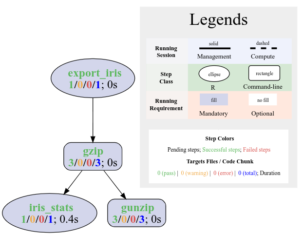{width=60% fig-align="center"}

For more details about the `plotWF` function, please visit its help with `?plotWF`.

## Report generation

`systemPipeR` produces two report types: Scientific and Technical. The
Scientific Report resembles a scientific publication detailing data analysis,
results, interpretation information, and user-provided text. The Technical
Report provides logging information useful for assessing workflow steps and
troubleshooting problems.

### Scientific reports

After a workflow run, `systemPipeR's` `renderReport` or `rmarkdown's` `render`
function can be used to generate  Scientific Reports in HTML, PDF or other
formats. The former uses the final `SAL` instance as input, and the latter the
underlying Rmd source file. The resulting reports mimic research papers by combining
user-generated text with analysis results, creating reproducible analysis
reports. This reporting infrastructure offers support for citations,
auto-generated bibliographies, code chunks with syntax highlighting, and inline
evaluation of variables to update text content. Tables and figures in a report
can be automatically updated when the document is rebuilt or workflows are
rerun, ensuring data components are always current. This automation increases
reproducibility and saves time creating Scientific Reports. Furthermore, the
workflow topology maps described earlier can be incorporated into Scientific
Reports, enabling integration between Scientific and Technical Reports. 

```{r}
#| eval: false
sal <- renderReport(sal)

rmarkdown::render("my.Rmd", clean = TRUE, output_format = "BiocStyle::html_document") 

```
Note, `my.Rmd` in the last code line needs to be replaced with the name (path) of 
the source `Rmd` file used for generating the `SAL` workflow container. 

### Technical report

The package collects technical information about workflow runs in a project’s
log directory (default name: `.SPRproject`). After partial or full completion
of a workflow, the logging information of a run is used by the `renderLog`
function to generate a Technical Report in HTML or other formats. The report
includes software execution commands, warnings and errors messages of each
workflow step. Easy visual navigation of Technical Reports is provided by
including an interactive instance of the corresponding workflow topology graph.
The technical details in these reports help assess the success of each workflow
step and facilitate troubleshooting.

```{r}
#| eval: false
sal <- renderLogs(sal)

```

## Converting workflows to Bash and Rmd

The SAL workflow containers of `systemPipeR` provide versatile conversion and
export options to both Rmd and executable Bash scripts. This feature not only
enhances the portability and reusability of workflows across different systems
but also promotes transparency, enabling efficient testing and
troubleshooting.

### R Markdown script

A populated `SAL` workflow container can be converted to an Rmd file using the
`sal2rmd` function. If needed, this `Rmd` file can be used to construct a `SAL`
workflow container with the `importWF` function as introduced above. This
functionality is useful for building templates of workflow Rmds and sharing
them with other systems. 

```{r}
#| eval: false
sal2rmd(sal)

```

### Bash script {#bash-script}

The `sal2bash` function converts and exports workflows stored in SAL containers
into executable Bash scripts. This enables users to run their workflows as Bash
scripts from the command line. The function takes a SAL container as input and
generates a `spr_wf.sh` file in the project's root directory as output.
Additionally, it creates a `spr_bash` directory that stores all R-based workflow
steps as separate R scripts. To minimize the number of R scripts needed, the 
function combines adjacent R steps into a single file. 

```{r}
#| eval: false
sal2bash(sal)

```

## Restarting and resetting workflows

The ability to restart existing workflows projects is important for continuing analyses that could not 
be completed, or to make changes without repeating already completed steps. Two main options are provided
to restart workflows. Another option is provided that resets workflows to the very beginning, which effectively
deletes the previous environment.

__1. The `resume=TRUE` option__ will initialize the latest instance of a `SAL` object stored in the `logs.dir`
   including its log files. When this option is used, a workflow can be continued where it was left off, 
   for example after closing and restarting R from the same directory on the same system. If the project was created
   with custom directory and/or file names, then those names need to be specified under the `log.dir` and `sys.file` 
   arguments of the `SPRproject` function, respectively, otherwise the default names will be used. 

```{r SPR_resume}
#| eval: false
sal <- SPRproject(resume = TRUE) 

```

If the R environment was saved, one can recover with `load.envir=TRUE` all
objects that were created during the previous workflow run. The same is possible with 
the `restart` option. For more details, please consult the help for the `runWF` function. 

```{r resume_load}
#| eval: false
sal <- SPRproject(resume = TRUE, load.envir = TRUE) 

```

After resuming the workflow with `load.envir` enabled, one can inspect the objects 
created in the old environment, and decide if it is necessary to copy them to the
current environment.

```{r envir}
#| eval: false
viewEnvir(sal)
copyEnvir(sal, list="plot", new.env = globalenv())

```

__2. The `restart=TRUE` option__ will also use the latest instance of the `SAL` object stored in 
   the `logs.dir`, but the previous log files will be deleted.


```{r restart_load}
#| eval: false
sal <- SPRproject(restart = TRUE) 

```

__3. The `overwrite=TRUE` option__ will reset the workflow project to the very beginning by deleting the 
   `log.dir` directory (`.SPRproject`) that stores the previous `SAL` instance and all its log files. At the same time 
   a new and empty ‘SAL’ workflow container will be created. This option should be used with caution
   since it will effectively delete the workflow environment. Output files written by the
   workflow steps to the `results` directory will not be deleted when this option is used. 

```{r SPR_overwrite}
#| eval: false
sal <- SPRproject(overwrite = TRUE) 

```

## Additional utilities {#sysargslist}

This section describes methods for accessing, subsetting and modifying `SAL`
workflow objects.

### Accessor methods {#accessor-methods}

Workflows and their run status can be explored further using a range of
accessor functions for `SAL` objects. 

#### General information

The number of steps in a workflow can be determined with the `length` function.

```{r}
length(sal)

```

The corresponding names of workflow steps can be returned with `stepName`.

```{r}
stepName(sal)

```

CL software used by each step in a workflow can be listed with `listCmdTools`.

```{r}
listCmdTools(sal)

```

Some computing systems (often HPC clusters) allow users to load CL software via 
an [Environment Modules](http://modules.sourceforge.net/) system into their PATH. 
If this is the case, then the exact verions of the software tools loaded via the 
module system can be listed for `SAL` and `SYSargs2` objects with `listCmdModules`
and `modules`, respectively. The example workflow used here 
does not make use of Environment Modules, and thus there are no software tools 
to list here. 

```{r}
listCmdModules(sal)
modules(stepsWF(sal)$gzip)

```

For more information on how to work with Environment Modules in `systemPipeR`, please
visit the help with `?module`, `?modules` and `?listCmdModules`.

#### Slot data

Several accessor functions are named after the corresponding slot names in
`SAL` objects. This makes it easy to look them up with `names()`, and then
apply them to `sal` as the only argument, such as `runInfo(sal)`. 

```{r}
names(sal)

```

The individual workflow steps in a `SAL` container are stored as `SYSargs2` and `LineWise` 
components. They can be returned with the `stepsWF` function. 

```{r}
stepsWF(sal)

```

The accessor function of `SYSargs2` and `LineWise` objects can be returned similarly 
(here for `gzip` step). 

```{r}
names(stepsWF(sal)$gzip)

```

The `statusWF` function returns a status summary for each step in a `SAL` workflow instance. 

```{r}
statusWF(sal)

```

The `targets` instances for each step in a workflow can be returned with `targetsWF`. The 
below applies it to the second step.

```{r}
targetsWF(sal[2])

```

If a workflow contains sample comparisons, that have been specified in the header 
lines of a targets file starting with a `# <CMP> tag`, then they can be returned 
with the `targetsheader` functions. This does not apply to the current demo `sal` 
instance, and thus the function returns `NULL`. For more details, consult the `targets` 
file section [here](https://girke.bioinformatics.ucr.edu/GEN242/tutorials/systempiper/systempiper/#targets-files).

```{r}
#| eval: false
targetsheader(sal, step = "Quality")

```

The `outfiles` component of a `SAL` object stores the paths to the expected outfiles files 
for each step in a workflow. Some of them are the input for downstream workflow steps.

```{r}
outfiles(sal[2])

```

The `dependency` step(s) in a workflow can be obtained with the
`dependency` function. This information is used to construct the toplogy
graph of a workflow (see [here](https://girke.bioinformatics.ucr.edu/GEN242/tutorials/systempiper/systempiper/#visualize-wf)). 

```{r}
dependency(sal)

```

The sample names (IDs) stored in the corresponding column of a targets file 
can be returned with the `SampleName` function. 

```{r}
SampleName(sal, step = "gzip")

```

The `getColumn` method can be used to obtain the paths to the files generated in a
specified step.

```{r}
getColumn(sal, "outfiles", step = "gzip", column = "gzip_file")
getColumn(sal, "targetsWF", step = "gzip", column = "FileName")

```

The `yamlinput` function returns the parameters of a workflow step defined in the 
corresponding yml file.

```{r}
yamlinput(sal, step = "gzip")

```

#### CL and R code {#cl-and-r}

The exact syntax for running CL software on each input data set in a workflow can 
be returned with the `cmdlist` function. The CL calls are assembled from the corresponding
`yml` and `cwl`, and an optional `targets` file as described in the above CLI section
[here](https://girke.bioinformatics.ucr.edu/GEN242/tutorials/systempiper/systempiper/#cl-interface). The example below shows the CL syntax for running `gzip`
and `gunzip` on the first input sample. Evaluating the output of `cmdlist` can
be very helpful for designing and debugging CWL parameter files to support new CL
software or changing their settings.

```{r}
cmdlist(sal, step = c(2,3), targets = 1)

```

Similarly, the `codeLine` function returns the R code of a `LineWise` workflow step.

```{r}
codeLine(sal, step = "export_iris")

```

#### R environment

The objects generated in a workflow's run environment can be accessed with `viewEnvir`.

```{r}
viewEnvir(sal)

```

If needed one or multiple objects can be copied from the run environment of a workflow 
to the current environment of an R session.

```{r}
copyEnvir(sal, list = c("plot"), new.env = globalenv(), silent = FALSE)

```

### Subsetting workflows

The bracket operator can be used to subset workflow by steps. For instance, the current
instance of `sal` has four steps, and `sal[1:2]` will subset the workflow to the first two 
steps. 

```{r}
length(sal)
sal[1:2]

```

In addition to subsetting by steps, one can subset workflows by input samples. The following
illustrates this for the first two input samples, but omits the function output for brevity.

```{r}
#| eval: false
sal_sub <- subset(sal, subset_steps = c(2,3), input_targets = c("SE", "VE"), keep_steps = TRUE)
stepsWF(sal_sub)
targetsWF(sal_sub)
outfiles(sal_sub)

```

For appending workflow steps, one can use the `+` operator.

```{r}
#| eval: false
sal[1] + sal[2] + sal[3]

```

### Replacement methods

Replacement methods are implemented to make adjustments to certain paramer settings and
R code in workflow steps.  

#### Changing parameters

```{r}
#| eval: false
## create a copy of sal for testing
sal_c <- sal
## view original value, here restricted to 'ext' slot
yamlinput(sal_c, step = "gzip")$ext
## Replace value under 'ext' 
yamlinput(sal_c, step = "gzip", paramName = "ext") <- "txt.gz"
## view modified value, here restricted to 'ext' slot
yamlinput(sal_c, step = "gzip")$ext
## Evaluate resulting CL call
cmdlist(sal_c, step = "gzip", targets = 1)

```

#### Changes to R steps {#change-r-step} 

Code lines can be added with `appendCodeLine` to R steps (`LineWise`) as shown in the 
following example. 

```{r}
#| eval: false
appendCodeLine(sal_c, step = "export_iris", after = 1) <- "log_cal_100 <- log(100)"
codeLine(sal_c, step = "export_iris")

```

In addition, code lines can be replaced with the `replaceCodeLine` function.
For additional details about the `LineWise` class, please see the example
[above](https://girke.bioinformatics.ucr.edu/GEN242/tutorials/systempiper/systempiper/#appendstep) and the detailed description of the `LineWise` class
[here](https://girke.bioinformatics.ucr.edu/GEN242/tutorials/systempiper/systempiper/#linewise).

```{r}
#| eval: false
replaceCodeLine(sal_c, step="export_iris", line = 2) <- LineWise(code={
                    log_cal_100 <- log(50)
                    })
codeLine(sal_c, step = "export_iris")

```

Renaming of workflow steps is possible with the `renameStep` function.

```{r}
#| eval: false
renameStep(sal_c, c(1, 2)) <- c("newStep2", "newIndex")
sal_c
names(outfiles(sal_c))
names(targetsWF(sal_c))
dependency(sal_c)

```

#### Replacing workflow steps

The `replaceStep` function can be used to replace entire workflow steps. When
replacing workflow steps, it is important to maintain a valid dependency graph
among the affected steps. 

```{r}
#| eval: false
sal_test <- sal[c(1,2)]
replaceStep(sal_test, step = 1, step_name = "gunzip" ) <- sal[3]
sal_test

```

If needed, workflow steps can be removed as follows. 

```{r}
sal_test <- sal[-2]
sal_test

```

## CWL specifications {#cwl}

This section provides a concise overview of [CWL](https://www.commonwl.org/user_guide/topics/) 
and its utilization within `systemPipeR`. It covers fundamental CWL concepts, including 
the `CommandLineTool` and `Workflow` classes for describing individual CL processes and 
workflows. For further details, readers want to refer to CWL's comprehensive
[CommandLineTool](https://www.commonwl.org/user_guide/topics/command-line-tool.html) and 
[Workflow](https://www.commonwl.org/user_guide/topics/workflows.html) documentation, as well 
as the examples provided in CWL's [Beginner Tutorial](https://carpentries-incubator.github.io/cwl-novice-tutorial/) 
and [User Guide](https://www.commonwl.org/user_guide/). Additionally, familiarizing oneself 
with [CWL's YAML](https://www.commonwl.org/user_guide/topics/yaml-guide.html) format 
specifications can be beneficial.

As illustrated in the introduction ([Fig 2](https://girke.bioinformatics.ucr.edu/GEN242/tutorials/systempiper/systempiper/#cl-interface)), CWL files with the '`.cwl`' 
extension define the parameters of a specific CL step or workflow, while files
with the '`.yml`' extension define their input values.

### CWL `CommandLineTool` {#cwl-clt}

A Command Line Tool (`CommandLineTool` class) specifies a standalone process
that can be run by itself (without including interactions with other
programs), and has inputs and outputs.

The following inspects the basic structure of a '`.cwl`' sample file for a `CommandLineTool` 
that is provided by this package. 

```{r}
dir_path <- system.file("extdata/cwl", package = "systemPipeR")
cwl <- yaml::read_yaml(file.path(dir_path, "example/example.cwl"))

```
Important components include:

__1.__ `cwlVersion`: version of CWL specification used by file.

__2.__ `class`: declares description of a `CommandLineTool`. 

```{r}
cwl[1:2]

```

__3.__ `baseCommand`: name of CL tool.

```{r}
cwl[3]

```

__4.__ `inputs`: defines input information to run the tool. This includes:

- `id`: each input has an `id` including name.
- `type`: type of input value; one of `string`, `int`, `long`, `float`, `double`, 
    `File`, `Directory` or `Any`.
- `inputBinding`: indicates if the input parameter should appear in CL call. If 
      missing input will not appear in the CL call.

```{r}
cwl[4]

```

__5.__. `outputs`: list of expected outputs after running the CL tool. Important components are:

- `id`: each input has an `id` including name.
- `type`: type of output value; one of `string`, `int`, `long`, `float`, `double`, 
    `File`, `Directory`, `Any` or `stdout`);
- `outputBinding`: defines how to set outputs values; `glob` specifies output value's name. 

```{r}
cwl[5]

```

__6.__ `stdout`: specifies `filename` for standard output. Note, by default `systemPipeR` 
       constructs the output `filename` from `results_path` and `SampleName` (see above).

```{r}
cwl[6]

```

## CWL `Workflow` {#cwl-wf}

CWL's `Workflow` class describes one or more workflow steps, declares
their interdependencies, and defines how `CommandLineTools` are executed. 
Its CWL file includes inputs, outputs, and steps. 

The following illustrates the basic structure of a '`.cwl`' sample file for a `Workflow` 
that is provided by this package. 

```{r}
cwl.wf <- yaml::read_yaml(file.path(dir_path, "example/workflow_example.cwl"))

```

__1.__ `cwlVersion`: version of CWL specification used by file.

__2.__ `class`: declares description of a `Workflow` that describes one or 
       more `CommandLineTools` and their combined usage. 

```{r}
cwl.wf[1:2]

```

__3.__ `inputs`: defines the inputs of the workflow. 

```{r}
cwl.wf[3]

```

__4.__ `outputs`: defines the outputs of the workflow.

```{r}
cwl.wf[4]

```

__5.__ `steps`: describes the steps of the workflow. The example below shows one step.

```{r}
cwl.wf[5]

```

## CWL input values

The `.yml` file provides the input values for the parameters described above.
The following example includes input values for three parameters (`message`,
`SampleName` and `results_path`).

```{r}
yaml::read_yaml(file.path(dir_path, "example/example_single.yml"))

```

Note, the `.yml` file needs to provide input values for each input parameter 
specified in the corresponding `.cwl` file (compare `cwl[4]` above).


## Mappings among `cwl`, `yml` and `targets` {#cwl_targets}

This section illustrates how the parameters in CWL files (`cwl` and `yml`) are 
interconnected to construct CL calls of steps, and subsequently assembled 
to workflows. 

A `SAL` container (long name `SYSargsList`) stores all information and instructions 
needed for processing a set of inputs (incl. files) with a single or many CL steps within a workflow 
The `SAL` object is created and fully populated with the `SYSargsList` constructor
function. More detailed documentation of `SAL` workflow instances is available
[here](https://girke.bioinformatics.ucr.edu/GEN242/tutorials/systempiper/systempiper/#appendstep) and [here](https://girke.bioinformatics.ucr.edu/GEN242/tutorials/systempiper/systempiper/#sysargslist).

The following imports the `.cwl` and `.yml` files for running the `echo Hello World!`
example.

```{r fromFile}
HW <- SYSargsList(wf_file = "example/workflow_example.cwl", 
                  input_file = "example/example_single.yml", 
                  dir_path = system.file("extdata/cwl", package = "systemPipeR"))
HW
cmdlist(HW)

```

The example provided is restricted to creating a CL call for a single input
(sample). To process multiple inputs, a straightforward approach is to assign
variables to the corresponding parameters instead of using fixed (hard-coded)
values. These variables can then be assigned the desired input values
iteratively, resulting in multiple CL calls, one for each input value. The 
following illustrates this with an example, where the `message` and `SampleName` 
parameters are assigned variables that are labeled with tags of the form
`_XXX_`. These variables will be assigned values stored in a `targets` file. 


```{r}
yml <- yaml::read_yaml(file.path(dir_path, "example/example.yml"))
yml

```

The content of the `targets` file used for this example is shown below. The 
general structure of `targets` files is explained [above](https://girke.bioinformatics.ucr.edu/GEN242/tutorials/systempiper/systempiper/#targets-files).

```{r}
targetspath <- system.file("extdata/cwl/example/targets_example.txt", package = "systemPipeR")
read.delim(targetspath, comment.char = "#")

```

In the simple example given above the values stored under the `Message` and
`SampleName` columns of the targets file will be passed on to the corresponding
parameters with matching names in the `yml` file, and from there to
the `echo` command defined in the `cwl` file (see [here](https://girke.bioinformatics.ucr.edu/GEN242/tutorials/systempiper/systempiper/#cwl-wf)). 
As mentioned previously, the usage of `targets` files is optional in
`systemPipeR`. Since `targets` files provide an easy and efficient solution for
organizing experimental variables, their usage is highly encouraged and well
supported in `systemPipeR`.

#### Assembly of CL calls from three files

The `SYSargsList` function constructs `SAL` instances from the three parameter
files, that were introduced above (see [Fig 3](https://girke.bioinformatics.ucr.edu/GEN242/tutorials/systempiper/systempiper/#cl-interface)). The path to each file is assigned to its own
argument: `wf_file` is assigned the path of a `cwl` workflow file, `input_file`
the path of a `yml` input file, and `targets` the path of a `targets` file. Additionally, a named
vector is provided under the `inputvars` argument that defines which column
values in the `targets` file are assigned to specific parameters in the `yml`
file. A parameter connection is established where a name in `inputvars` has
matching column and parameter names in the `targets` and `yml` files,
respectively (Fig 3). A tagging syntax with the pattern `_XXX_` is used to
indicate which parameters contain variables that will be assigned values from
the `targets` file. The usage of this pattern is only recommended for
consistency and easy identification, but not enforced.

The `SYSargslist` function call constructs the `echo` commands (CL calls) based on the 
parameters provided by the above described parameter file instances (`cwl`, `yml` and `targets`) 
as well as the variable mappings specified under the `inputvars` argument. 

```{r fromFile_example}
HW_mul <- SYSargsList(step_name = "echo", 
                      targets=targetspath, 
                      wf_file="example/workflow_example.cwl", input_file="example/example.yml", 
                      dir_path = dir_path, 
                      inputvars = c(Message = "_STRING_", SampleName = "_SAMPLE_"))
HW_mul

```

The final CL calls (here `echo` command) can be returned with the `cmdlist` for
each string given under the `Message` column of the `targets` file. The values under
the `SampleName` column are used to name the corresponding output files, each with a
`txt` extension. 

```{r fromFile_example2}
cmdlist(HW_mul)

```

## Auto-creation of CWL files {#cwl-auto} 

To streamline the process of generating CWL parameter files (both `cwl` and
`yml`), users can simply provide the CL syntax for executing new software. This
action will automatically create the corresponding CWL parameter files, which
alleviates the need for manual creation of CWL files, reducing the
burden on users. This functionality is implemented in systemPipeR’s
`createParam` function group. 

### Expected CL syntax 

To use this functionality, CL calls need to be provided in a pseudo-bash script format
and stored as a `character vector`. 

The following uses as example a CL call for the HISAT2 software.

```{r cmd_orig}
#| eval: false
hisat2 -S ./results/M1A.sam -x ./data/tair10.fasta -k 1 -min-intronlen 30 -max-intronlen 3000 -threads 4 -U ./data/SRR446027_1.fastq.gz

```

For the CL call above, the corresponding pseudo-bash syntax is given below.
Here, the CL string needs to be stored in a single slot of a `character vector`, 
here named `command`. The formatting requirements for the CL string will be explained
next.

```{r cmd}
command <- "
    hisat2 \
    -S <F, out: ./results/M1A.sam> \
    -x <F: ./data/tair10.fasta> \
    -k <int: 1> \
    -min-intronlen <int: 30> \
    -max-intronlen <int: 3000> \
    -threads <int: 4> \
    -U <F: ./data/SRR446027_1.fastq.gz>
"

```

__Format specifications for pseudo-bash syntax (Version 1)__

- The syntax organizes each part of a CL string on a separate line. Each part is terminated by a backslash `\` at the end of a line.
- The first line contains the base command (`baseCommand`). It can include a subcommand, such as in `git commit` where `commit` is a subcommand. 
- Arguments are listed in the subsequent lines, one argument per line.
- Short- and long-form arguments are expected to start on a new line with one
  or two dashes, respectively, and are terminated by the first space on the
  same line, such as `-S` and `--min`. Values that should be assigned to
  arguments are placed inside `<...>`, also on the same line. Arguments and flags without 
  values lack this assignment. 
- The type of the input for arguments with assigned values is defined by a pattern of the form `<TYPE:`, where `TYPE` can be 
  `F` for "File", "int", "string", etc. 
- Optional: to indicate that an argument specifies CWL output, the flag `out` can be added after `TYPE` separated by a comma.
- Lines without a prefix will be treated as positional arguments. The line
  number defines the position of the argument in the CL.
- A colon `:` is used to separate keywords and default values. Any non-space value after the `:` will be treated as a default value. 

Note, the above specifications are Version 1 (`v1`) of the pseudo-bash syntax
used by the `createParam` function below. There also is a Version 2 (`v2`)
specification that supports additional features, but comes with more syntax
restrictions. Details on this are available in the help of the `createParam`
function. 

### `createParam` Function

The `createParam` function accepts as input a CL string that is formatted in the above 
pseudo-bash syntax. As output it creates the corresponding CWL files (`cwl` and `yml`) 
that will be written to the default directory: `./param/cwl/`. This path can be changed 
under the `file` argument. In addition, it constructs for the given CL string the corresponding
`SYSargs2` object (here assigned to `cmd`). The information printed as console output
contains the original CL string that is included for checking purposes. This CL string is 
not included to the resulting CWL files. 


```{r}
cmd <- createParam(command, writeParamFiles = TRUE, overwrite=TRUE, confirm=TRUE) 

```

Next, the `cmdlist` can be used to check the correctness of the CL call defined
by the CWL parameter files generated by the `createParam` command above. 

```{r}
cmdlist(cmd)

```

If the `createParam` function is executed without creating the CWL parameter files right 
away (argument setting `writeParamFiles=FALSE`) then these files can be generated in a 
separate step with `writeParamFiles`. 

```{r saving}
#| eval: false
writeParamFiles(cmd, overwrite = TRUE)

```

### Example with `targets` file

The following gives a more complete example where the CWL files are first created for a CL string, 
and then loaded together with a `targets` file into a `SYSargs2` object. Next, the final CL calls 
are assembled for each input sample with the `renderWF` function. The final CL calls can then be 
inspected with the `cmdlist` function, where the below shows only the first 2 of a total of
18 CL calls for brevity. The R code for these steps can be downloaded from [here](https://raw.githubusercontent.com/tgirke/GEN242/refs/heads/main/static/custom/cwl/rcwl.R). 

__1. Define CL call__

```{r sysargs2b}
#| eval: false
#| results: hide
library(systemPipeR)
command2 <- "
    hisat2 \
    -S <F, out: ./results/_SampleName_.sam> \
    -x <F: ./data/tair10.fasta> \
    -k <int: 1> \
    -min-intronlen <int: 30> \
    -max-intronlen <int: 3000> \
    -threads <int: 4> \
    -U <F: _FASTQ_PATH1_>
"

WF <- createParam(command2, overwrite = TRUE, writeParamFiles = TRUE, confirm = TRUE)
yml <- yaml::read_yaml("param/cwl/hisat2/hisat2.yml"); yml <- c(SampleName = "_SampleName_", yml); yaml::write_yaml(yml, "param/cwl/hisat2/hisat2.yml")
targetspath <- system.file("extdata", "targets.txt", package = "systemPipeR")
WF_test <- loadWorkflow(targets = targetspath, wf_file = "hisat2.cwl", input_file = "hisat2.yml",
    dir_path = "param/cwl/hisat2/")
WF_test <- renderWF(WF_test, inputvars = c(FileName = "_FASTQ_PATH1_", SampleName = "_SampleName_"))

```

__2. Test CL call__

```{r sysargs2c}
#| eval: false
#| results: hide
cmdlist(WF_test)[1:2]

```

__3. Use CL call in a WF step__

```{r sysargs2d}
#| eval: false
#| results: hide
dir.create("data") # create data directory if it doesn't exist
sal <- SPRproject(overwrite=TRUE) # Use overwrite only for testing
appendStep(sal) <- LineWise(code = {
    library(systemPipeR)
}, step_name = "load_SPR")

appendStep(sal) <- SYSargsList(step_name = "hisat2_mapping",
    targets = targetspath, wf_file = "hisat2.cwl",
    input_file = "hisat2.yml", dir_path = "param/cwl/hisat2",
    inputvars = c(FileName = "_FASTQ_PATH1_", SampleName = "_SampleName_"),
    dependency=c("load_SPR")
)
cmdlist(sal)

```

## Workflow step classes

The workflow steps of `SAL` (synonym `SYSargsList`) containers are composed of `SYSargs2` 
and/or `LineWise` objects. These two classes are introduced here in more detail.

### `SYSargs2` class {#sysargs2}

The `SYSargs2` class stores workflow steps that run CL software. An instance of
`SYSargs2` stores all the input/output paths and parameter components necessary
for executing a specific CL data analysis step. `SYSargs2` instances are
created using two constructor functions: `loadWF` and `renderWF`. These
functions make use of a `targets` (or `yml`) and the two CWL parameter files
`cwl` and `yml`. The structure and content for the CWL files are described
[above](https://girke.bioinformatics.ucr.edu/GEN242/tutorials/systempiper/systempiper/#cwl). The following creates a `SYSargs2` instance using the `cwl` and
`yml` files for running the RNA-Seq read aligner HISAT2 [@Kim2015-ve]. Note,
when using the `SYSargsList` method for constructing workflow steps 
(see [here](https://girke.bioinformatics.ucr.edu/GEN242/tutorials/systempiper/systempiper/#cmd-step)), then the user will not need to run the `loadWF` 
and `renderWF` directly. 


```{r SYSargs2_structure}
library(systemPipeR)
targetspath <- system.file("extdata", "targets.txt", package = "systemPipeR")
dir_path <- system.file("extdata/cwl", package = "systemPipeR")
WF <- loadWF(targets = targetspath, wf_file = "hisat2/hisat2-mapping-se.cwl",
                   input_file = "hisat2/hisat2-mapping-se.yml",
                   dir_path = dir_path)

WF <- renderWF(WF, inputvars = c(FileName = "_FASTQ_PATH1_", 
                                 SampleName = "_SampleName_"))

```

In addition to `SAL` objects (see [here](https://girke.bioinformatics.ucr.edu/GEN242/tutorials/systempiper/systempiper/#cl-and-r)), the `cmdlist` function accepts 
`SYSargs2` to constructs CL calls based on the parameter inputs imported from the
corresponding `targets`, `yml` and `cwl` files. 

```{r cmdlist}
cmdlist(WF)[1]

```

Several accessor methods are available that are named after the slot names of
`SYSargs2` objects.

```{r names_WF}
names(WF)

```

The output components of `SYSargs2` define the expected output files for each
step in the workflow; some of which are the input for the next workflow step,
 _e.g._ a downstream `SYSargs2` instance.

```{r output_WF}
output(WF)[1]

```

The `targets` method allows access to the `targets` component of a `SYSargs2`
object. Refer to the information provided [above](https://girke.bioinformatics.ucr.edu/GEN242/tutorials/systempiper/systempiper/#targets-files) for an
explanation of the `targets` file structure.

```{r}
targets(WF)[1]
as(WF, "DataFrame")

```

If CL software is loaded via an [Environment Modules](http://modules.sourceforge.net/) system
into a user's `PATH`, then this information can be accessed in `SYSargs2` objects as shown
below. For more details on working with Environment Modules, see [here](https://girke.bioinformatics.ucr.edu/GEN242/tutorials/systempiper/systempiper/#module-system).

```{r}
modules(WF)

```

Additional accessible information includes the location of the parameters files, 
`inputvars` (see [here](https://girke.bioinformatics.ucr.edu/GEN242/tutorials/systempiper/systempiper/#cmd-step)) and more.

```{r}
#| eval: false
files(WF)
inputvars(WF)

```

### LineWise Class {#linewise}

To define R code as workflow steps, the `LineWise` class is used. The syntax
for declaring lines of R code as workflow steps in R or Rmd files is introduced
in the [workflow design](https://girke.bioinformatics.ucr.edu/GEN242/tutorials/systempiper/systempiper/#linewise_rmd) section. The following showcases
additional utilities for `LineWise` objects.

```{r lw}
rmd <- system.file("extdata", "spr_simple_lw.Rmd", package = "systemPipeR")
sal_lw <- SPRproject(overwrite = TRUE)
sal_lw <- importWF(sal_lw, rmd, verbose = FALSE)
codeLine(sal_lw)

```

Coerce a `LineWise` object to a `list` object and vice versa.

```{r}
lw <- stepsWF(sal_lw)[[2]]
## Coerce
ll <- as(lw, "list")
class(ll)
lw <- as(ll, "LineWise")
lw

```

Accessing basic information of `LineWise` objects. 

```{r}
length(lw)
names(lw)
codeLine(lw)
codeChunkStart(lw)
rmdPath(lw)

```

Subsetting `LineWise` objects.

```{r}
l <- lw[2]
codeLine(l)
l_sub <- lw[-2]
codeLine(l_sub)

```

Replacement methods for changing R code in `LineWise` objects.

```{r}
replaceCodeLine(lw, line = 2) <- "5+5"
codeLine(lw)
appendCodeLine(lw, after = 0) <- "6+7"
codeLine(lw)

```

For comparison, similar replacement methods are available for `SAL` objects. They have been
covered [above](https://girke.bioinformatics.ucr.edu/GEN242/tutorials/systempiper/systempiper/#change-r-step). 

```{r}
#| eval: false
replaceCodeLine(sal_lw, step = 2, line = 2) <- LineWise(code={
                                                             "5+5"
                                                                })
codeLine(sal_lw, step = 2)

appendCodeLine(sal_lw, step = 2) <- "66+55"
codeLine(sal_lw, step = 2)

appendCodeLine(sal_lw, step = 1, after = 1) <- "66+55"
codeLine(sal_lw, step = 1)

```

## Supplemental Material

### Examples of CL software {#third-party-software-tools}

Here is a partial list of CL software for which `systemPipeR` includes CWL
parameter file templates. Notably, with the newly added auto-creation feature
for CWL files (see [here](https://girke.bioinformatics.ucr.edu/GEN242/tutorials/systempiper/systempiper/#cwl-auto)), generating CWL parameter files for most CL 
tools has become straightforward. Thus, maintaining and extending this list will
not be necessary anymore.

```{r table_tools}
#| echo: false
#| message: false
library(magrittr)
SPR_software <- system.file("extdata", "SPR_software.csv", package = "systemPipeR")
software <- read.delim(SPR_software, sep = ",", comment.char = "#")
colors <- colorRampPalette((c("darkseagreen", "indianred1")))(length(unique(software$Category)))
id <- as.numeric(c((unique(software$Category))))
software %>%
  dplyr::mutate(Step = kableExtra::cell_spec(Step, color = "white", bold = TRUE,
   background = factor(Category, id, colors))) %>%
   dplyr::select(Tool, Step, Description) %>%
   dplyr::arrange(Tool) %>% 
  kableExtra::kable("html", escape = FALSE, col.names = c("Tool Name", "Description", "Step")) %>%
    kableExtra::kable_material(c("striped", "hover", "condensed")) %>%
    kableExtra::scroll_box(width = "90%", height = "500px")

```

To run any of the tools mentioned, users must ensure that the necessary
software is installed on their system and added to the `PATH`. There are
several methods to verify if the required tools/modules are installed. The
easiest method is automatically executed for users when they call the `importWF`
function, or just `tryCL(<base_command>)`. In the print message of `importWF`, all 
necessary tools and modules are automatically listed and checked for users. 
For additional tool validation methods, please refer to these instructions: 
[Five Minute Tutorial](https://girke.bioinformatics.ucr.edu/GEN242/tutorials/systempiper/systempiper/#five-min), [Environment Modules](https://girke.bioinformatics.ucr.edu/GEN242/tutorials/systempiper/systempiper/#module-system), and
[Managing Workflows](https://systempipe.org/sp/spr/sp_run/step_run/#before-running). 

```{r cleaning3}
#| include: false
if (file.exists(".SPRproject")) unlink(".SPRproject", recursive = TRUE)
## NOTE: Removing previous project create in the quick starts section

```

### Data analysis functionalities

This section presents various data analysis functionalities that are valuable
for many workflows. Some of these functionalities are R functions, while others
are CWL interfaces to widely used CL software. A few of them are included for
historical reasons.

### Project initialization

To work with the following examples a new workflow project needs to be created.
The below includes the `overwrite=TRUE` setting to remove any already 
project directory.

```{r SPRproject2}
#| eval: false
sal <- SPRproject(projPath = getwd(), overwrite = TRUE) 

```

The first step in the new workflow project is to load the `systemPipeR` package.

```{r load_SPR}
#| message: false
#| eval: false
#| spr: true
appendStep(sal) <- LineWise({
                            library(systemPipeR)
                            }, 
                            step_name = "load_SPR")

```

Importantly, in order to use the individual `appendStep` operations below, one has 
to pay attention to the step dependencies.

#### Read Preprocessing

##### Preprocessing with `preprocessReads` function

The function `preprocessReads` allows to apply predefined or custom
read preprocessing functions to the FASTQ files referenced in a
`SYSargsList` container, such as quality filtering or adapter trimming
routines. Internally, `preprocessReads` uses the `FastqStreamer` function from
the `ShortRead` package to stream through large FASTQ files in a
memory-efficient manner. The following example performs adapter trimming with
the `trimLRPatterns` function from the `Biostrings` package.

In this step, the preprocessing parameters defined in the corresponding
`*.pe.cwl` and `*.pe.yml` files are added to a previously created `SAL` object.
This preprocessing step is crucial for preparing the reads for further
analysis.

```{r preprocessing}
#| message: false
#| eval: false
#| spr: true
targetspath <- system.file("extdata", "targetsPE.txt", package = "systemPipeR")
appendStep(sal) <- SYSargsList(
    step_name = "preprocessing",
    targets = targetspath, dir = TRUE,
    wf_file = "preprocessReads/preprocessReads-pe.cwl",
    input_file = "preprocessReads/preprocessReads-pe.yml",
    dir_path = system.file("extdata/cwl", package = "systemPipeR"),
    inputvars = c(
        FileName1 = "_FASTQ_PATH1_",
        FileName2 = "_FASTQ_PATH2_",
        SampleName = "_SampleName_"
    ),
    dependency = c("load_SPR"))

```

After the preprocessing step, the `outfiles` files can be used to generate the new 
targets files containing the paths to the trimmed FASTQ files. The new targets 
information can be used for the next workflow step instance, _e.g._ running the 
NGS alignments with the trimmed FASTQ files. The `appendStep` function is
automatically handling this connectivity between steps. Please check the next 
step for more details.

The following example shows how one can design a custom `preprocessReads`
function. Here, it is possible to replace the function used on the
`preprocessing` step and modify the corresponding `sal` object. Because it is a
custom function, it is necessary to save this part in the R object, and
internally the `preprocessReads.doc.R` script, that is stored in the `param` directory 
of the workflow templates, is loading the custom function. If the R
object is saved with a different name (here `"param/customFCT.RData"`), one has
to adjust the corresponding path in the `preprocessReads.doc.R` script.

First, the custom function is defined.

```{r custom_preprocessing_function}
#| eval: false
appendStep(sal) <- LineWise(
    code = {
        filterFct <- function(fq, cutoff = 20, Nexceptions = 0) {
            qcount <- rowSums(as(quality(fq), "matrix") <= cutoff, na.rm = TRUE)
            # Retains reads where Phred scores are >= cutoff with N exceptions
            fq[qcount <= Nexceptions]
        }
        save(list = ls(), file = "param/customFCT.RData")
    },
    step_name = "custom_preprocessing_function",
    dependency = "preprocessing"
)

```

After this the input parameters can be edited as shown here.

```{r editing_preprocessing}
#| message: false
#| eval: false
yamlinput(sal, "preprocessing")$Fct
yamlinput(sal, "preprocessing", "Fct") <- "'filterFct(fq, cutoff=20, Nexceptions=0)'"
yamlinput(sal, "preprocessing")$Fct ## check the new function
cmdlist(sal, "preprocessing", targets = 1) ## check if the command line was updated with success

```

##### Preprocessing with TrimGalore!

[TrimGalore!](http://www.bioinformatics.babraham.ac.uk/projects/trim_galore/) is 
a wrapper tool for Cutadapt and FastQC to consistently apply quality and adapter 
trimming to fastq files.

```{r trimGalore}
#| eval: false
#| spr: true
targetspath <- system.file("extdata", "targets.txt", package = "systemPipeR")
appendStep(sal) <- SYSargsList(step_name = "trimGalore", 
                               targets = targetspath, dir = TRUE,
                               wf_file = "trim_galore/trim_galore-se.cwl", 
                               input_file = "trim_galore/trim_galore-se.yml", 
                               dir_path = system.file("extdata/cwl", package = "systemPipeR"),
                               inputvars = c(FileName = "_FASTQ_PATH1_", SampleName = "_SampleName_"), 
                               dependency = "load_SPR", 
                               run_step = "optional")

```


##### Preprocessing with Trimmomatic

[Trimmomatic](http://www.usadellab.org/cms/?page=trimmomatic) software [@Bolger2014-yr] 
performs a variety of useful trimming tasks for Illumina paired-end and single
ended reads. The following is an example of how to perform this task.

```{r trimmomatic}
#| eval: false
#| spr: true
targetspath <- system.file("extdata", "targets.txt", package = "systemPipeR")
appendStep(sal) <- SYSargsList(step_name = "trimmomatic", 
                               targets = targetspath, dir = TRUE,
                               wf_file = "trimmomatic/trimmomatic-se.cwl", 
                               input_file = "trimmomatic/trimmomatic-se.yml", 
                               dir_path = system.file("extdata/cwl", package = "systemPipeR"),
                               inputvars = c(FileName = "_FASTQ_PATH1_", SampleName = "_SampleName_"), 
                               dependency = "load_SPR", 
                               run_step = "optional")

```

#### FASTQ quality report

The following `seeFastq` and `seeFastqPlot` functions generate and plot a series of useful 
quality statistics for a set of FASTQ files, including per cycle quality box
plots, base proportions, base-level quality trends, relative k-mer
diversity, length, and occurrence distribution of reads, number of reads
above quality cutoffs and mean quality distribution. The results are
written to a PDF file named `fastqReport.pdf`.

```{r fastq_report}
#| eval: false
#| message: false
#| spr: true
appendStep(sal) <- LineWise(code = {
                fastq <- getColumn(sal, step = "preprocessing", "targetsWF", column = 1)
                fqlist <- seeFastq(fastq = fastq, batchsize = 10000, klength = 8)
                pdf("./results/fastqReport.pdf", height = 18, width = 4*length(fqlist))
                seeFastqPlot(fqlist)
                dev.off()
                }, step_name = "fastq_report", 
                dependency = "preprocessing")

``` 

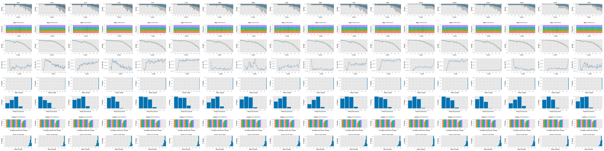{fig-align="center"}<div align="center">FASTQ quality report </div></br>


#### NGS Alignment software

After quality control, the sequence reads can be aligned to a reference genome or 
transcriptome. The following gives examples for running several NGS read aligners. 

##### `HISAT2`

The following steps demonstrate how to run the `HISAT2` short read aligner
[@Kim2015-ve] from `systemPipeR`.

To use an NGS aligner, one has to first index the reference genome. This is done
below with `hisat2-build`.

```{r hisat_index}
#| eval: false
#| spr: true
appendStep(sal) <- SYSargsList(step_name = "hisat_index", 
                               targets = NULL, dir = FALSE,
                               wf_file = "hisat2/hisat2-index.cwl", 
                               input_file = "hisat2/hisat2-index.yml", 
                               dir_path = system.file("extdata/cwl", package = "systemPipeR"),
                               inputvars = NULL, 
                               dependency = "preprocessing")

```

The parameter settings of the aligner are defined in the `workflow_hisat2-se.cwl` 
and `workflow_hisat2-se.yml` files. The following shows how to append the alignment 
step to the `sal` workflow container. In this step several post-processing steps 
with `Samtools` are included to convert the SAM files, that were generated by `HISAT2`, 
to indexed and sorted BAM files. Those sub-steps are defined by the corresponding CWL workflow file 
(see workflow_hisat2-se.cwl). 

```{r hisat_mapping_samtools}
#| eval: false
#| spr: true
appendStep(sal) <- SYSargsList(step_name = "hisat_mapping", 
                               targets = "preprocessing", dir = TRUE,
                               wf_file = "workflow-hisat2/workflow_hisat2-se.cwl", 
                               input_file = "workflow-hisat2/workflow_hisat2-se.yml", 
                               dir_path = system.file("extdata/cwl", package = "systemPipeR"),
                               inputvars=c(FileName1="_FASTQ_PATH1_", SampleName="_SampleName_"), 
                               dependency = c("hisat_index"), 
                               run_session = "compute")

```

##### `STAR`

The following demonstrates how to run the `STAR` short read aligner
from `systemPipeR`. First, one has to index the reference genome for `STAR`.

```{r star_index}
#| eval: false
#| spr: true
appendStep(sal) <- SYSargsList(
    step_name = "star_index", 
    dir = FALSE, 
    targets=NULL, 
    wf_file = "star/star-index.cwl", 
    input_file="star/star-index.yml",
    dir_path="param/cwl", 
    dependency = "load_SPR"
)

```

The parameter settings of the aligner are defined in the `star-mapping-pe.cwl` 
and `star-mapping-pe.cwl` files. The following shows how to append the alignment 
step to the `sal` workflow container. Note, in this step `STAR` also generates the 
BAM files as well as the corresponding read counting tables. 

```{r star_mapping}
#| eval: false
#| spr: true
appendStep(sal_test) <- SYSargsList(
    step_name = "star_mapping",
    dir = TRUE,
    targets ="preprocessing",
    wf_file = "star/star-mapping-pe.cwl",
    input_file = "star/star-mapping-pe.yml",
    dir_path = "param/cwl",
    inputvars = c(preprocessReads_1 = "_FASTQ_PATH1_", preprocessReads_2 = "_FASTQ_PATH2_",
                  SampleName = "_SampleName_"), rm_targets_col = c("FileName1", "FileName2"),
    dependency = c("preprocessing", "star_index")
)

```
A more detailed example is given [here](https://github.com/tgirke/GEN242/blob/main/content/en/assignments/Projects/helper_code/aligners/star_test.Rmd) that also provides code for assembling the read counts
for all processed samples in a single matrix.

##### `Tophat2`

The `Bowtie2/Tophat2` suite is the predecessor of `Hisat2` [@Kim2013-vg; @Langmead2012-bs]. 
How to run it via CWL is shown below. 

First, the reference genome has to be indexed for `Bowtie2`. 

```{r bowtie_index}
#| eval: false
#| spr: true
appendStep(sal) <- SYSargsList(step_name = "bowtie_index", 
                               targets = NULL, dir = FALSE,
                               wf_file = "bowtie2/bowtie2-index.cwl", 
                               input_file = "bowtie2/bowtie2-index.yml", 
                               dir_path = system.file("extdata/cwl", package = "systemPipeR"),
                               inputvars = NULL, 
                               dependency = "preprocessing", 
                               run_step = "optional")

```

Next, the alignment step is constructed with the parameter files `workflow_tophat2-mapping.cwl` 
and `tophat2-mapping-pe.yml`. 

```{r tophat2_mapping}
#| eval: false
#| spr: true
appendStep(sal) <- SYSargsList(step_name = "tophat2_mapping", 
                               targets = "preprocessing", dir = TRUE,
                               wf_file = "tophat2/workflow_tophat2-mapping-se.cwl", 
                               input_file = "tophat2/tophat2-mapping-se.yml", 
                               dir_path = system.file("extdata/cwl", package = "systemPipeR"),
                               inputvars=c(preprocessReads_se="_FASTQ_PATH1_", SampleName="_SampleName_"), 
                               dependency = c("bowtie_index"), 
                               run_session = "remote", 
                               run_step = "optional")

```

##### `Bowtie2`

The following example runs `Bowtie2` by itself (without `Tophat2` or `Hisat2`). 

```{r bowtie2_mapping}
#| eval: false
#| spr: true
appendStep(sal) <- SYSargsList(step_name = "bowtie2_mapping", 
                               targets = "preprocessing", dir = TRUE,
                               wf_file = "bowtie2/workflow_bowtie2-mapping-se.cwl", 
                               input_file = "bowtie2/bowtie2-mapping-se.yml", 
                               dir_path = system.file("extdata/cwl", package = "systemPipeR"),
                               inputvars=c(preprocessReads_se="_FASTQ_PATH1_", SampleName="_SampleName_"), 
                               dependency = c("bowtie_index"), 
                               run_session = "remote", 
                               run_step = "optional")

```

##### `BWA-MEM`

The following example runs BWA-MEM, an aligner that is widely used for VAR-Seq experiments. 

First, the reference genome has to be indexed for `BWA-MEM`. 

```{r bwa_index}
#| eval: false
#| spr: true
appendStep(sal) <- SYSargsList(step_name = "bwa_index", 
                               targets = NULL, dir = FALSE,
                               wf_file = "bwa/bwa-index.cwl", 
                               input_file = "bwa/bwa-index.yml", 
                               dir_path = system.file("extdata/cwl", package = "systemPipeR"),
                               inputvars = NULL, 
                               dependency = "preprocessing", 
                               run_step = "optional")

```

Next, the reads can be aligned with `BWA-MEM`. 

```{r bwa_mapping}
#| eval: false
#| spr: true
appendStep(sal) <- SYSargsList(step_name = "bwa_mapping", 
                               targets = "preprocessing", dir = TRUE,
                               wf_file = "bwa/bwa-se.cwl", 
                               input_file = "bwa/bwa-se.yml", 
                               dir_path = system.file("extdata/cwl", package = "systemPipeR"),
                               inputvars=c(preprocessReads_se="_FASTQ_PATH1_", SampleName="_SampleName_"), 
                               dependency = c("bwa_index"), 
                               run_session = "remote", 
                               run_step = "optional")

```

##### `Rsubread`

`Rsubread` is an R package for processing short and long reads. It is well known for its
fast and accurate mapping performance of RNA-Seq reads. 

First, the reference genome has to be indexed for `Rsubread`. 

```{r rsubread_index}
#| eval: false
#| spr: true
appendStep(sal) <- SYSargsList(step_name = "rsubread_index", 
                               targets = NULL, dir = FALSE,
                               wf_file = "rsubread/rsubread-index.cwl", 
                               input_file = "rsubread/rsubread-index.yml", 
                               dir_path = system.file("extdata/cwl", package = "systemPipeR"),
                               inputvars = NULL, 
                               dependency = "preprocessing", 
                               run_step = "optional")

```

Next, the RNA-Seq reads can be aligned with `Rsubread`. 

```{r rsubread_mapping}
#| eval: false
#| spr: true
appendStep(sal) <- SYSargsList(step_name = "rsubread", 
                               targets = "preprocessing", dir = TRUE,
                               wf_file = "rsubread/rsubread-mapping-se.cwl", 
                               input_file = "rsubread/rsubread-mapping-se.yml", 
                               dir_path = system.file("extdata/cwl", package = "systemPipeR"),
                               inputvars=c(FileName1="_FASTQ_PATH1_", SampleName="_SampleName_"), 
                               dependency = c("rsubread_index"), 
                               run_session = "compute", 
                               run_step = "optional")

```

##### `gsnap`

The `gmapR` package provides an interface to work with the `GSNAP` and `GMAP`
aligners from R [@Wu2010-iq]. 

First, the reference genome has to be indexed for `GSNAP`. 

```{r gsnap_index}
#| eval: false
#| spr: true
appendStep(sal) <- SYSargsList(step_name = "gsnap_index", 
                               targets = NULL, dir = FALSE,
                               wf_file = "gsnap/gsnap-index.cwl", 
                               input_file = "gsnap/gsnap-index.yml", 
                               dir_path = system.file("extdata/cwl", package = "systemPipeR"),
                               inputvars = NULL, 
                               dependency = "preprocessing", 
                               run_step = "optional")

```

Next, the RNA-Seq reads are aligned with `GSNAP`. 

```{r gsnap_mapping}
#| eval: false
#| spr: true
appendStep(sal) <- SYSargsList(step_name = "gsnap", 
                               targets = "targetsPE.txt", dir = TRUE,
                               wf_file = "gsnap/gsnap-mapping-pe.cwl", 
                               input_file = "gsnap/gsnap-mapping-pe.yml", 
                               dir_path = system.file("extdata/cwl", package = "systemPipeR"),
                                inputvars = c(FileName1 = "_FASTQ_PATH1_", 
                                              FileName2 = "_FASTQ_PATH2_", SampleName = "_SampleName_"), 
                               dependency = c("gsnap_index"), 
                               run_session = "remote", 
                               run_step = "optional")

```


#### BAM file viewing in IGV

The genome browser IGV supports reading of indexed/sorted BAM files via web
URLs. This way it can be avoided to create unnecessary copies of these large
files. To enable this approach, an HTML directory with https access needs to be
available in the user account (_e.g._ `home/.html`) of a system. If this
is not the case then the BAM files need to be moved or copied to the system
where IGV runs. In the following, `htmldir` defines the path to the HTML
directory with https access where the symbolic links to the BAM files will be
stored. The corresponding URLs will be written to a text file specified under
the `urlfile` argument. To make the following code work, users need to change
the directory name (here `somedir/`) and the username (here `<username>`) to the
corresponding names on their system.

```{r bam_IGV}
#| eval: false
#| spr: true
appendStep(sal) <- LineWise(
    code = {
        bampaths <- getColumn(sal, step = "hisat2_mapping", "outfiles", 
                  column = "samtools_sort_bam")
        symLink2bam(
            sysargs = bampaths, htmldir = c("~/.html/", "somedir/"),
            urlbase = "https://cluster.hpcc.ucr.edu/<username>/",
            urlfile = "./results/IGVurl.txt")
    },
    step_name = "bam_IGV",
    dependency = "hisat_mapping",
    run_step = "optional"
)

```

#### Read counting for mRNA profiling experiments

Reads overlapping with annotation ranges of interest are counted for each
sample using the `summarizeOverlaps` function [@Lawrence2013-kt]. 

First, the gene annotation ranges from a GFF file are stored in a `TxDb` container for
efficient work with genomic features. 

```{r create_txdb}
#| message: false
#| eval: false
#| spr: true
appendStep(sal) <- LineWise(code = {
                            library(txdbmaker)
                            txdb <- makeTxDbFromGFF(file="data/tair10.gff", format="gff", 
                                                    dataSource="TAIR", organism="Arabidopsis thaliana")
                            saveDb(txdb, file="./data/tair10.sqlite")
                            }, 
                            step_name = "create_txdb", 
                            dependency = "hisat_mapping")

```

Next, The read counting is preformed for exonic gene regions in a
non-strand-specific manner while ignoring overlaps among different genes. 

```{r read_counting}
#| message: false
#| eval: false
#| spr: true
appendStep(sal) <- LineWise({
                            library(BiocParallel)
                            txdb <- loadDb("./data/tair10.sqlite")
                            eByg <- exonsBy(txdb, by="gene")
                            outpaths <- getColumn(sal, step = "hisat_mapping", 'outfiles', column = 2)
                            bfl <- BamFileList(outpaths, yieldSize=50000, index=character())
                            multicoreParam <- MulticoreParam(workers=4); register(multicoreParam); registered()
                            counteByg <- bplapply(bfl, function(x) summarizeOverlaps(eByg, x, mode="Union",
                                                                                     ignore.strand=TRUE,
                                                                                     inter.feature=TRUE,
                                                                                     singleEnd=TRUE))
                            # Note: for strand-specific RNA-Seq set 'ignore.strand=FALSE' and for PE data set 'singleEnd=FALSE'
                            countDFeByg <- sapply(seq(along=counteByg), 
                                                  function(x) assays(counteByg[[x]])$counts)
                            rownames(countDFeByg) <- names(rowRanges(counteByg[[1]]))
                            colnames(countDFeByg) <- names(bfl)
                            rpkmDFeByg <- apply(countDFeByg, 2, function(x) returnRPKM(counts=x, ranges=eByg))
                            write.table(countDFeByg, "results/countDFeByg.xls", 
                                        col.names=NA, quote=FALSE, sep="\t")
                            write.table(rpkmDFeByg, "results/rpkmDFeByg.xls", 
                                        col.names=NA, quote=FALSE, sep="\t")
                            }, 
                            step_name = "read_counting", 
                            dependency = "create_txdb")

```

Please note, in addition to read counts this step generates RPKM normalized
expression values. For most statistical differential expression or abundance
analysis methods, such as `edgeR` or `DESeq2`, the raw count values should
be used as input. The usage of RPKM values should be restricted to specialty
applications required by some users, _e.g._ manually comparing the expression
levels of different genes or features. 

##### Read and alignment stats

The following provides an overview of the number of reads in each sample and
how many of them aligned to the reference. 

```{r align_stats}
#| message: false
#| eval: false
#| spr: true
appendStep(sal) <- LineWise({
                            read_statsDF <- alignStats(args)
                            write.table(read_statsDF, "results/alignStats.xls", 
                                        row.names = FALSE, quote = FALSE, sep = "\t")
                            }, 
                            step_name = "align_stats", 
                            dependency = "hisat_mapping")

```

The following shows the first four lines of the sample alignment stats file 
provided by the `systemPipeR` package. For simplicity the number of PE reads 
is multiplied here by 2 to approximate proper alignment frequencies where each 
read in a pair is counted. 

```{r align_stats2}
read.table(system.file("extdata", "alignStats.xls", package = "systemPipeR"), header = TRUE)[1:4,]

```

#### Read counting for miRNA profiling experiments

Example of downloading a GFF file for miRNA ranges from an organism of interest (here _A. thaliana_), and then 
use them for read counting, here RNA-Seq reads from the above steps. 

```{r read_counting_mirna}
#| message: false
#| eval: false
#| spr: true
appendStep(sal) <- LineWise({
                            system("wget https://www.mirbase.org/download/ath.gff3 -P ./data/")
                            gff <- rtracklayer::import.gff("./data/ath.gff3")
                            gff <- split(gff, elementMetadata(gff)$ID)
                            bams <- getColumn(sal, step = "bowtie2_mapping", 'outfiles', column = 2)
                            bfl <- BamFileList(bams, yieldSize=50000, index=character())
                            countDFmiR <- summarizeOverlaps(gff, bfl, mode="Union",
                                                            ignore.strand = FALSE, inter.feature = FALSE) 
                            countDFmiR <- assays(countDFmiR)$counts
                            # Note: inter.feature=FALSE important since pre and mature miRNA ranges overlap
                            rpkmDFmiR <- apply(countDFmiR, 2, function(x) returnRPKM(counts = x, ranges = gff))
                            write.table(assays(countDFmiR)$counts, "results/countDFmiR.xls", 
                                        col.names=NA, quote=FALSE, sep="\t")
                            write.table(rpkmDFmiR, "results/rpkmDFmiR.xls", col.names=NA, quote=FALSE, sep="\t")
                            }, 
                            step_name = "read_counting_mirna", 
                            dependency = "bowtie2_mapping")

```


#### Correlation analysis of samples

The following computes the sample-wise Spearman correlation coefficients from
the `rlog` (regularized-logarithm) transformed expression values generated
with the `DESeq2` package. After transformation to a distance matrix,
hierarchical clustering is performed with the `hclust` function and the
result is plotted as a dendrogram. 

```{r sample_tree_rlog}
#| message: false
#| eval: false
#| spr: true
appendStep(sal) <- LineWise({
                            library(DESeq2, warn.conflicts=FALSE, quietly=TRUE)
                            library(ape, warn.conflicts=FALSE)
                            countDFpath <- system.file("extdata", "countDFeByg.xls", package="systemPipeR")
                            countDF <- as.matrix(read.table(countDFpath))
                            colData <- data.frame(row.names = targetsWF(sal)[[2]]$SampleName,  
                                                  condition=targetsWF(sal)[[2]]$Factor)
                            dds <- DESeqDataSetFromMatrix(countData = countDF, colData = colData, 
                                                          design = ~ condition)
                            d <- cor(assay(rlog(dds)), method = "spearman")
                            hc <- hclust(dist(1-d))
                            plot.phylo(as.phylo(hc), type = "p", edge.col = 4, edge.width = 3,
                                       show.node.label = TRUE, no.margin = TRUE)
                            }, 
                            step_name = "sample_tree_rlog", 
                            dependency = "read_counting")

```

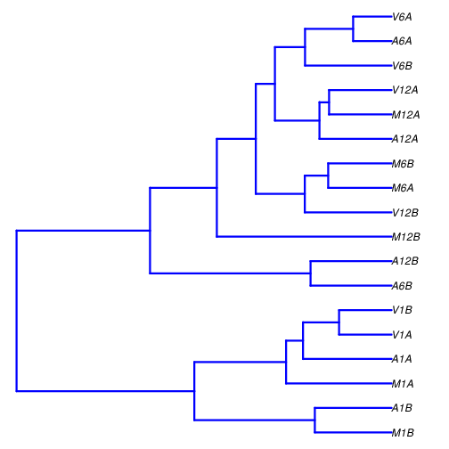{fig-align="center"}<div align="center">Correlation dendrogram of samples for _`rlog`_ values. </div></br>

#### DEG analysis with `edgeR`

The following _`run_edgeR`_ function is a convenience wrapper for
identifying differentially expressed genes (DEGs) in batch mode with
_`edgeR`_'s GML method [@Robinson2010-uk] for any number of
pairwise sample comparisons specified under the _`cmp`_ argument. Users
are strongly encouraged to consult the 
[_`edgeR`_](\href{http://www.bioconductor.org/packages/devel/bioc/vignettes/edgeR/inst/doc/edgeRUsersGuide.pdf) vignette 
for more detailed information on this topic and how to properly run _`edgeR`_ 
on data sets with more complex experimental designs. 

```{r edger}
#| message: false
#| eval: false
#| spr: true
appendStep(sal) <- LineWise({
                            targetspath <- system.file("extdata", "targets.txt", package = "systemPipeR")
                            targets <- read.delim(targetspath, comment = "#")
                            cmp <- readComp(file = targetspath, format = "matrix", delim = "-")
                            countDFeBygpath <- system.file("extdata", "countDFeByg.xls", package = "systemPipeR")
                            countDFeByg <- read.delim(countDFeBygpath, row.names = 1)
                            edgeDF <- run_edgeR(countDF = countDFeByg, targets = targets, cmp = cmp[[1]],
                                                independent = FALSE, mdsplot = "")
                            DEG_list <- filterDEGs(degDF = edgeDF, filter = c(Fold = 2, FDR = 10))
                            }, 
                            step_name = "edger", 
                            dependency = "read_counting")

```

Filter and plot DEG results for up and down-regulated genes. Because of the
small size of the toy data set used by this vignette, the _FDR_ cutoff value has been
set to a relatively high threshold (here 10%). More commonly used _FDR_ cutoffs
are 1% or 5%. The definition of '_up_' and '_down_' is given in the
corresponding help file. To open it, type `?filterDEGs` in the R console. 

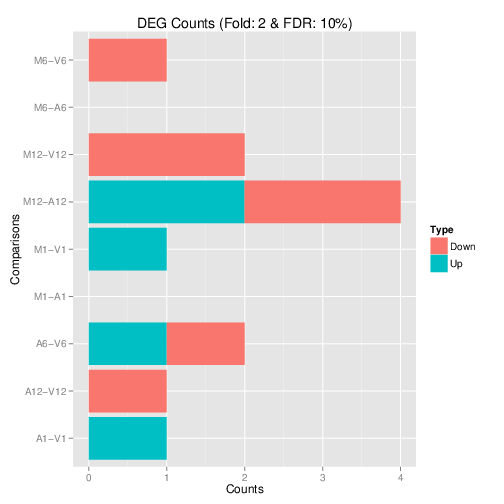{fig-align="center"}<div align="center">Up and down regulated DEGs identified by `edgeR`. </div></br>

#### DEG analysis with `DESeq2` 

The following `run_DESeq2` function is a convenience wrapper for
identifying DEGs in batch mode with `DESeq2` [@Love2014-sh] for any number of
pairwise sample comparisons specified under the `cmp` argument. Users
are strongly encouraged to consult the 
[_`DESeq2`_](http://www.bioconductor.org/packages/devel/bioc/vignettes/DESeq2/inst/doc/DESeq2.pdf) vignette
for more detailed information on this topic and how to properly run `DESeq2`
on data sets with more complex experimental designs. 

```{r deseq2}
#| message: false
#| eval: false
#| spr: true
appendStep(sal) <- LineWise({
                            degseqDF <- run_DESeq2(countDF=countDFeByg, targets=targets, cmp=cmp[[1]],
                                                   independent=FALSE)
                            DEG_list2 <- filterDEGs(degDF=degseqDF, filter=c(Fold=2, FDR=10))
                            }, 
                            step_name = "deseq2", 
                            dependency = "read_counting")

```

#### Venn Diagrams

The function `overLapper` can compute Venn intersects for large numbers of
sample sets (up to 20 or more) and `vennPlot` can plot 2-5 way Venn diagrams.
A useful feature is the possibility to combine the counts from several Venn
comparisons with the same number of sample sets in a single Venn diagram (here
for 4 up and down DEG sets).

```{r vennplot}
#| message: false
#| eval: false
#| spr: true
appendStep(sal) <- LineWise({
                            vennsetup <- overLapper(DEG_list$Up[6:9], type="vennsets")
                            vennsetdown <- overLapper(DEG_list$Down[6:9], type="vennsets")
                            vennPlot(list(vennsetup, vennsetdown), mymain="", mysub="", 
                                     colmode=2, ccol=c("blue", "red"))
                            }, 
                            step_name = "vennplot", 
                            dependency = "edger")

```

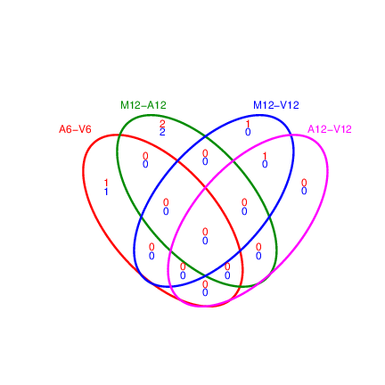{fig-align="center"}<div align="center">Venn Diagram for 4 Up and Down DEG Sets. </div></br>

#### GO term enrichment analysis of DEGs

##### Obtain gene-to-GO mappings

The following shows how to obtain gene-to-GO mappings from `biomaRt` (here
for _A. thaliana_) and how to organize them for the downstream GO term
enrichment analysis. Alternatively, the gene-to-GO mappings can be obtained for
many organisms from Bioconductor's  `*.db` genome annotation packages or GO
annotation files provided by various genome databases. For each annotation,
this relatively slow preprocessing step needs to be performed only once.
Subsequently, the preprocessed data can be loaded with the `load` function as
shown in the next step. 

```{r get_go_biomart}
#| message: false
#| eval: false
#| spr: true
appendStep(sal) <- LineWise({
                            library("biomaRt")
                            listMarts() # To choose BioMart database
                            listMarts(host="plants.ensembl.org")
                            m <- useMart("plants_mart", host="https://plants.ensembl.org")
                            listDatasets(m)
                            m <- useMart("plants_mart", dataset="athaliana_eg_gene", host="https://plants.ensembl.org")
                            listAttributes(m) # Choose data types you want to download
                            go <- getBM(attributes=c("go_id", "tair_locus", "namespace_1003"), mart=m)
                            go <- go[go[,3]!="",]; go[,3] <- as.character(go[,3])
                            go[go[,3]=="molecular_function", 3] <- "F"
                            go[go[,3]=="biological_process", 3] <- "P"
                            go[go[,3]=="cellular_component", 3] <- "C"
                            go[1:4,]
                            dir.create("./data/GO")
                            write.table(go, "data/GO/GOannotationsBiomart_mod.txt", 
                                        quote=FALSE, row.names=FALSE, col.names=FALSE, sep="\t")
                            catdb <- makeCATdb(myfile="data/GO/GOannotationsBiomart_mod.txt",
                                               lib=NULL, org="", colno=c(1,2,3), idconv=NULL)
                            save(catdb, file="data/GO/catdb.RData")
                            }, 
                            step_name = "get_go_biomart", 
                            dependency = "edger")

```

##### Batch GO term enrichment analysis

Apply the enrichment analysis to the DEG sets obtained in the above
differential expression analysis. Note, in the following example the _FDR_
filter is set here to an unreasonably high value, simply because of the small
size of the toy data set used in this vignette. Batch enrichment analysis of
many gene sets is performed with the `GOCluster_Report` function. When
`method="all"`, it returns all GO terms passing the p-value cutoff specified
under the `cutoff` arguments. When `method="slim"`, it returns only the GO
terms specified under the `myslimv` argument. The given example shows how one
can obtain such a GO slim vector from BioMart for a specific organism. 

```{r go_enrichment}
#| message: false
#| eval: false
#| spr: true
appendStep(sal) <- LineWise({ 
                            load("data/GO/catdb.RData")
                            DEG_list <- filterDEGs(degDF=edgeDF, filter=c(Fold=2, FDR=50), plot=FALSE)
                            up_down <- DEG_list$UporDown; names(up_down) <- paste(names(up_down), "_up_down", sep="")
                            up <- DEG_list$Up; names(up) <- paste(names(up), "_up", sep="")
                            down <- DEG_list$Down; names(down) <- paste(names(down), "_down", sep="")
                            DEGlist <- c(up_down, up, down)
                            DEGlist <- DEGlist[sapply(DEGlist, length) > 0]
                            BatchResult <- GOCluster_Report(catdb=catdb, setlist=DEGlist, method="all",
                                                            id_type="gene", CLSZ=2, cutoff=0.9,
                                                            gocats=c("MF", "BP", "CC"), recordSpecGO=NULL)
                            library("biomaRt")
                            m <- useMart("plants_mart", dataset="athaliana_eg_gene", host="https://plants.ensembl.org")
                            goslimvec <- as.character(getBM(attributes=c("goslim_goa_accession"), mart=m)[,1])
                            BatchResultslim <- GOCluster_Report(catdb=catdb, setlist=DEGlist, method="slim",
                                                                id_type="gene", myslimv=goslimvec, CLSZ=10,
                                                                cutoff=0.01, gocats=c("MF", "BP", "CC"),
                                                                recordSpecGO=NULL)
                            gos <- BatchResultslim[grep("M6-V6_up_down", BatchResultslim$CLID), ]
                            gos <- BatchResultslim
                            pdf("GOslimbarplotMF.pdf", height=8, width=10); goBarplot(gos, gocat="MF"); dev.off()
                            goBarplot(gos, gocat="BP")
                            goBarplot(gos, gocat="CC")
                            }, 
                            step_name = "go_enrichment", 
                            dependency = "get_go_biomart")

```

##### Plot batch GO term results

The `data.frame` generated by `GOCluster_Report` can be plotted with the
`goBarplot` function. Because of the variable size of the sample sets, it may
not always be desirable to show the results from different DEG sets in the same
bar plot. 

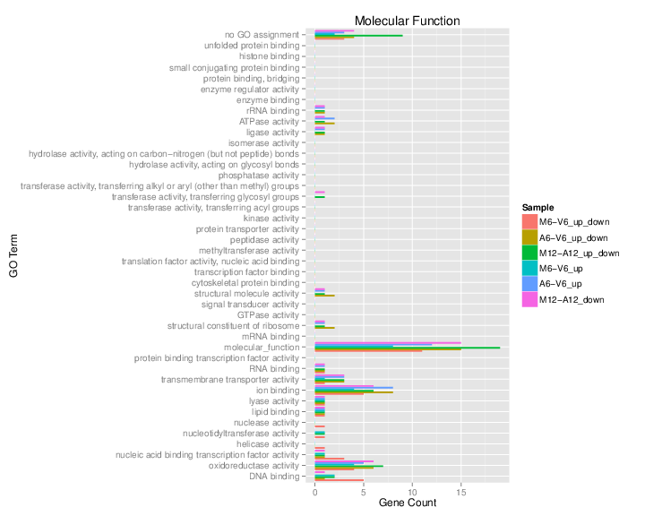{fig-align="center"}<div align="center">GO Slim Barplot for MF Ontology.</div></br>


#### Clustering and heat maps

The following example performs hierarchical clustering on the `rlog`
transformed expression matrix subsetted by the DEGs identified in the above
differential expression analysis. It uses a Pearson correlation-based distance
measure and complete linkage for cluster joining.

```{r hierarchical_clustering}
#| message: false
#| eval: false
#| spr: true
appendStep(sal) <- LineWise({
                            library(pheatmap)
                            geneids <- unique(as.character(unlist(DEG_list[[1]])))
                            y <- assay(rlog(dds))[geneids, ]
                            pdf("heatmap1.pdf")
                            pheatmap(y, scale="row", clustering_distance_rows="correlation",
                                     clustering_distance_cols="correlation")
                            dev.off()
                            }, 
                            step_name = "hierarchical_clustering", 
                            dependency = c("sample_tree_rlog", "edger"))

```


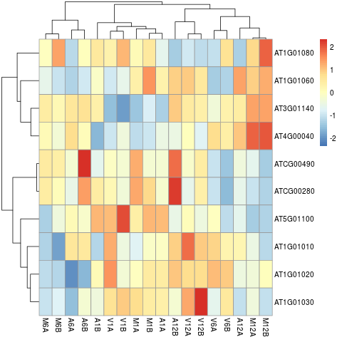{fig-align="center"}<div align="center">Heat map with hierarchical clustering dendrograms of DEGs.</div></br>


## Version information

**Note:** the most recent version of this tutorial can be found <a href="http://www.bioconductor.org/packages/devel/bioc/vignettes/systemPipeR/inst/doc/systemPipeR.html">here</a>.

```{r sessionInfo}
sessionInfo()

```

## Funding

This project is funded by awards from the National Science Foundation ([ABI-1661152](https://www.nsf.gov/awardsearch/showAward?AWD_ID=1661152)], 
and the National Institute on Aging of the National Institutes of Health ([U19AG023122](https://reporter.nih.gov/project-details/9632486)). 

## References


